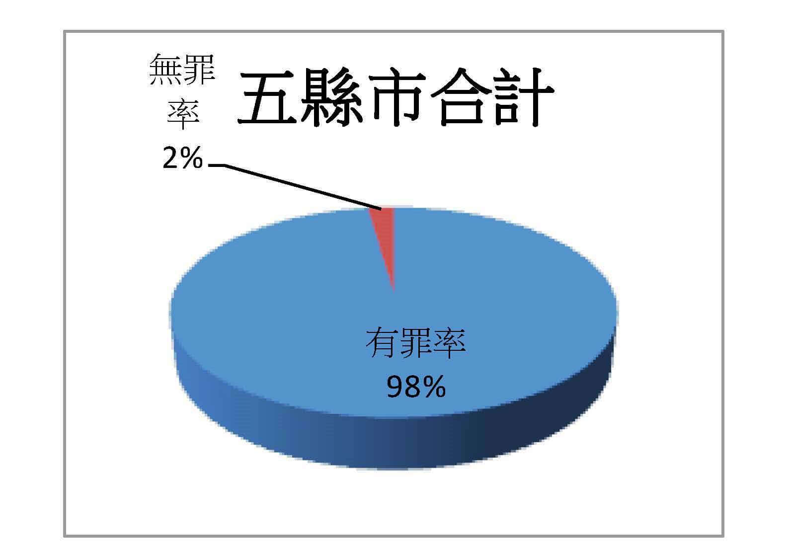

ref:

- https://digital.jrf.org.tw/articles/2244

Descriptions:

1. 讓被害人X先匯/轉五千至詐騙集團人頭A
2. 再從其他被騙的帳戶匯款至被害人 (將被害人當作人頭B)
3. 最後請被害人輸入密碼，提走被騙帳戶的錢

Treatments:

1. (事先談和解)
2. 偵查庭判無罪不起訴
3. 偵查庭判有罪
   1. 認罪
      1. 和解
   2. 不認罪
      1. 上至法院審 (一二三審)
         1. 無罪
         2. 有罪 (有案底)
            1. 有期徒刑 + 罰金
            2. 拘役 + 罰金
            3. 罰金

**刑法第339條至341條**

最高法院92年度台上字第5284號判決即有指出：

「按刑法第339條第1項之詐欺取財罪，係以行為人於行為之初，即意圖為自己或第三人不法之所有，為其主觀構成要件。又債務人於債之關係成立後，如有債務不履行之情形，在一般社會經驗上，其可能之原因甚多，縱令有遲延給付或不為給付之情形，**茍無足以認定其在債之關係發生時即故意藉此詐財之積極證據，尚不得僅以其違反債信之客觀事態，推定債務人原有詐欺取財之不法所有意圖」。**

- 普通詐欺罪中，因詐欺取得他人財產稱「**詐欺取財罪**」；因詐欺而獲得其他利益稱「**詐欺得利罪**」。

### (一) 詐欺罪定義

因應詐欺的手法、程度、造成的損害狀況，詐欺罪在法律上又分為不同層級：

- **刑法第339條（普通詐欺罪）：** 意圖為自己或第三人不法之所有，以詐術使人將本人或第三人之物交付者，處5年以下有期徒刑、拘役**或科或併科**50萬元以下罰金。以前項方法得財產上不法之利益或使第三人得之者，亦同。前2項之未遂犯罰之。
- **第339-1條（收費設備詐欺）：** 意圖為自己或第三人不法之所有，以不正方法由收費設備取得他人之物者，處1年以下有期徒刑、拘役或10萬元以下罰金。以前項方法得財產上不法之利益或使第三人得之者，亦同。前2項之未遂犯罰之。
- **第339-2條（自動付款設備詐欺）：** 意圖為自己或第三人不法之所有，以不正方法由自動付款設備取得他人之物者，處3年以下有期徒刑、拘役或30萬元以下罰金。以前項方法得財產上不法之利益或使第三人得之者，亦同。前2項之未遂犯罰之。
- **第339-3條（電腦設備詐欺）：** 意圖為自己或第三人不法之所有，以不正方法將虛偽資料或不正指令輸入電腦或其相關設備，製作財產權之得喪、變更紀錄，而取得他人之財產者，處7年以下有期徒刑，得併科70萬元以下罰金。以前項方法得財產上不法之利益或使第三人得之者，亦同。前2項之未遂犯罰之。
- **第339-4條（加重詐欺罪）：** 犯第339條詐欺罪而有下列情形之一者，處1年以上7年以下有期徒刑，得併科100萬元以下罰金：(1)冒用政府機關或公務員名義犯之。(2)3人以上共同犯之。(3)以廣播電視、電子通訊、網際網路或其他媒體等傳播工具，對公眾散布而犯之。前項之未遂犯罰之。
- **第341條（準詐欺罪）：** 意圖為自己或第三人不法之所有，乘未滿18歲人之知慮淺薄，或乘人精神障礙、心智缺陷而致其辨識能力顯有不足或其他相類之情形，使之將本人或第三人之物交付者，處5年以下有期徒刑、拘役或科或併科50萬元以下罰金。以前項方法得財產上不法之利益或使第三人得之者，亦同。前2項之未遂犯罰之。

=> 刑法第339條（普通詐欺罪） (以**詐術**使人將本人或第三人之物交付者)，有期徒刑、拘役**或**科**或**併科=>最後判決有罪也可以能只有罰金，但就有案底了。

詐術?

### (二) 詐欺罪構成要件

## 被告詐欺例子

**新聞**

- https://twinnocenceproject.org/%E8%A2%AB%E9%A8%99%E5%8F%88%E8%A2%AB%E5%86%A4%EF%BC%8C%E5%BF%83%E9%85%B8%E5%95%A5%E4%BA%BA%E7%9F%A5%EF%BC%9F-%E4%BA%BA%E9%A0%AD%E5%B8%B3%E6%88%B6%E7%9A%84%E5%86%A4%E7%BD%AA%E7%B4%80%E5%AF%A6/

統計

## 確定故意 & 不確定故意 (間接故意)

ref: 

- https://www.facebook.com/LawyerGuitar/posts/1870083943077023/

刑法第 13 條規定，行為人對於構成犯罪之事實，明知並有意使其發生者，為故意。行為人對於構成犯罪之事實，預見其發生而其發生並不違背其本意者，以故意論。又行為人對於構成犯罪之事實，明知並有意使其發生者，為直接故意，亦稱確定故意；行為人對於構成犯罪之事實，**預見其發生**而**其發生並不違背其本意**者，為間接故意，亦稱**不確定故意**（最高法院99年台上字第7807號刑事判決）。

「不確定故意」，意思是當事人「明知某件事有可能會發生，但這件事發生他也容忍、接受」。

## 提刑附民

## 易科罰金 VS 併科罰金

## 簡易判決處刑

## 認罪、和解、拚無罪、自動上訴

- 檢察官看到無罪判決，幾乎都是自動上訴

## 拘役 VS 有期徒刑 

## 訴訟費用 (裁判費)

一審: ~ 1.1%

二三審: ~1.5%

## 律師費用

偵查庭 (到起訴，包含再偵查): 六萬

法庭: 每一審六萬，最高到三審

每次出庭: 5000元

## 卷證併送制

[檢察官](https://opinion.udn.com/opinion/tag/檢察官)依法應負舉證責任，也就是證明被告有罪之責任

即起訴時，會把偵查所得的相關卷宗、證據全部送到法院去

針對人證的部分，檢察官會以偵查中已有證人筆錄為由，而在審理中拒絕再傳喚證人到庭。

現行法官於審理中採用職權調查，往往是接手檢察官訴追犯罪之功能，指稱法官一旦接下這接力棒，就會出現「隧道視野現象」，容易忽略對被告有利之證據，進而判決被告有罪。

## 無罪推定原則

[《刑事訴訟法》第154條第1項](https://law.moj.gov.tw/LawClass/LawSingle.aspx?pcode=C0010001&flno=154)「被告未經審判證明有罪確定前，推定其為無罪」。

而同條第2項也明定「犯罪事實應依證據認定之，無證據不得認定犯罪事實」

一項證據是否能證明被告的犯罪事實，需經過兩道關卡，也就是「證據能力」與「證明力」的審查

- 證據能力: 證據得提出於法庭調查，以供作認定犯罪事實之用，所應具備的資格。白話文就是說，該證據是否「有資格」成為證據。
- 證明力: 擁有證據能力的證據，能證明事實（不一定是犯罪事實，還包含不在場證明等）到什麼程度？

要特別注意的是，有證據能力不等於有證明力，因為可能與事實不符，亦可能因為「違背經驗法則及論理法則」而無證明力。

依據[《刑事訴訟法》第159-1條第2項](https://law.moj.gov.tw/LawClass/LawSingle.aspx?pcode=C0010001&flno=159-1)規定「被告以外之人於偵查中向檢察官所為之陳述，除顯有不可信之情況者外，得為證據」；證人於偵查中具結後之證詞，原則上是得作為證據的。

**詰問權**

法源依據為[《刑事訴訟法》第248條第1項](https://law.moj.gov.tw/LawClass/LawSingle.aspx?pcode=C0010001&flno=248)前段「訊問證人、鑑定人時，如被告在場者，被告得親自詰問」，雖然是規定「被告得親自詰問」，不過在解釋上是否包括辯護人？這是有疑義的。一說認為應包含律師，另一說認為法律未明文授權，如何能擅自擴張？否則豈非同意被告以外之人均能於偵查中對證人詰問？

**反詰問**

**交互詰問**

告訴人或被告為自己利益或便於案件偵查，得於案件受理後，偵查終結前，提出聲請狀，敘明案號、股別、應受傳喚之證人、鑑定人姓名、年籍、住居所等資料，及待證事項，向承辦檢察官提出聲請（各地檢署服務中心均備有聲請傳喚證人、鑑定人狀例稿，供查詢、索取），或於檢察事務官、檢察官開庭調查時，以言詞陳述，聲請傳喚證人、鑑定人，並經記明筆錄亦可。