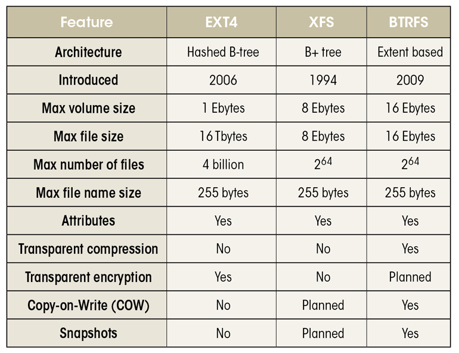

**grep and glob**

```
# Colorized grep — viewing the entire file with highlighted matches
egrep --color 'directory|$'
egrep --color 'directory|'

# egrep (ERE) / grep / Global Regular Expressions Print in Linux (Content Search / Regex)
grep = grep -G = --basic-regexp (default) : '\', e.g., \?, \+, \{, \}, \|, \(, and \) intepreted as METACHARACTER
  In basic regular expressions the meta-characters ?, +, {, |, (, and ) lose their special meaning; instead use the backslashed versions \?, \+, \{, \|, \(, and \).
  features:
    *character set (`[]`)*
    *posix character list (`[::]`)* (*posix character set (`[[:...:]]`)*)
    negation (`^`)
    wildcards (`.`)
    others (`?`, `*`, `+`, `-`, `^`, `$`, `\b`, `\B`)
    anchors 
      `^` -  Match the empty string at the beginning of a line; also represents the characters not in the range of a list (neagtion) 
      `$` -  Match the empty string at the end of a line.
      `\<` - Match the empty string at the beginning of word
      `\>` - Match the empty string at the end of word
    *OR* (`x\|y`)
    *AND* (`x\|y`)
    *Repetition* (`x\{3,\}`, `x\{1, 3\}`, `x\{3\}`)

  egrep = grep -E = --extended-regexp : +, ?, |, (, and ) intepreted as METACHARACTER
    *OR* (`x|y`)
    *AND* (`x`)
    *Repetition* (`x{3,}`, `x{1, 3}`, `x{3}`)

grep -P = --perl-regexp
  features:
    **lookbehind** - `(?<=abc)` or `(?<!abc)` for negative lookbehind
    **lookahead** - `(?=abc)` or `(?!abc)` for negative lookahead
fgrep = grep -F = --fixed-strings : PATTERN is a set of newline-separated fixed strings
    grep -F -e PATTERN1 -e PATTERN2 ... (see []^./ as normal/fixed strings)
grep -e PATTERN1 -e PATTERN2 -f PATTERNINFILE -i
-x = --line-regexp : match only whole line (strange)
-w = --word-regexp : match only whole word
-m = --max-count NUM
-c = --count : print only a count of selected lines per FILE
-n = --line-number : print line #
-o = --only-matching : print only the matched part
--binary-files 
-d = --directories ACTION : read|recurse|skip
rgrep = -r = --recursive = --directories=recurse
-R = --dereference-recursive = -r + follow symlinks
-v : Number of lines that do not match the pattern.
-l : Displays list of filenames.

--exclude/--include FILEPATTERN : exclude/include files matching FILEPATTERN
--exclude-from PATTERNINFILE
--exclude-dir DIRPATTERN

-B = --before-context NUM : print NUM lines of before context
-A = --after-context NUM
-NUM = -C NUM = --context NUM = -A NUM/2 -B NUM/2

--color = --colour WHEN : always|never|auto

## examples
grep -nr 'zxcv zxcv zxcv' ./
grep -nr '2731 12 4602 13 5281 971 12 208 627 1 1871 47 203 813 1 415 13 8 25 102 508 1677 332 42 135 11 492 1202 5 0 149 4550 529 12 3610 13 2' ./

## lookaround
`(?=...)`
``

# glob
** matches any character including a forward-slash / (used in multiple directory levels)
* matches any character except a forward-slash (to match just the file or directory name)
* matches zero or more

? matches one
+, ?, [-], []*, []+, [:upper:], ... 
^[]=[^]=![]=[!] : ^[a-z] -> will match [abc] not just [a]bc at the beginning of a line
{}: ls {?????.sh,*st.txt} = ls ?????.sh *st.txt

```
**system tools**

```
# time
time <command>


# use dd for getting the information of file transfer speed
 dd if=/dev/input.file  of=/path/to/output.file  bs=block-size  count=number-of-blocks  oflag=dsync
 ##Adjust bs and count as per your needs and setup
 dd if=/dev/zero of=/tmp/test1.img bs=1G count=1 oflag=dsync
 dd if=/dev/zero of=/tmp/test2.img bs=64M count=1 oflag=dsync
 dd if=/dev/zero of=/tmp/test3.img bs=1M count=256 conv=fdatasync
 dd if=/dev/zero of=/tmp/test4.img bs=8k count=10k
 dd if=/dev/zero of=/tmp/test4.img bs=512 count=1000 oflag=dsync
 ## OR alternate syntax for GNU/dd ##
 dd if=/dev/zero of=/tmp/testALT.img bs=1G count=1 conv=fdatasync

# fallocate
fallocate -l (--length) 15G file1.big

# make a filesystem (XFS for example)
apt install xfsprogs

fallocate -l 40G proj1.img
mkfs.xfs -m reflink=1 -L proj1 proj1.img
(-m for metadata, The fast and efficient reflink copy works only inside the boundaries of a filesystem. If for some reason the data files and the cache have to be on different filesystems, a slow and inefficient normal copy is going to be used.)
mkdir proj1
mount -o loop proj1.img proj1
(-o for option, -o mount via the loop device: `mount -o loop=/dev/loop3` or `mount -o loop`)
​```
cat <<EOF >> /etc/fstab
/root/proj1.img  /root/proj1  auto  loop  0 0
EOF
​```

# mount

​```
cat <<EOF >> /etc/fstab
/root/proj1.img  /root/proj1  auto  loop  0 0
EOF
​```

mount: `mount -a`
unmount: `unmount`
mount via the loop device: `mount -o loop=/dev/loop3` or `mount -o loop`

# ulmit

​```
$ ulimit -a
-t: cpu time (seconds)         unlimited
-f: file size (blocks)         unlimited
-d: data seg size (kbytes)     unlimited
-s: stack size (kbytes)        8192
-c: core file size (blocks)    0
-m: resident set size (kbytes) unlimited
-u: processes                  192276
-n: file descriptors           21000
-l: locked-in-memory size (kb) unlimited
-v: address space (kb)         unlimited
-x: file locks                 unlimited
-i: pending signals            192276
-q: bytes in POSIX msg queues  819200
-e: max nice                   30
-r: max rt priority            65
-N 15:                         unlimited

$ ulimit -n <value>  #set file descriptor to <value>
​```


## Linux distributions using Upstart

limit fsize unlimited unlimited    # (file size)
limit cpu unlimited unlimited      # (cpu time)
limit as unlimited unlimited       # (virtual memory size)
limit memlock unlimited unlimited  # (locked-in-memory size)
limit nofile 64000 64000           # (open files)
limit nproc 64000 64000            # (processes/threads)

## Linux distributions using systemd (systemctl)

systemctl list-unit-files
systemctl list-unit-files | grep enabled
systemctl list-unit-files --state=enabled
systemctl enable <service>


[Service]
# Other directives omitted
# (file size)
LimitFSIZE=infinity
# (cpu time)
LimitCPU=infinity
# (virtual memory size)
LimitAS=infinity
# (locked-in-memory size)
LimitMEMLOCK=infinity
# (open files)
LimitNOFILE=64000
# (processes/threads)
LimitNPROC=64000
Each systemd limit directive sets both the “hard” and “soft” limits to the value specified.

## Sysvinit
...
/etc/init.d/mongodb stop

## proc-file system

The /proc file-system stores the per-process limits in the file system object located at /proc/<pid>/limits, where <pid> is the process’s PID or process identifier. You can use the following bash function to return the content of the limits object for a process or processes with a given name:
​```
return-limits(){

     for process in $@; do
          process_pids=`ps -C $process -o pid --no-headers | cut -d " " -f 2`

          if [ -z $@ ]; then
             echo "[no $process running]"
          else
             for pid in $process_pids; do
                   echo "[$process #$pid -- limits]"
                   cat /proc/$pid/limits
             done
          fi

     done

}
​```
​```
return-limits mongod
return-limits mongos
return-limits mongod mongos
​```

# Performance Monitoring

iostat -xmt 1

# Check Server/Computer Info

lscpu
grep MemTotal /proc/meminfo


# check port

nc -zv localhost 8888
ss -tnlp | grep :23750

# convert / check UTF-8 encoding
-i or --mime flag which enables printing of mime type string

file -i input.file  #Car.java: text/x-c++; charset=us-ascii
iconv -f ISO-8859-1 -t UTF-8//TRANSLIT input.file -o out.file
iconv options -f from-encoding -t to-encoding inputfile(s) -o outputfile 

# PID
To find the shell you have on the default environment you can check the value of the SHELL environment variable:
echo $SHELL

To find the PID of the current instance of shell:
echo "$$"

Now to find the process having the PID:
ps -p <PID>

Putting it together:
ps -p "$$"

# processes

ps -a
ps x (show also the ones without tty)
ps f (f for forest/tree view)

# 
lsblk  (physical disk)
du -h
df  (logical volume)
fdisk -l

# sudo vs su
To change (switch) users using su command, you should provide the password of target user, that's how it works. However with sudo you can use your own password.
sudo -i (login shell)
sudo -s (no-login shell)
sudo su - (login shell)
sudo -l see privileges you have


You can use: sudo -i to switch into root with its default shell as a login shell, or for a no-login shell sudo -s or even old school sudo su - (login shell again).

```

**diff**

```
diff
   -E, --ignore-tab-expansion
          ignore changes due to tab expansion

   -Z, --ignore-trailing-space
          ignore white space at line end

   -b, --ignore-space-change
          ignore changes in the amount of white space

   -w, --ignore-all-space
          ignore all white space

   -B, --ignore-blank-lines
          ignore changes whose lines are all blank
  -u, -U NUM, --unified[=NUM]   output NUM (default 3) lines of unified context
  -c, -C NUM, --context[=NUM]   output NUM (default 3) lines of copied context
  -y, --side-by-side            output in two columns  
```

```
diff -Z -y # -Z: ignore trailing spaces, -y: side-by-side
diff -Z -u # -u: unified
diff -Z -c # -c: context

# count diffs
diff -U 0 file1 file2 | grep -v ^@ | wc -l
```

```
typeset
declare
fontconfig
fc-cache
install
mktemp
exec > run.log

trap "rm -f $temp_file" 0 2 3 15

ar [OPTIONS] archive_name member_files
ar super.a *.txt
ar r super.a *.txt  # create archive, insert files in archive
ar q super.a *.txt  # create but deletes existing
ar d super.a 1.txt  # Deletes modules from archive
ar p super.a  # print the specified members of a archive
ar t super.a  # displays the contents of the archive in a listed manner
```

## Temp file
https://unix.stackexchange.com/questions/181937/how-create-a-temporary-file-in-shell-script

`&3` as a temporary file
```
tmp="$(mktemp)"
exec 3> "$tmp"
rm "$tmp"
...
echo ... >&3
```

`sed ... file | sponge file` = `sed ... file  sponge file`

## NICE
ref: https://en.wikipedia.org/wiki/Nice_(Unix)
nice becomes useful when several processes are demanding more resources than the CPU can provide. In this state, a higher-priority process will get a larger chunk of the CPU time than a lower-priority process. Only the superuser (root) may set the niceness to a lower value (i.e. a higher priority). On Linux it is possible to change /etc/security/limits.conf to allow other users or groups to set low nice values.[1]

If a user wanted to compress a large file, but not slow down other processes, they might run the following:
```
$ nice -n 19 tar cvzf archive.tgz largefile
```
## Logs
What’s in these Linux Logs?
* /var/log/syslog or /var/log/messages:
	Shows general messages and info regarding the system. Basically a data log of all activity throughout the global system. Know that everything that happens on Redhat-based systems, like CentOS or Rhel, will go in messages. Whereas for Ubuntu and other Debian systems, they go in Syslog.
* /var/log/auth.log or /var/log/secure:
	 Keep authentication logs for both successful or failed logins, and authentication processes. Storage depends on system type. For Debian/Ubuntu, look in /var/log/auth.log. For Redhat/CentrOS, go to /var/log/secure.
* /var/log/boot.log: start-up messages and boot info.
* /var/log/maillog or var/log/mail.log: is for mail server logs, handy for postfix, smtpd, or email-related services info running on your server.
* /var/log/kern: keeps in Kernel logs and warning info. Also useful to fix problems with custom kernels.
* /var/log/dmesg: a repository for device driver messages. Use dmesg to see messages in this file.
* /var/log/faillog: records info on failed logins. Hence, handy for examining potential security breaches like login credential hacks and brute-force attacks.
* /var/log/cron: keeps a record of Crond-related messages (cron jobs). Like when the cron daemon started a job.
* /var/log/daemon.log: keeps track of running background services but doesn’t represent them graphically.
* /var/log/btmp: keeps a note of all failed login attempts.
* /var/log/utmp: current login state by user.
* /var/log/wtmp: record of each login/logout.
* /var/log/lastlog: holds every user’s last login. A binary file you can read via lastlog command.
* /var/log/yum.log: holds data on any package installations that used the yum command. So you can check if all went well.
* /var/log/httpd/: a directory containing error_log and access_log files of the Apache httpd daemon. Every error that httpd comes across is kept in the error_log file. Think of memory problems and other system-related errors. access_log logs all requests which come in via HTTP.
* /var/log/mysqld.log or /var/log/mysql.log : MySQL log file that records every  debug, failure and success message, including starting, stopping and restarting of MySQL daemon mysqld. The system decides on the directory. RedHat, CentOS, Fedora, and other RedHat-based systems use /var/log/mariadb/mariadb.log. However, Debian/Ubuntu use /var/log/mysql/error.log directory.
* /var/log/pureftp.log: monitors for FTP connections using the pureftp process. Find data on every connection, FTP login, and authentication failure here.
* /var/log/spooler: Usually contains nothing, except rare messages from USENET.
* /var/log/xferlog: keeps FTP file transfer sessions. Includes info like file names and user-initiated FTP transfers.

## LVM

The /dev/mapper/ubuntu--vg-root in place of a traditional /dev/sdxN block device just indicates that you chose to install the system using LVM2 logical volume management. 

You can think of LVM as "dynamic partitions", meaning that you can create/resize/delete LVM "partitions" (they're called "Logical Volumes" in LVM-speak) from the command line *while your Linux system is running*: no need to reboot the system to make the kernel aware of the newly-created or resized partitions.

Other nice features that LVM "Logical Volumes" provide are:

1. If you have more than one hard-disk, Logical Volumes can extend over more than one disk: i.e., they are not limited by the size of one single disk, rather by the total aggregate size.
2. You can set up "striped" LVs, so that I/O can be distributed to all disks hosting the LV in parallel. (Similar to RAID-0, but a bit easier to set-up.)
3. You can create a (read-only) snapshot of any LV. You can revert the original LV to the snapshot at a later time, or delete the snapshot if you no longer need it. This is handy for server backups for instance (you cannot stop all your applications from writing, so you create a snapshot and backup the snapshot LV), but can also be used to provide a "safety net" before a critical system upgrade (clone the root partition, upgrade, revert if something went wrong).

While being most useful on server systems, I think that features 1. and 3., combined with LVM's ability to create/resize/delete LVs on the fly, are quite handy on desktop systems as well. (Especially if you experiment a lot with the system.)

### Downsides

Of course, all of this comes at a price: the initial setup of LVM is more complex than just partitioning a disk, and you will definitely need to understand the LVM terminology and model (Logical Volumes, Physical Volumes, Volume Groups) before you can *start* using it. (Once it is set up, using it is much easier, though.)

Also, if you use LVM across hard drives, you may lose all your data when only one drive fails.

- **PV** : Physical Volumes. This means the hard disk, hard disk partitions, RAID or LUNs from a SAN which form "Physical Volumes" (or PVs).
- **VG** : Volume Groups. This is a collection of one or more Physical Volumes.
- **LV** : Logical Volumes. LVs sit inside a Volume Group and form, in effect, a virtual partition.
- **PE** : Physical Extents. In order to manipulate the actual data, it is divided into blocks of data called **P**hysical **E**xtents.
- **LE** : Logical Extents. Similar to Physical Extents, but at the Logical Volume level. Physical Extents are to Physical Volumes as Logical Extents are to Logical Volumes. The size of blocks are the same for each logical volume (LV) in the same volume group (VG).


### X Windows/XDG

XDG: X Desktop Group, e.g. X11 (X Windows)

- refs: 
  - https://unix.stackexchange.com/questions/24347/why-do-some-applications-use-config-appname-for-their-config-data-while-other
  - http://standards.freedesktop.org/basedir-spec/latest/index.html#introduction

>There is a single base directory relative to which user-specific configuration files should be written. This directory is defined by the environment variable $XDG_CONFIG_HOME...
>
>If $XDG_CONFIG_HOME is either not set or empty, a default equal to $HOME/.config should be used

## Commands

```
# coproc can read stdin / stdout of subprocesses from executing shell unlike in bg processes

coproc command args
coproc name command args
```

## help / man / info

> https://unix.stackexchange.com/questions/19451/difference-between-help-info-and-man-command/159817
>
> `help` is a built-in command in the `bash` shell (and that shell only) that documents some of the builtin commands and keywords of that shell. That's an internal documentation system of that shell. Other shells have their own documentation system (`ksh93` has `--help` and `--man` options for its builtins, `zsh` has a run-help helper that extracts information from manuals in other formats). Other commands like `vim` have their own embedded documentation system.
>
> `man` is a system-wide documentation system that provides short reference manuals (pages) for individual commands, API functions, concepts, configuration file syntax, file formats organised in sections (1 for user commands, 2 for system calls...). That's the traditional Unix documentation system.
>
> `info` is another documentation system originating in the GNU project. It's hypertext with links (predates the web). An info manual is like a digital book with a concept of table of contents and (searchable) index which helps locating the information.
>
> There's overlap between the 3. For instance, `bash` being part of the GNU project has both a man page and an info manual. The size of the manual makes the man system not as appropriate for `bash` though. However, the structure of the info manual and index is not very good in `bash` which makes it not as easy to look information in as in other `info` manuals like `zsh`'s. `zsh` manual being even bigger is split into several man pages and also has a good `info` manual with a very good index.
>
> It should be noted that the `info` manual is generated from a `texinfo` format which is also used to generate HTML and printable (PDF/PS) versions. In the case of `zsh` though, the texinfo is generated from another format (`yodl`).

**troff** ([/ˈtiːrɒf/](https://en.wikipedia.org/wiki/Help:IPA/English)), short for "typesetter roff", is the major component of a [document processing system](https://en.wikipedia.org/wiki/Document_processing_system) developed by [AT&T Corporation](https://en.wikipedia.org/wiki/AT%26T_Corporation) for the [Unix](https://en.wikipedia.org/wiki/Unix) operating system.

### Cryptographic hash verification
We do not recommend using MD5 verification as SHA-256 is more secure.
Windows: `Get-FileHash filename -Algorithm SHA256`  # PowerShell V4 or later
Linux: `sha256sum filename`
macOS:  `shasum -a 256 filename`
sha256sum ideaIC-2019.2.4.exe | grep "`wget -qO - <weburl>`"

### debug

 - Debug an executable:
   `gdb {{executable}}`

 - Attach a process to gdb:
   `gdb -p {{procID}}`

 - Create a named pipe at a given path:
   `mkfifo {{path/to/pipe}}`

`close` - close a file descriptor
`openvt` - start a program on a new virtual terminal (VT).

### find

```
# find and delete

find . -name "*.pyc" -exec rm -f {} \;
find . -name \*.pyc -delete  # -delete is not part of the POSIX specification, and not guaranteed to exist in all implementations of find
```

### 7z

```
7z x -o<output_dir>
```

### SQLite
```
apt install sqlite3

sqlite3 ~/data.sqlite <<EOF
CREATE TABLE files (name varchar(30));
INSERT INTO files VALUES ('diff1');
INSERT INTO files VALUES ('diff2');
INSERT INTO files VALUES ('diff3');
INSERT INTO files VALUES ('diff4');
EOF

sqlite3 ~/data.sqlite \
    'SELECT name FROM files;'
```

## 

```bash
# reinitialize /var/lib/apt/lists
# https://serverfault.com/questions/368669/debian-ubuntu-is-it-possible-to-reinitialize-var-lib-apt-lists-and-var-apt-cac
rm -rf /var/lib/apt/lists/*  # useful when creating docker image to keep it minimal
```

## Filesystems

