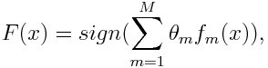
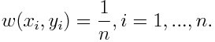
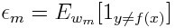
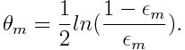

ref: 
- https://towardsdatascience.com/understanding-adaboost-2f94f22d5bfe
- https://towardsdatascience.com/boosting-algorithm-adaboost-b6737a9ee60c
- https://medium.com/syncedreview/tree-boosting-with-xgboost-why-does-xgboost-win-every-machine-learning-competition-ca8034c0b283
- https://homes.cs.washington.edu/~tqchen/pdf/BoostedTree.pdf

tl;dr:
- Boosting is a kind of learning algorithms that try to fit the data by using multiple simpler models, or so called base learner/weak learner. The way it does is to adaptively fit the data by using the same or slightly different in parameter setting’s base learners.
- AdaBoost works by putting more weight on difficult to classify instances and less on those already handled well.
- AdaBoost is actually minimizing the exponential loss function and iteratively get the weak classifier to be trained on weighted data. 
- LogitBoost, a new boosting algorithm, was also proposed which tries to minimize a second-order approximation of the log-loss.

Boosting Variations:
- MART (multiple additive regression trees)
- XGBoost (Extreme Gradient Boosting) [Tree Boosting With XGBoost](https://medium.com/syncedreview/tree-boosting-with-xgboost-why-does-xgboost-win-every-machine-learning-competition-ca8034c0b283)
- 
- LightGBM
- CatBoost

Key points:

> After training a classifier at any level, ada-boost assigns weight to each training item. Misclassified item is assigned higher weight so that it appears in the training subset of next classifier with higher probability.

>  After each classifier is trained, the weight is assigned to the classifier as well based on accuracy. The more accurate classifier is assigned higher weight so that it will have more impact in the final outcome. A classifier with 50% accuracy is given a weight of zero, and a classifier with less than 50% accuracy is given negative weight.

> A linear model, in contrast, forces us to make predictions that scale linearly in each parameter. If the weight on some feature is positive, then increasing that feature predicts higher odds of success no matter how high it goes. 
> 
> The ensemble of stumps, which is not bound by that restriction, will not build a model of that shape unless it can find sufficient evidence in the data that this is true. Ensembles of decision stumps generalize linear models, adding the ability to see non-linear relationships between the labels and individual features.

Maths:

*Here -1 denotes the negative class while 1 represents the positive one.*

Initialize the weight for each data point as:

For iteration m=1,…,M:

(1) Fit weak classifiers to the data set and select the one with the lowest weighted classification error:

(2) Calculate the weight for the m_th weak classifier:

TODO ...