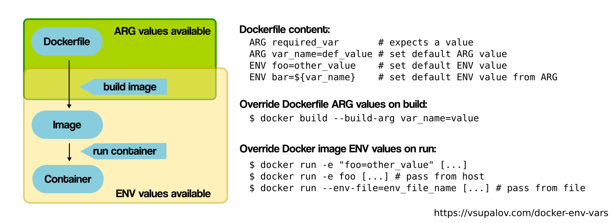

# docker-compose

docker-compose up

## docker-compose.yml

```
version: '3.7'
services:
	name1:
		build:
			context: .
			dockerfile: file
		ports:
```


```
Compose file format	Docker Engine release
3.8	19.03.0+
3.7	18.06.0+ <=
3.6	18.02.0+
```
ref: https://docs.docker.com/compose/compose-file/ for checking Docker Engine and compose file format compatibility

e.g.
	51: Docker version 18.09.0, build 4d60db4
	227: Docker version 19.03.5, build 633a0ea838
	
Common attribute names:

```
version: '3.7'

services:
	aaa:
		ports:
			- ...
		volumes:
			- ...
		networks:
			- ...
		container_name:
		working_dir:
		command:
		entrypoint:
		image:
		build:
			context: ./dir
			dockerfile: file
			args:
			  ...
		env_file:
		environment:
			- ABC=...
		healthcheck:
			test: CMD/CMD-SHELL/NONE command
			interval: 1m30s
			timout: 10s
			retries: 3
			start_period 4s
			
networks:
	xxx:
		aliases:
			- ...

networks:
  - xxx
		
```

## Expose vs Publish 

1) If you specify neither EXPOSE nor -p, the service in the container will only be accessible from inside the container itself.

2) If you EXPOSE a port, the service in the container is not accessible from outside Docker, but from inside other Docker containers. So this is good for inter-container communication.

3) If you EXPOSE and -p a port, the service in the container is accessible from anywhere, even outside Docker.

```
-P: publish all "exposed" ports
--expose
-p, --publish
```

## Save only the last image (reduce the image size) by `docker export` & `docker import`

(Note that the later version of `docker` can use `docker squash` command instead of `docker export`.

```
docker export container_name > file.tar
cat file.tar | docker import - image_name:tag
```

This will have the issue that only the filesystem are saved, which means that many things that have been done in the initial `Dockerfile` are not saved, e.g., **environment varaibles**. This will cause some issue like `torch.cuda.is_available()` will not return `True` (c.f. `2020-07-11-cuda-cudnn.md`).

`docker export` vs `docker save`

(c.f. https://stackoverflow.com/questions/22655867/what-is-the-difference-between-save-and-export-in-docker)

> - `save` will fetch an image : for a VM or a physical server, that would be the installation .ISO image or disk. The base operating system.
>
>   It will pack the layers and metadata of all the chain required to build the image. You can then load this "saved" images chain into another docker instance and create containers from these images.
>
> - `export` will fetch the whole container : like a snapshot of a regular VM. Saves the OS of course, but also any change you made, any data file written during the container life. This one is more like a traditional backup.
>
>   It will give you a flat .tar archive containing the filesystem of your container.

```
# check if docker works properly
sudo docker run hello-world

# check what is inside /var/lib/docker/graph
ls -al /var/lib/docker/graph
/var/lib/docker/repositories


# expose daemon on tcp://localhost:2376/2375 port
{
    "hosts": [ "unix:///var/run/docker.sock","tcp://0.0.0.0:2376"],
    "log-driver": "journald",
    "signature-verification": false,

}

# commit
docker commit <container-name> <image-name>:<tag>

# save to a tar file
docker save <image-name>:<tag> > <filename>.tar
docker save <image-name>:<tag> -o <filename>.tar

# docker push to Docker Hub or a self-hosted one

docker login -u ciaochiaociao [-p]
docker tag <image name> <registry-host>:<port>/myadmin/rhel-httpd
docker tag rhel-httpd registry-host:5000/myadmin/rhel-httpd
docker tag cwhsu_event_zh ciaochiaociao/cwhsu_event_zh
docker push reponame:tagname

# 
docker ps -s  # show the size of the container writable layer and the image size (virtual)

#docker images, containers, storage are stored in this folder:
/var/lib/docker/...

# bind mount/docker volume/tmpfs mount
Volume:
docker run -v vol_name:/workspace == docker run --mount [type=volume,]src=<vol_name>,dst=<path>

Bind Mount:
docker run -v /path/to/mounted:/workspace == docker run --mount type=bind,source=<vol_name>,target=<path>

tmpfs Mount:
docker run --tmpfs <path> == docker run --mount type=tmpfs,destination=<path>

(source==src, target=dst=destination)
```

# Dockerfile

```
FROM image:tag
MAINTAINER Chiao-Wei Hsu <cwhsu@iis.sinica.edu.tw>
WORKDIR
RUN exec1 --flag, arg1
RUN [ "exec2", "--flag", "arg1", ...]  # create layers

ENTRYPOINT [ "exec3", "--flag", "arg1", ...]  # cannot be overridden, params can be appended (from "CMD exec form w/ only params" or "docker run cli arguments")
#ENTRYPOINT exec3 --flag arg1 ...  # cannot be overridden, params can't be appended, ignore any CMD or docker run cli arguments

CMD [ 'exec', ... ]  # default that can be overridden, only the last CMD is considered
#CMD [ 'param1', ... ]  # append after ENTRYPOINT exec form
#CMD ...
```

## CMD vs ENTRYPOINT vs RUN

Use RUN instructions to build your image by adding layers on top of initial image.

Prefer ENTRYPOINT to CMD when building executable Docker image and you need a command always to be executed. Additionally use CMD if you need to provide extra default arguments that could be overwritten from command line when docker container runs.

Choose CMD if you need to provide a default command and/or arguments that can be overwritten from command line when docker container runs.


shell form: <instruction> <command>  ---> /bin/sh -c <command>
exec form: <instruction> ["executable", "param1", "param2", ...]  ---> executable param1 param2 (calls executable directly. Note that any $var will not be substituted.)

For bash: use exec form - ["/bin/bash", "-c", "<command>"]

RUN: executes command(s) in a new layer and creates a new image. 

CMD: default command, which will be executed only when you "run" container without specifying a command (If Docker container runs with a command, the default command will be ignored. If Dockerfile has more than one CMD instruction, all but last CMD instructions are ignored.)

CMD ["param1","param2"] (sets additional default parameters for ENTRYPOINT in exec form)
It sets default parameters that will be added after ENTRYPOINT parameters if container runs without command line arguments.

ENTRYPOINT: configure a container that will run as an executable. ENTRYPOINT command and parameters are not ignored when Docker container runs with command line parameters. 


## install
RUN apt-get update && apt-get install -y \
  bzr \
  cvs \
  git \
  mercurial \
  subversion

Note that apt-get update and apt-get install are executed in a single RUN instruction. This is done to make sure that the latest packages will be installed. If apt-get install were in a separate RUN instruction, then it would reuse a layer added by apt-get update, which could had been created a long time ago.

# GPU

```
NVIDIA_VISIBLE_DEVICES  # the GPUs that can be used, which can only be set at the `docker run`. Even if it changed in the container, it does not effect.
CUDA_VISIBLE_DEVICES  # the GPUs that are used, which can be changed in container
```

# Others

## Change the Dockerfile content/instructions in existing container

```
docker commit --change "CMD ["apachectl", "-DFOREGROUND"]' -c "EXPOSE 80" c3f279d17e0a  svendowideit/testimage:version4
docker commit --change "ENV DEBUG true" c3f279d17e0a  svendowideit/testimage:version3
# The --change option will apply Dockerfile instructions to the image that is created. Supported Dockerfile instructions: CMD|ENTRYPOINT|ENV|EXPOSE|LABEL|ONBUILD|USER|VOLUME|WORKDIR
```

The `--change` option will apply `Dockerfile` instructions to the image that is created. Supported `Dockerfile` instructions: `CMD`|`ENTRYPOINT`|`ENV`|`EXPOSE`|`LABEL`|`ONBUILD`|`USER`|`VOLUME`|`WORKDIR`

## Size vs Virutal Size

```bash
docker ps -s/--size
```

https://github.com/docker/docker.github.io/issues/1520#issuecomment-305179362

In the example below, I started 10 nginx containers;

```
CONTAINER ID        IMAGE                      COMMAND                  CREATED              SIZE
6ca0cef8db8d        nginx                      "nginx -g 'daemon ..."   55 seconds ago       2B (virtual 183MB)
0b75532c34d2        nginx                      "nginx -g 'daemon ..."   56 seconds ago       2B (virtual 183MB)
a86d8818795d        nginx                      "nginx -g 'daemon ..."   56 seconds ago       2B (virtual 183MB)
3e9151f0332d        nginx                      "nginx -g 'daemon ..."   57 seconds ago       2B (virtual 183MB)
429c418114a1        nginx                      "nginx -g 'daemon ..."   57 seconds ago       2B (virtual 183MB)
01f6a0818b32        nginx                      "nginx -g 'daemon ..."   58 seconds ago       2B (virtual 183MB)
9ed93ee43912        nginx                      "nginx -g 'daemon ..."   58 seconds ago       2B (virtual 183MB)
c7c17bf50744        nginx                      "nginx -g 'daemon ..."   59 seconds ago       2B (virtual 183MB)
a7b0502d95ce        nginx                      "nginx -g 'daemon ..."   About a minute ago   2B (virtual 183MB)
8b9e9ee6c4e8        nginx                      "nginx -g 'daemon ..."   About a minute ago   2B (virtual 183MB)
```

All these containers use the same image, so the "Virtual size" (`183MB` in the example) is used only once, irregardless of how many containers are started from the same image - I can start 1 container or a thousand; no extra disk space is used. The "Size" (`2B` in the example) is unique per container though, so the total space used on disk is:

183MB + 10 * 2B

## Pain of Environment Variables

replied by member in 2014: https://github.com/phusion/baseimage-docker/issues/54#issuecomment-40927469

> That is something SSH and PAM do. They reset environment variables. Not much we can do about it. You have to modify your PAM config files or your bash startup files to load the environment variables you want.

another contributor in 2014: https://github.com/phusion/baseimage-docker/issues/54#issuecomment-40933667

> Shouldn't `/etc/container_environment.sh` be sourced from `/root/.profile` by default then?

official docs by docker:	https://web.archive.org/web/20200922152104/https://docs.docker.com/engine/examples/running_ssh_service/

> **Environment variables**
>
> Using the `sshd` daemon to spawn shells makes it complicated to pass environment variables to the user’s shell via the normal Docker mechanisms, as `sshd` scrubs the environment before it starts the shell.
>
> If you’re setting values in the `Dockerfile` using `ENV`, you need to push them to a shell initialization file like the `/etc/profile` example in the `Dockerfile` above.
>
> If you need to pass`docker run -e ENV=value` values, you need to write a short script to do the same before you start `sshd -D` and then replace the `CMD` with that script.

Good blog about `ENV, ARG, .env, env_file (-e, ...)`

> https://vsupalov.com/docker-arg-env-variable-guide/
>
> Here’s a list of **easy takeaways**:
>
> - The **.env file**, is only used during a pre-processing step when working with docker-compose.yml files. Dollar-notation variables like $HI are substituted for values contained in an “.env” named file in the same directory.
> - **ARG** is only available during the build of a Docker image (RUN etc), not after the image is created and containers are started from it (ENTRYPOINT, CMD). You can use ARG values to set ENV values to [work around](https://vsupalov.com/docker-build-time-env-values/) that.
> - **ENV** values are available to containers, but also RUN-style commands during the Docker build starting with the line where they are introduced.
> - If you set an environment variable in an **intermediate container** using bash (RUN export VARI=5 && …) it will not persist in the next command. There’s [a way](https://vsupalov.com/set-dynamic-environment-variable-during-docker-image-build/) to work around that.
> - An **env_file**, is a convenient way to pass many environment variables to a single command in one batch. This should not be confused with a *.env* file.
> - Setting ARG and ENV values leaves **traces** in the Docker image. Don’t use them for secrets which are not meant to stick around (well, you kinda can with [multi-stage builds](https://vsupalov.com/build-docker-image-clone-private-repo-ssh-key/)).
>
> 

From stackoverflow


> [I can't get env var in the Docker container](https://stackoverflow.com/questions/55182220/i-cant-get-env-var-in-the-docker-container)
>
> >  I've ran my Docker container using this command: `docker run --name test1 -d -e FLAG='***' rastasheep/ubuntu-sshd` Now, when I connect to it via SSH, I can't get my env there via `printenv FLAG`. How can I fix this? When running with `-it` and `sh`, I can my get env via `printenv FLAG`.
>
> You are doing two different things:
>
> - `docker run -it -e FLAG='***' rastasheep/ubuntu-sshd sh` will run a container in interactive mode with a shell, and **this shell session will have the environment variable** you passed on the command line. With `docker run -d -e FLAG='***' rastasheep/ubuntu-sshd`, a SSH daemon process will start with defined env vars.
> - when you connect in the container with SSH you will create a **new shell session which does not have these environment variable set**.
>
> This can be observed when running a container, connecting to it using ssh and showing all processes and their environment variable:
>
> ```
> docker run -d -p 2222:22 -e FLAG='test' rastasheep/ubuntu-sshd
> ssh root@localhost -p 2222
> ...
> ```
>
> We are now connected into the container, we can see the SSH daemon process (PID 1) and our SSH session process (PID 7):
>
> ```
> root@788fa982c2d0:~# ps -xf
>   PID TTY      STAT   TIME COMMAND
>     1 ?        Ss     0:00 /usr/sbin/sshd -D  # <== does have the FLAG env var
>     7 ?        Ss     0:00 sshd: root@pts/0   # <== no FLAG env var
> ```
>
> Lets check it out, print our current process env var, and the env var of the SSH daemon process:
>
> ```
> root@788fa982c2d0:~# printenv FLAG # Nothing
> root@788fa982c2d0:~# cat /proc/1/environ # We see the FLAG env var!
> [..]FLAG=test[...]
> ```
>
> As pointed out by @Dmitrii, you can read [Dockerize an SSH service](https://docs.docker.com/engine/examples/running_ssh_service/) for more details.

>As suggested by [docs](https://docs.docker.com/engine/examples/running_ssh_service/) you might need to create your own Dockerfile with following changes
>
>```bash
>Project  
>|--Dockerfile  
>|--entrypoint.sh
>```
>
>Dockerfile
>
>```bash
>FROM rastasheep/ubuntu-sshd
>COPY entrypoint.sh /usr/local/bin/entrypoint.sh
>ENTRYPOINT ["/usr/local/bin/entrypoint.sh"]
>CMD ["/usr/sbin/sshd", "-D"]
>```
>
>File: entrypoint.sh
>
>```bash
>#!/bin/bash
>echo "export FLAG=$FLAG" >> /etc/profile
>exec "$@"
>```
>
>Command:
>
>```bash
> docker build -t your-ubuntu-sshd .
> docker run --name test1 -d -e FLAG='abc' -p 2222:22 your-ubuntu-sshd
>```
>
>

