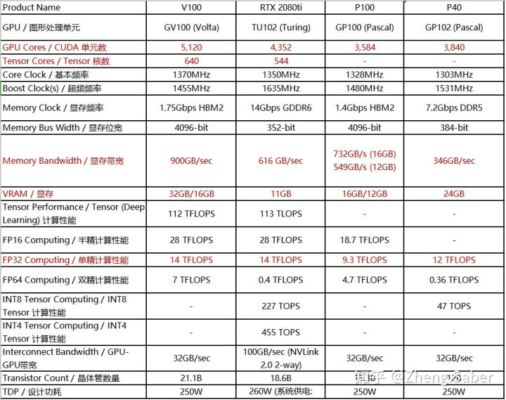

ref: 
 * https://zhuanlan.zhihu.com/p/51380356
 * https://kknews.cc/zh-tw/tech/2n2eok9.html
 * https://timdettmers.com/2019/04/03/which-gpu-for-deep-learning/
 * https://zhuanlan.zhihu.com/p/61411536

## GPU

* Nvidia: 
    * GPU Microarchitecture: Turing, Pascal, Kepler, Volta, Fermi, Tesla
    * RTX: Core for supporting DirectX Ray-Tracing (RT Core), mostly with Turing microarchitecture
    * Series:
	    * Titan
            * GTX Titan (Black/Z): Kepler (2013)
            * GTX Titan X: Maxwell (2014)
            * Titan X/Xp: Pascal (2016, 2017)
            * Titan RTX: Turing
            * Titan V: Volta (max. 24GB)
	    * GeForce (RTX/GTX 20/16/10/9/... Series 80/70/60 Ti)
	    	* GeForce 10/16: Pascal (only GT but certain models have been activated the DirectX Ray-Tracing)
			* GeForce 20: Turing (only RTX)
			* (GeForce 30: Ampere?)
	    * Tesla (data center GPU cores): A100 (~= 200,000 USD / 8~=70萬TWD) > V100 (~=20萬TWD) > P100 > T4
            * A100: Ampere
            * V100: Volta
            * T4: Turing

 - TWCC: 2016 個 NVIDIA Tesla V100 32GB GPU (9PFLOPS)
 - NLU LAB
  - Tower GPU Server:
    - 191/192: GeForce GTX 1080 (8GB)
    - 190/195: GeForce GTX 1080Ti (11GB)
  - Rack GPU Server (multi-GPU):
     	- 51/145 server:
    - 4*GPU: GeForce RTX 2080Ti (11GB)
    - 172 server:
         	- Tesla P4 8GB
         	- Tesla V100 32GB
      - New server:
         	- Titan RTX 24GB

