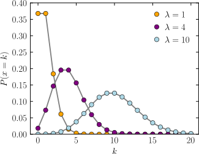

To Do:

- Deep Learning Book

  - > p.132 Any loss consisting of a negative log-likelihood is a cross-entropy between the empirical distribution defined by the training set and the probability distribution defined by model. For example, Mean Square Error is the cross-entropy between the empirical distribution and a Gaussian model.

    - https://stats.stackexchange.com/questions/288451/why-is-mean-squared-error-the-cross-entropy-between-the-empirical-distribution-a

    - 
      $$
      {\displaystyle g(x)={\frac {1}{\sigma {\sqrt {2\pi }}}}\exp {\left(-{\frac {1}{2}}{\frac {(x-\mu )^{2}}{\sigma ^{2}}}\right)}.}\\
      H(\hat{p}_{data}, g) = -E_{x\sim\hat{p}_{data}}\left[\log g(x; \mu, \sigma)\right] = -\sum_{i=1}^{m}\log g(x^{(i)}; \mu, \sigma) = \frac{1}{2}\sum_{i=1}^{m}\left(\log(2\pi \sigma^2) + \frac{(x^{(i)}-\mu)^2}{\sigma^2}\right)
      $$

  - 5.5.2 Properties of MLE

## Networks

- Unstructured: directly model `P(x)` without factorizing by storing a lookup table with one probability value per possible outcome (Not feasible => e.g. to model a distribution over a random vector x containing n discrete variables capable of taking on k values each => k^n parameters )

- Structure: factorize `P(x) = P1 x P2 x ...`

  - (Directed Structured Model) Bayesian / Bayes / Belief / Decision Model (Network): `P(x) = P(x|y, z) x P(y|w) x ...`

    - All edges must be directed acyclic (DAG) (e.g., HMM is not Bayesian Network because it has cycles)

  - (Undirected Structured Model) Markov Network (Model) / Markov Random Field: `P(x) = P(a) x P(b) x ...`

    - can be cyclic

    - Boltzmann Machine: often with designating latent variables

      - e.g., 

        - Restricted Boltzmann Machine (RBM)

          

        - Deep Belief Network (DBN)

          

        - Deep Boltzmann Machine (DBM)

          

    - Markov Random Field / Log-linear model: Boltzmann machine without latent variables:

      - e.g. Conditional Random Field

## Label Smoothing

ref: https://towardsdatascience.com/what-is-label-smoothing-108debd7ef06

- used by *Transformer* in *All you need is attention!*
- it is also a kind of regularization
- only applicable in cross entropy loss with softmax
- useful in classification task
- it models the noise
- it tackles not only the problem of **overfitting** but also **overconfidence**
- it is also falling under the field of **Neural Networks Calibration** (like other techniques such as *temperature scaling*)

```
y_ls = (1 - α) * y_hot + α / K
```


```
# https://github.com/pytorch/pytorch/issues/7455

class LabelSmoothingLoss(nn.Module):
    def __init__(self, classes, smoothing=0.0, dim=-1):
        super(LabelSmoothingLoss, self).__init__()
        self.confidence = 1.0 - smoothing
        self.smoothing = smoothing
        self.cls = classes
        self.dim = dim

    def forward(self, pred, target):
        pred = pred.log_softmax(dim=self.dim)
        with torch.no_grad():
            # true_dist = pred.data.clone()
            true_dist = torch.zeros_like(pred)
            true_dist.fill_(self.smoothing / (self.cls - 1))
            true_dist.scatter_(1, target.data.unsqueeze(1), self.confidence)
        return torch.mean(torch.sum(-true_dist * pred, dim=self.dim))
        

# https://medium.com/towards-artificial-intelligence/how-to-use-label-smoothing-for-regularization-aa349f7f1dbb

def linear_combination(x, y, epsilon): 
    return epsilon*x + (1-epsilon)*y
    
    
def reduce_loss(loss, reduction='mean'):
    return loss.mean() if reduction=='mean' else loss.sum() if reduction=='sum' else loss


class LabelSmoothingCrossEntropy(nn.Module):
    def __init__(self, epsilon:float=0.1, reduction='mean'):
        super().__init__()
        self.epsilon = epsilon
        self.reduction = reduction
    
    def forward(self, preds, target):
        n = preds.size()[-1]
        log_preds = F.log_softmax(preds, dim=-1)
        loss = reduce_loss(-log_preds.sum(dim=-1), self.reduction)
        nll = F.nll_loss(log_preds, target, reduction=self.reduction)
        return linear_combination(loss/n, nll, self.epsilon)
        

# https://github.com/OpenNMT/OpenNMT-py/blob/e8622eb5c6117269bb3accd8eb6f66282b5e67d9/onmt/utils/loss.py#L186

class LabelSmoothingLoss(nn.Module):
    """
    With label smoothing,
    KL-divergence between q_{smoothed ground truth prob.}(w)
    and p_{prob. computed by model}(w) is minimized.
    """
    def __init__(self, label_smoothing, tgt_vocab_size, ignore_index=-100):
        assert 0.0 < label_smoothing <= 1.0
        self.ignore_index = ignore_index
        super(LabelSmoothingLoss, self).__init__()

        smoothing_value = label_smoothing / (tgt_vocab_size - 2)
        one_hot = torch.full((tgt_vocab_size,), smoothing_value)
        one_hot[self.ignore_index] = 0
        self.register_buffer('one_hot', one_hot.unsqueeze(0))

        self.confidence = 1.0 - label_smoothing

    def forward(self, output, target):
        """
        output (FloatTensor): batch_size x n_classes
        target (LongTensor): batch_size
        """
        model_prob = self.one_hot.repeat(target.size(0), 1)
        model_prob.scatter_(1, target.unsqueeze(1), self.confidence)
        model_prob.masked_fill_((target == self.ignore_index).unsqueeze(1), 0)

        return F.kl_div(output, model_prob, reduction='sum')
```


references:

- https://towardsdatascience.com/what-is-label-smoothing-108debd7ef06
- I. Goodfellow, Y. Bengio, and A. Courville. [Deep Learning](http://www.deeplearningbook.org/) (2016), MIT Press. Chapter 7.5.1 Regularization - Noise Robustness - Injecting Noise at the Output Targets


## Batch/Layer/Instance/Group/Weight Normalization

ref: 

- https://mlexplained.com/2018/11/30/an-overview-of-normalization-methods-in-deep-learning/
- https://mlexplained.com/2018/01/13/weight-normalization-and-layer-normalization-explained-normalization-in-deep-learning-part-2/
- http://mlexplained.com/2018/01/10/an-intuitive-explanation-of-why-batch-normalization-really-works-normalization-in-deep-learning-part-1/


### Weight Normalization


- ref: https://arxiv.org/pdf/1602.07868.pdf
- In [weight normalization](https://arxiv.org/pdf/1602.07868.pdf), instead of normalizing the activations directly, we **normalize the weights of the layer**.
- Similar to batch normalization, weight normalization **separates the norm of the weight vector from its direction without reducing expressiveness**. This has a similar effect to dividing the inputs by the standard deviation in batch normalization.
- As for the mean, the authors of the paper proposed using a method called "mean-only batch normalization" together with weight normalization. Basically, they subtract out the mean of the minibatch but do not divide by the standard deviation. Compared to the standard deviation, the mean apparently has a "gentler" noise thanks to the law of large numbers, so weight normalization can still work in settings with a smaller minibatch size.

### Batch Normalization

- http://mlexplained.com/2018/01/10/an-intuitive-explanation-of-why-batch-normalization-really-works-normalization-in-deep-learning-part-1/
- When we introduce batch normalization, the loss value for each sample in a minibatch becomes dependent **on other samples in the minibatch**
- Also, **batch normalization makes the loss function dependent on the batch size**  (a smaller minibatch size will increase the random variation in the mean and variance statistics)
  - we need to take extra care in choosing the batch size and learning rate in the presence of batch normalization when doing distributed training. If two different machines use different batch sizes, they will indirectly be optimizing **different loss functions**: this means that the value of gamma that worked for one machine is unlikely to work for another machine. This is why the authors stressed that the batch size for each worker must be kept constant across all machines.
- Suppose we fine-tune a ResNet50 by freezing all the layers except the last layer. An interesting question is whether we should use the mean and variance computed on the **original dataset** or use the mean and variance of the mini-batches.
  -  Though most frameworks use the mini-batch statistics, if we are using a different mini-batch size there will be a mismatch between the optimal batch normalization parameters and the parameters in the network. As [this thread discusses](https://forums.fast.ai/t/freezing-batch-norm/8377/5), it might be better to use the statistics of the original dataset instead.


### Layer Normalization

- ref: https://arxiv.org/pdf/1607.06450.pdf
- it **normalizes the inputs across the features**.
-  layer normalization is not a simple reparameterization of the network, unlike the case of weight normalization and batch normalization, which both have the same expressive power as an unnormalized neural network.
- **performs well on RNNs**
- used in Vaswani's Transformer a lot


where  is the i,j-th element of the input, the first dimension represents the batch and the second represents the feature


### Instance Normalization

- ref: https://arxiv.org/pdf/1607.08022.pdf
-  is similar to layer normalization but goes one step further: it computes the mean/standard deviation and normalize across **each channel in each training example**.
- Originally devised for style transfer, the problem instance normalization tries to address is that the network should be agnostic to the **contrast** of the original image
- specific to images and not trivially extendable to RNNs.
- Recently, instance normalization has also been used as a replacement for batch normalization in GANs

### Group Normalization

- ref: https://arxiv.org/pdf/1803.08494.pdf
- computes the mean and standard deviation over **groups of channels** for each training example.
- when we put all the channels into a single group, group normalization becomes layer normalization and when we put each channel into a different group it becomes instance normalization.
- Though layer normalization and instance normalization were both effective on RNNs and style transfer respectively, they were still inferior to batch normalization for image recognition tasks.
-  Group normalization was able to achieve much closer performance to batch normalization with a batch size of 32 on ImageNet and outperformed it on **smaller batch sizes**.
-  For tasks like object detection and segmentation that use much higher resolution images (and therefore cannot increase their batch size due to memory constraints), group normalization was shown to be a very effective normalization method
- One of the implicit assumptions that layer normalization makes is that all channels are "equally important" when computing the mean. This assumption is not always true in convolution layers. 
- Channels in an image are not completely independent though, so being able to leverage the statistics of nearby channels is an advantage group normalization has over instance normalization.

### Batch Renormalization

- ref: https://arxiv.org/pdf/1702.03275.pdf

- we do not use the individual mini-batch statistics for batch normalization during inference. Instead, we use a **moving average** of the mini batch statistics.

- a moving average provides a better estimate of the true mean and variance compared to individual mini-batches.

  - why don't we use the moving average during training? 

    > ​	 The answer has to do with the fact that during training, we need to perform backpropagation. In essence, when we use some statistics to normalize the data, we need to **backpropagate through those statistics as well**. If we use the statistics of activations from previous mini-batches to normalize the data, we need to account for how the previous layer affected those statistics during backpropagation. If we ignore these interactions, we could potentially cause previous layers to keep on increasing the magnitude of their activations even though it has no effect on the loss. This means that if we use a moving average, we would need to store the data from **all previous mini-batches** during training, which is far too expensive.

- a simple reparameterization of normalization with the moving average
- The trick here is to **not backpropagate** through gamma and d. Though this means we ignore some of the effects of previous layers on previous mini batches, since the mini batch statistics and moving average statistics should be the same on average, the overall effect of this should cancel out on average as well.
- still degrades when the batch size decreases (though not as badly as batch normalization)


### Batch-Instance Normalization

- ref: https://arxiv.org/pdf/1805.07925.pdf
-  the balancing parameter  is **learned** through gradient descent
- In image classification tasks, the value of  tended to be close to 0 or 1, meaning many layers used either instance or batch normalization almost exclusively. In addition, layers tended to use batch normalization more than instance normalization, which fits the intuition proposed by the authors that instance normalization serves more as a method to eliminate unnecessary style variation.
-  On style transfer - on the other hand - the model tended to use instance normalization more, which makes sense given style is much less important in style transfer.


### Switchable Normalization

- ref: https://arxiv.org/pdf/1811.07727v1.pdf
- switchable normalization, a method that uses a weighted average of different mean and variance statistics from batch normalization, instance normalization, and layer normalization.
-  the weights were learned through backpropagation.
- the statistics of instance normalization were used more heavily in earlier layers, whereas layer normalization was preferred in the later layers, and batch normalization being used in the middle
-  Smaller batch sizes lead to a preference towards layer normalization and instance normalization

### Spectral Normalization

- ref: https://arxiv.org/pdf/1805.07925.pdf

- Spectral normalization was a method proposed to improve the training of GANs by limiting the Lipschitz constant of the discriminator.

  - The Lipschitz constant - in case you are not familiar - is a constan L for a function f where for any x and y, 

    

- The authors restrict the Lipschitz constant by normalizing the weight matrices by their largest eigenvalue (or their spectral norm - hence the name). The largest eigenvalue is computed using the [power method](https://en.wikipedia.org/wiki/Power_iteration) which makes the computational cost of this method very cheap.

- Compared to weight normalization, spectral normalization does not reduce the rank of the weight matrix.

### ScaleNorm

- ref: https://arxiv.org/pdf/1910.05895.pdf
- a new form of normalization for the Transformer model
- centering the activations does not really matter, and that the scale is what is important.
- Instead of learning a desirable mean and variance, they cut the number of learnable parameters in half and learn a scale to which they adust the magnitude of the activations.
- The authors combine ScaleNorm with Weight Normalization and found the results roughly matched those of Layer Normalization on machine translation.


## Loss

ref: https://pytorch.org/docs/stable/nn.html#crossentropyloss

|                                    | range        | note                                                         |
| ---------------------------------- | ------------ | ------------------------------------------------------------ |
| Logits                             | (-inf, +inf) | before softmax/sigmoid/logistic                              |
| Odds                               | (0, +inf)    | obtained by exponentializing *Logits*                        |
| Likelihood/Probability             | (0, 1)       | after softmax/sigmoid/logistic (or obtained by normalizing *Odds*) |
| Log-Likelihood                     | (-inf, 0)    |                                                              |
| Negative-Log-Likelihood (NLL) Loss | (0, +inf)    | can be a type of loss, which should be as small as possible  |


- **logits to likelihood**
  - convert (-inf, inf) to [0, 1]. A way to obtain **probabilities**/**likelihood** from logits (log-odds)
  - E.g., Softmax, Sigmoid, Logistic Function, tanh
  - Two steps:
    - **logits to odds**
      - (-inf, inf) to (0, inf)
      - *exponential* function
    - **odds to likelihood**
      - (0, inf) to (0, 1)
      - *normalization* such as divided by the sum (e.g. in Softmax), or using function 1/(1+x) (e.g. in sigmoid or logistic)

### L1 Loss (`L1Loss`)

$$
\left| y_n - x_n \right|
$$

### L2 Norm Loss (`MSELoss`)

$$
\left|y_n - x_n\right|^2
$$


### SmoothL1Loss

- Creates a criterion that uses a squared term if the absolute element-wise error falls below beta and an L1 term otherwise. 
- It is less sensitive to outliers than the [`torch.nn.MSELoss`](https://pytorch.org/docs/stable/generated/torch.nn.MSELoss.html#torch.nn.MSELoss) and in some cases prevents exploding gradients (e.g. see Fast R-CNN paper by Ross Girshick). 
- Omitting a scaling factor of `beta`, this loss is also known as the Huber loss
- When `beta` is set to 0, this is equivalent to [`L1Loss`](https://pytorch.org/docs/stable/generated/torch.nn.L1Loss.html#torch.nn.L1Loss). 
- Passing a negative value in for `beta` will result in an exception.

$$
\begin{cases}
0.5 (x_i - y_i)^2 / beta, & \text{if } |x_i - y_i| < beta \\
|x_i - y_i| - 0.5 * beta, & \text{otherwise }
\end{cases}
$$


### Negative Log Likelihood Loss (`NLLLoss`)

- The **input** given through a forward call is expected to **contain** log-probabilities of each class.
- only applies **Negation**, Weighting and Reduction
- Input: log-likelihood / log-probabilities (-inf~0)
- Output: (0~+inf)

$$
\ell(x, y) = L = \{l_1,\dots,l_N\}^\top \\
l_n = - w_{y_n} x_{n,y_n} \\
w_{c} = \text{weight}[c] \cdot \mathbb{1}\{c \not= \text{ignore_index}\}
$$


### Cross Entropy Loss (`CrossEntropyLoss`)

- This criterion combines `nn.LogSoftmax()` and `nn.NLLLoss()` in one single class.
- Target: multiple classes
- **Negation + Log + Softmax** + Weighting + Masking + Reduction
- Input: Logits (-inf~+inf)
- Output: (0~+inf)
- It is useful when training a classification problem with C classes. If provided, the optional argument `weight` should be a 1D Tensor assigning weight to each of the classes. This is particularly useful when you have an unbalanced training set.
- This criterion expects a class index in the range [0, C-1][0,*C*−1] as the target for each value of a 1D tensor of size minibatch; if ignore_index is specified, this criterion also accepts this class index (this index may not necessarily be in the class range).

$$
\text{loss}(x, class) = -\log\left(\frac{\exp(x[class])}{\sum_j \exp(x[j])}\right)
                       = -x[class] + \log\left(\sum_j \exp(x[j])\right)
$$
or in the case of the :attr:`weight` argument being specified:
$$
\text{loss}(x, class) = weight[class] \left(-x[class] + \log\left(\sum_j \exp(x[j])\right)\right)
$$

The losses are averaged across observations for each minibatch. If the `weight` argument is specified then this is a weighted average:
$$
\text{loss} = \frac{\sum^{N}_{i=1} loss(i, class[i])}{\sum^{N}_{i=1} weight[class[i]]}
$$


### Binary Cross Entropy Loss (`BCELoss`)

- no softmax applied on the input
- Target: only binary classes
- **Negation + Log** + Weighting + Masking + Reduction
- Input: Likelihood (0~1), can't be lower than zero
- Output: (0~+inf)

The unreduced (i.e. with `reduction` set to `'none'`) loss can be described as:
$$
\ell(x, y) = L = \{l_1,\dots,l_N\}^\top \\
l_n = - w_n \left[ y_n \cdot \log x_n + (1 - y_n) \cdot \log (1 - x_n) \right] \\
$$
where *N* is the batch size. 

If `reduction` is not `'none'` (default `'mean'`), then
$$
\ell(x, y) = \begin{cases}
\operatorname{mean}(L), & \text{if reduction} = \text{`mean';} \\
\operatorname{sum}(L),  & \text{if reduction} = \text{`sum'.}
\end{cases}
$$

This is used for measuring the error of a reconstruction in for example an auto-encoder. Note that the targets y should be numbers between 0 and 1.

Notice that if x_n*x**n* is either 0 or 1, one of the log terms would be mathematically undefined in the above loss equation. PyTorch chooses to set \log (0) = -\inftylog(0)=−∞ , since \lim_{x\to 0} \log (x) = -\inftylim*x*→0log(*x*)=−∞ . However, an infinite term in the loss equation is not desirable for several reasons.

For one, if either y_n = 0*y**n*=0 or (1 - y_n) = 0(1−*y**n*)=0 , then we would be multiplying 0 with infinity. Secondly, if we have an infinite loss value, then we would also have an infinite term in our gradient, since \lim_{x\to 0} \frac{d}{dx} \log (x) = \inftylim*x*→0*d**x**d*log(*x*)=∞ . This would make BCELoss’s backward method nonlinear with respect to x_n*x**n* , and using it for things like linear regression would not be straight-forward.

Our solution is that BCELoss clamps its log function outputs to be greater than or equal to -100. This way, we can always have a finite loss value and a linear backward method.

### Binary Cross Entropy Loss with Sigmoid(`BCEWithLogitsLoss`)

- Input: Logits (-inf~+inf)
- Output: (0~+inf)

This loss combines a Sigmoid layer and the BCELoss in one single class. This version is more numerically stable than using a plain Sigmoid followed by a BCELoss as, by combining the operations into one layer, we take advantage of the log-sum-exp trick for numerical stability.
$$
x_n \rarr \sigma(x_n)
$$

$$
l_n = - w_n \left[ y_n \cdot \log \sigma(x_n) + (1 - y_n) \cdot \log (1 - \sigma(x_n)) \right]
$$


### Ranking-based Loss Function

```
|Ans=Top1 - Top2| > d
```

### Probability Loss Function

FaceNet: Euclidean Distance -> Probability

### **PoissonNLLLoss**

$$
\text{target} \sim \mathrm{Poisson}(\text{input}) \\
\text{loss}(\text{input}, \text{target}) = \text{input} - \text{target} * \log(\text{input}) + \log(\text{target!})
$$

- https://en.wikipedia.org/wiki/Poisson_distribution

- $$
  loss = - \log Pr(X=k) \\
  = \lambda - k \log\lambda + \log (k!) \\
  $$

- $$
  k = target \\
  \lambda = input \\
  target \sim Poisson(input) \\
  \rarr Pr(X=target) = f(k=target; \lambda=input) \\
  \rarr loss = input - target \cdot \log(input) + \log(target!)
  $$

- 

*Probability mass function*

- k is the number of occurrences
- The positive [real number](https://en.wikipedia.org/wiki/Real_number) *λ* is equal to the [expected value](https://en.wikipedia.org/wiki/Expected_value) of *X* and also to its [variance](https://en.wikipedia.org/wiki/Variance)
- The Poisson distribution can be applied to systems with a [large number of possible events, each of which is rare](https://en.wikipedia.org/wiki/Large_number_of_rare_events). The number of such events that occur during a fixed time interval is, under the right circumstances, a random number with a Poisson distribution. For examples,
  - The number of meteorites greater than 1 meter diameter that strike Earth in a year
  - The number of patients arriving in an emergency room between 10 and 11 pm
  - The number of laser photons hitting a detector in a particular time interval

$$
\!f(k; \lambda)= \Pr(X{=}k)= \frac{\lambda^k e^{-\lambda}}{k!},
$$

The equation can be adapted if, instead of the average number of events lambda, we are given a time rate for the number of events r to happen. Then lambda=rt (showing r number of events per unit of time), and
$$
{\displaystyle P(k{\text{ events in interval }}t)={\frac {(rt)^{k}e^{-rt}}{k!}}}
$$




*Cumulative distribution function*


### GaussianNLLLoss

### The Kullback-Leibler divergence loss  (`KLDivLoss `)

- [Kullback-Leibler divergence](https://en.wikipedia.org/wiki/Kullback-Leibler_divergence) is a useful distance measure for continuous distributions and is often useful when performing direct regression over the space of (discretely sampled) continuous output distributions.

- As with [`NLLLoss`](https://pytorch.org/docs/stable/generated/torch.nn.NLLLoss.html#torch.nn.NLLLoss), the input given is expected to contain *log-probabilities* and is not restricted to a 2D Tensor. The targets are interpreted as *probabilities* by default, but could be considered as *log-probabilities* with `log_target` set to `True`
  $$
  l(x,y) = L = \{ l_1,\dots,l_N \} \\
  l_n = y_n \cdot \left( \log y_n - x_n \right)
  $$

### HingeEmbeddingLoss

- Measures the loss given an input tensor :math:`x` and a labels tensor y (containing 1 or -1).
- This is usually used for measuring whether two inputs are similar or dissimilar, e.g. using the L1 pairwise distance as :math:`x`, and is typically used for learning nonlinear embeddings or semi-supervised learning.

### CosineEmbeddingLoss

### MultiLabelMarginLoss

Creates a criterion that optimizes a multi-class multi-classification
    hinge loss (margin-based loss) between input :math:`x` (a 2D mini-batch `Tensor`)
    and output :math:`y` (which is a 2D `Tensor` of target class indices).

### SoftMarginLoss

### TripletMarginLoss

### TripletMarginWithDistanceLoss

### MarginRankingLoss

### The Connectionist Temporal Classification loss (`CTCLoss`)

### Focal Loss