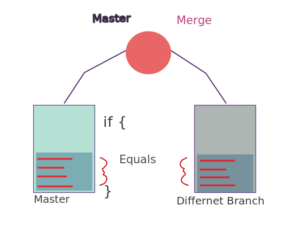

---

title: Git
---

## Folder Structure

```
[inside .git of a repo]
- HEAD
- logs
  - HEAD
  - refs
    - heads
- refs
  - heads
    - master
  - tags
- config
...
```

## Cheat sheet
```bash
git init
git remote add origin <url>
git pull

git add .
git config --global user.name "Chiao-Wei Hsu"
git config --global user.email "tony790927@gmail.com"

git push origin master

# or

git branch --set-upstream-to=origin/master master
# or
git push --set-upstream/-u origin master
git push


# show git tree history
git log --graph [--simplify-by-decoration --decorate --all --abbrev-commit --date=relative --branches --tags --pretty=format:'...' --oneline]

git show-branch --list --topo-order


# tracking/staging(to staging area / index / cached)
git add <=> git rm --cached [--ignore-unmatch] [--]  # "`rm` only in index" / "stage the `rm` in index without affecting worktree" and be careful doing it that way. If this was an existing file you just staged the deletion of the file. => use git reset HEAD <filename> instead
git add [--all --ignore-errors --]
git add -u #update  Update the index just where it already has an entry matching <pathspec>. This removes as well as modifies index entries to match the working tree, but **adds no new files.**
git add -A==--all==--no-ignore-removal  # Update the index not only where the working tree has a file matching <pathspec> but also where the index already has an entry. This adds, modifies, and removes index entries to match the working tree. If no <pathspec> is given when -A option is used, all files in the entire working tree are updated
git rm <=> rm & git add
git add --no-all==--ignore-removal  # Update the index by adding new files that are unknown to the index and files modified in the working tree, but ignore files that have been removed from the working tree. This option is a no-op when no <pathspec> is used. This option is primarily to help users who are used to older versions of Git
git add -- # This option can be used to separate command-line options from the list of files, (useful when filenames might be mistaken for command-line options).


git add -i # interactive
git add -p # Interactively choose hunks of patch
git add -e # Open the diff vs. the index in an editor and let the user edit it. After the editor was closed, adjust the hunk headers and apply the patch to the index. The intent of this option is to pick and choose lines of the patch to apply, or even to modify the contents of lines to be staged.

git add -n==--dry-run
git add --force # Allow adding otherwise ignored files.

# commiting/staging for commit
git commit -m "..."  # <=> 1. git revert 2. git reset HEAD^ (--mixed) 3. git reset --hard origin/master (local files will be changed!)
git commit -a  # == git add <all modified> + git commit


# branch
git checkout -b branchname
git status
git branch
git branch branchname

# show
git log
git log -U/--unified=0  # no context (context=0). implies -p (--patch)
git log -u/-p/--patch

git log --ancestry-path

git show <commit>	
git show <commit>:<file>
git ls-tree <commit>
git grep <commit>
git grep <regexp> $(git rev-list --all)  # search commited code instead of the commit message
git grep <regexp> $(git rev-list <rev1>..<rev2>)
git grep <regexp> $(git rev-list --all -- sub/dir) -- sub/dir
git grep -e <regexp1> [--or] -e <regexp2>
git grep -e <regexp1> --and -e <regexp2>
git grep --all-match -e <regexp1> -e <regexp2>  # AND all
git grep -l  # reporting files only


# diff
git diff # - [cached vs worktree] +
git diff <commit> # - commit [vs worktree] +
	git diff master
	git diff origin/master
git diff --cached <commit> # - commit [vs cached] +
	git diff --cached master # cached vs local master branch (after committed)
	git diff --cached # cached vs HEAD
git diff <commit> <commit> (<commit>..<commit>) # commit vs commit
	git diff master origin/master (git diff master..origin/master) # local master branch vs remote master 
	git diff master (git diff master..) # master vs HEAD

git diff -U/--unified=0  # no context (context=0). implies -p (--patch)


# update
git merge
git rebase
git pull  # git fetch + git merge (by default)
git pull --rebase  # git fetch + git rebase 

# update by branch default in PyCharm
git fetch origin [--progress --prune]
git stash save "Uncommitted changes before Update at 8/26/2019 11:34 AM"
git merge origin/master [--no-stat -v]
git stash pop
```

## Terminology

### git
**0. not shown in untracked files** <--(gitignore)-- **1. untracked files in workdir** <--(`git checkout --`/`git restore`)--|--(modify/new/delete/rename)--> **2. changes not staged for commit** <--(`git reset HEAD`/`git restore --staged`)--|--(`git add`/track/stage)--> **3. staging area(index)/Changes to be committed** <--(`git reset --soft/--mixed(directly to 2)/--hard(directly to 1)`)--|--(`git commit`/stage for commit)--> **4. a commit in HEAD (local repo)** --(`git push`)--> **5. a branch in a remote repository**

### PyCharm

**Ignored Files** <--gitignore-- **Unversioned Files (workdir)** --add/track/stage--> **Changes in Changelist / Excluded (index)**

## config (1. `/usr/local/etc/gitconfig`, 2.`~/.config/git/config`, 3. `~/.gitconfig`, 4. `<repo>/.git/config`, 5.`<repo>/.git/config.worktree`)
5 files in the order of reading, the last value takes precedence over values read earlier:

 - system: `$(prefix)/etc/gitconfig`, i.e., `/usr/local/etc/gitconfig` usually (The prefix environment variable git was compiled with.)

    - Bonus: `/etc` vs `/usr/local/etc or $prefix/etc`: `/etc` is used by your OS for its configuration files

      `/usr/local/etc` can be used for your config files by you and your addtionally installed software

 - global (Second user-specific): `$XDG_CONFIG_HOME/git/config` or `$HOME/.config/git/config` if `XDG_CONFIG_HOME` is not set. Overriddable by `~/.gitconfig`.

    - `XDG_CONFIG_HOME` is analogous to `/etc`, but should be default to `~/.config`

 - global (user-specific): ~/.gitconfig

 - repository: <repo>/.git/config

 - worktree: <repo>/.git/config.worktree (if extensions.worktreeConfig is present)

```bash
git config --system/--global/--local/--worktree

git config --global user.name "Chiao-Wei Hsu"
git config --global user.email "cwhsu@iis.sinica.edu.tw"

git config http.postBuffer 524288000  # Fix: The remote end hung up unexpectedly
```
```
user.username
core.autocrlf true
core.filemode false
core.editor vim
core.excludesfile <ignore_file>
core.whitespace fix,-indent-with-non-tab,trailing-space,cr-at-eol

web.browser google-chrome

diff.tool vimdiff
difftool.prompt false
alias.<name> ...

core.quotepath false
log.showSignature false
http.sslbackend schannel  # for windows
credential.helper 
```

## Resolve merge conflicts

```bash
git mergetool
```

## Alias

```bash
#config (1)
git config --global alias.lgb "log --graph --pretty=format:'%Cred%h%Creset -%C(yellow)%d%Creset %s %Cgreen(%cr) %C(bold blue)<%an>%Creset%n' --abbrev-commit --date=relative --branches"
git lgb


#config (2)
# in ~/.gitconfig
[alias]
    l = log --graph --oneline --decorate
    ll = log --graph --oneline --decorate --branches --tags
    lll = log --graph --oneline --decorate --all
```

## rm
Remove files from the index, or from the working tree and the index. 
 - git rm will not remove a file from just your working directory. (There is no option to remove a file only from the working tree and yet keep it in the index; use /bin/rm if you want to do that.)
 - The files being removed have to be identical to the tip of the branch, and no updates to their contents can be staged in the index, though that default behavior can be overridden with the -f option. 
 - When --cached is given, the staged content has to match either the tip of the branch or the file on disk, allowing the file to be removed from just the index.

## .git/info/exclude vs .gitignore vs ~/.gitignore (setting up manually required)

ref: https://stackoverflow.com/questions/22906851/when-would-you-use-git-info-exclude-instead-of-gitignore-to-exclude-files

### .git/info/exclude vs .gitignore

> The advantage of .gitignore is that it can be checked into the repository itself, unlike .git/info/exclude. Another advantage is that you can have multiple .gitignore files, one inside each directory/subdirectory for directory specific ignore rules, unlike .git/info/exclude.
> So, .gitignore is available across all clones of the repository. Therefore, in large teams all people are ignoring the same kind of files Example *.db, *.log. And you can have more specific ignore rules because of multiple .gitignore.
> .git/info/exclude is available for individual clones only, hence what one person ignores in his clone is not available in some other person's clone. For example, if someone uses Eclipse for development it may make sense for that developer to add .build folder to .git/info/exclude because other devs may not be using Eclipse.
> In general, files/ignore rules that have to be universally ignored should go in .gitignore, and otherwise files that you want to ignore only on your local clone should go into .git/info/exclude

### ~/.gitignore

setup manually

```bash
# Linux
git config --global core.excludesfile ~/.gitignore
```

```powershell
# Windows
git config --global core.excludesfile %USERPROFILE%\.gitignore
```

These will add to the ~/.gitconfig file

```ini
[core]
        excludesfile = /home/username/.gitignore
```


## undo

```bash
git reset --hard|mixed|soft ORIG_HEAD # move the HEAD and branch ref pointer to a specified commit; default to mixed
 - soft: HEAD
 - mixed: HEAD, index
 - hard: HEAD, index, worktree (all)
 others:
	- --merge: HEAD, index, worktree that have no unstaged changes
	- --keep: HEAD, index, worktree (abort if  a file that is different between <commit> and HEAD has local changes)

git checkout # move the HEAD and branch ref pointer to a specified commit

git revert HEAD^# create a revert commit message

```

Command	| Scope |	Common use cases
---|---|---
git reset |	Commit-level |	Discard commits in a private branch or throw away uncommited changes
git reset |	File-level |	Unstage a file
git checkout |	Commit-level |	Switch between branches or inspect old snapshots
git checkout |	File-level |	Discard changes in the working directory
git revert |	Commit-level |	Undo commits in a public branch
git revert |	File-level |	(N/A)

## delete
```bash
git branch -d branchname

# use with care
git push origin --delete branchname
git push origin feature --force
```

## rebase

```bash
$ git rebase -i
$ git rebase [--onto new_base]  [upstream [branch]]
# As a special case, you may use "A...B" as a shortcut for the merge base of A and B if there is exactly one merge base. You can leave out at most one of A and B, in which case it defaults to HEAD, e.g. A... or ...B (means merge base of A...HEAD and HEAD...B)
$ git rebase --onto master next topic  # new_base upstream branch
$ git rebase --onto master --fork-point next topic  # same above
# before
               o---o---o---o---o  master
                    \
                     o---o---o---o---o  next
                                      \
                                       o---o---o  topic
# after
               o---o---o---o---o  master
                   |            \
                   |             o'--o'--o'  topic
                    \
                     o---o---o---o---o  next

$ git rebase --keep-base
# Set the starting point at which to create the new commits to the merge base of <upstream> <branch>. Running git rebase --keep-base <upstream> <branch> is equivalent to running git rebase --onto <upstream>... <upstream>.
# https://stackoverflow.com/questions/53234798/can-i-rebase-on-a-branchs-fork-point-without-explicitly-specifying-the-parent
# The new "git rebase --keep-base <upstream>" tries to find the original base of the topic being rebased and rebase on top of that same base, which is useful when running the "git rebase -i" (and its limited variant "git rebase -x").
$ (feature) git rebase master  # upstream=master, branch=HEAD(feature), new_base=upstream=master, fork-point=upstream=master
$ (feature) git rebase --keep-base master  
$ (feature) git rebase --keep-base master = git rebase --onto master...HEAD master
# upstream=master, branch=HEAD(feature), new_base=upstream...HEAD=master...HEAD, fork-point=upstream=master

```

|| description                                                  |unspecified|
|---|---|---|
|--onto <new_base>|Starting point at which to create the new commits.|assume <upstream>|
|--fork-point <br />--no-fork-point (default)|Use **reflog** to find a better common ancestor between <upstream> and <branch> when calculating which commits have been introduced by <branch>.<br />When `--fork-point` is active, fork_point will be used instead of <upstream> to calculate the set of commits to rebase, where fork_point is the result of `git merge-base --fork-point            <upstream> <branch>`|assume <upstream> (when --fork-point is active and not specifying the <fork_point>)|
|<upstream>|Upstream branch to compare against. May be any valid commit, not just an existing branch name. Defaults to the configured upstream for the current branch.|defaults to branch.<name>.remote, branch.<name>.merge<br />--fork-point assumed if unspecified<br />--no-fork-point if specified|
|<branch>|Working branch; defaults to HEAD.|assume current branch|

## Format / Create / Apply Patches / Mailboxes

```bash
# -- Mailboxes --
$ git format-patch <branch>
$ git format-patch <branch> -o <directory>
patches/0001-My-feature-commit-1.patch
patches/0002-My-feature-commit-2.patch
$ git format-patch -1 <commit_sha>

# Apply a series of patches from a mailbox
$ git am [(<mbox> | <Maildir>)...]  # takes a mailbox of commits formatted as an email messages (e.g. the output of git format-patch)

# -- Patches --

# Apply a patch to files and/or to the index
$ git apply [<patch>...]  # takes the output of git diff
```

- [`git am` uses `git apply` behind the scenes](https://github.com/git/git/blob/bbcefff/git-am.sh#L151), but does more work before (reading a `Maildir` or `mbox`, and parsing email messages) and after (creating commits).
- `git apply` would work for output from `git format-patch` as well but the changes would be unstaged and would need to be committed (thus creating a different commit point in the index they are applied to). With `git am` you would be carrying the commit information (along with author, etc.) into the index it is applied to. `git apply` then is for patching your repo (bad), `git am` can take legit feature changes and include it into your repo (preferred approach).

## Move the branch to a commit

https://stackoverflow.com/questions/5471174/move-branch-pointer-to-different-commit-without-checkout

```
# method 1: update-ref (with message to reflog) <= preferred
git update-ref -m "reset: Reset <branch> to <new commit>" refs/heads/<branch> <commit>

# method 2
git checkout branch-name
git reset --hard new-tip-commit

# method 3
git branch -f/--force <branch-name> [<new-tip-commit>]
#-f: Reset <branchname> to <startpoint>, even if <branchname> exists already. Without -f, git branch refuses to change an existing branch. In combination with -d (or --delete), allow deleting the branch irrespective of its merged status. In combination with -m (or --move), allow renaming the branch even if the new branch name already exists, the same applies for -c (or --copy).
```

## git merge-base

- *git merge-base* finds best common ancestor(s) between two commits to use in a three-way merge.
- One common ancestor is *better* than another common ancestor if the latter is an ancestor of the former. 
- A common ancestor that does not have any better common ancestor is a *best common ancestor*, i.e. a *merge base*. Note that there can be more than one merge base for a pair of commits.

### tldr

```
                  o---o---o---o---C
                 /
                /   o---o---o---B
               /   /
           ---2---1---o---o---o---A
$ git merge-base A B C  # return 1
$ git merge-base --octopus A B C  # return 2
$ git merge-base --fork-point  # will consider reflog (history of a branch tip)

$ fork_point=$(git merge-base --fork-point origin/master topic)
$ git rebase --onto origin/master $fork_point topic  # D0'..D'
                            o---B2
                           /
           ---o---o---B1--o---o---o---B (origin/master)
                   \                   \
                    B0                  D0'--D1'--D' (topic - updated)
                     \
                      D0---D1---D (topic - old)

```


```
Given two commits A and B, git merge-base A B will output a commit which is reachable from both A and B through the parent relationship.

       For example, with this topology:

                    o---o---o---B
                   /
           ---o---1---o---o---o---A

       the merge base between A and B is 1.

       Given three commits A, B and C, git merge-base A B C will compute the merge base between A and a hypothetical commit M, which is a merge between B and C. For example, with this topology:

                  o---o---o---o---C
                 /
                /   o---o---o---B
               /   /
           ---2---1---o---o---o---A

       the result of git merge-base A B C is 1. This is because the equivalent topology with a merge commit M between B and C is:

                  o---o---o---o---o
                 /                 \
                /   o---o---o---o---M
               /   /
           ---2---1---o---o---o---A

       and the result of git merge-base A M is 1. Commit 2 is also a common ancestor between A and M, but 1 is a better common ancestor, because 2 is an ancestor of 1. Hence, 2 is not a merge base.
       
The result of git merge-base --octopus A B C is 2, because 2 is the best common ancestor of all commits.
```

## git range operator

https://stackoverflow.com/questions/22993011/caret-dot-dot-notaion-in-git

https://stackoverflow.com/questions/36433572/how-does-ancestry-path-work-with-git-log

- used in `git log` (`git rev-list`)
- `git diff` has `..` operator, but this is different. `git diff` only takes two commits instead of a range in fact. Don't be confused with this.

### double dot notation (`..`): set substraction

- shorthand syntax for **set subtraction** `A..B`
- same as `B ^A` (`^`: excluding)

The manual defines it as

> ```
> <rev1>..<rev2>
> ```
>
> Include commits that are reachable from `<rev2>` but exclude those that are reachable from `<rev1>`.

…and slightly above that

> ```
> ^<rev>
> ```
>
> Exclude commits that are reachable from (i.e. ancestors of) .

 That is, if we write B..D for instance, it means: "Select D with ancestry, and then select B with ancestry, and then give me the set of commits from the D selection after excluding (subtracting away) all commits from the B selection."

```
     o---o
    /     \
A--o       \
    \   B   \
     \ /     \
      o       C--D
       \     /
        o---o
        
# B..D

     o---o
          \
           \
            \
             \
              C--D
             /
        o---o
```

### three-dot notation (`...`): set XOR

- git finds all commits that are reachable from *either* commit, but not from *both*

```
     o--I
    /
G--H
    \   J
     \ /
      K
       \
        o--L
        
# I...L or L...I (the same)
     o--I
 


      K
       \
        o--L
```

### `git log/rev-list --ancestry-path`

> When given a range of commits to display (e.g. `commit1..commit2` or `commit2 ^commit1`), only display commits that exist directly on the ancestry chain between the `commit1` and `commit2`, i.e. commits that are both descendants of `commit1`, and ancestors of `commit2`.

**=> *discard* items that are not children of the merge base**

```
     o---o
    /     \
A--o       \
    \   B   \
     \ /     \
      o       C--D
       \     /
        o---o
        
# B...D, without the special --ancestry-path
     o---o
          \
           \
        B   \
             \
              C--D
             /
        o---o
        
# B...D, with --ancestry-path 


        B

              C--D
             /
        o---o
```

## --rebase-merges

```
...--o--*--o---o   <-- main
      \  \
       \  A--B---F--G   <-- branch
        \       /
         C--D--E

$ git rebase --rebase-merges=no-rebase-cousins

                 A'-B'---------F'-G'  <-- branch
                /             /
...--o--*--o---o   <-- main  /
      \  \                  /
       \  A--B---F--G      /  [abandoned]
        \       /_________/
         C--D--E

$ git rebase --rebase-merges=rebase-cousins
                  C'-D'-E'
                 /       \
                /         \
               / A'-B'-----F'-G'  <-- branch
               |/
...--o--*--o---o   <-- main
      \  \
       \  A--B---F--G   [abandoned]
        \       /
         C--D--E
```

## git merge strategies

https://stackoverflow.com/questions/366860/when-would-you-use-the-different-git-merge-strategies

https://www.geeksforgeeks.org/merge-strategies-in-git/

### Recursive

- ours: This option conflicts to be auto-resolved cleanly by favoring the 'our' version. Changes from the 'theirs' side are automatically incorporated if they do not conflict.

- theirs: opposite of ours

- patience: This option spends extra time to avoid mis-merges on unimportant matching lines. This options is best used when branches to be merged have extremely diverged.

- diff-algorithim: This option allows specification of an explicit diff-algorithim. The diff-algorithims are shared with the `git diff` command.

- ignore-*

  ```
    ignore-space-change
    ignore-all-space
    ignore-space-at-eol
    ignore-cr-at-eol
  ```

  A set of options that target whitespace characters. Any line that matches the subset of the passed option will be ignored.

- renormalize

  This option runs a check-out and check-in on all of the tree git trees while resolving a three-way merge. This option is intended to be used with merging branches with differing `checkin`/`checkout` states.

- no-normalize

  Disables the renormalize option. This overrides the `merge.renormalize` configuration variable.

- no-renames

  This option will ignore renamed files during the merge.

- find-renames=n

  This is the default behavior. The recursive merge will honor file renames. The `n` parameter can be used to pass a threshold for rename similarity. The default `n` value is `100%.`

- subtree

  This option borrows from the `subtree` strategy. Where the strategy operates on two trees and modifies how to make them match on a shared ancestor, this option instead operates on the path metadata of the tree to make them match.

### Ours

Ours == I want to pull in another head, but throw away all of the changes that head introduces.

This keeps the history of a branch without any of the effects of the branch.

(Read: It is not even looked at the changes between those branches. The branches are just merged and nothing is done to the files. If you want to merge in the other branch and every time there is the question "our file version or their version" you can use `git merge -X ours`)

### Octopus

The default merge strategy for more than two heads. When more than one branch is passed octopus is automatically engaged. If a merge has conflicts that need manual resolution octopus will refuse the merge attempt. It is primarily used for bundling similar feature branch heads together.


### Subtree

Subtree is useful when you want to merge in another project into a subdirectory of your current project. Useful when you have a library you don't want to include as a submodule.

This is a modified recursive strategy. When merging trees A and B, if B corresponds to a subtree of A, B is first adjusted to match the tree structure of A, instead of reading the trees at the same level. This adjustment is also done to the common ancestor tree.


### Resolve

Recursive is the current default two-head strategy, but after some searching I finally found some info about the "resolve" merge strategy.

This strategy can only resolve two heads (i.e. the current branch and another branch you pulled from) using a 3-way merge algorithm. It tries to carefully detect criss-cross merge ambiguities and is considered generally safe and fast.

**Note:** ‘**-s resolve**‘ solves only trivial conditions. If code differs between branches, the conflict has to be solved manually.

Taken from O'Reilly book [Version Control with Git](http://books.google.com/books?id=e9FsGUHjR5sC&pg=PA142&lpg=PA142&dq=git merge "-s resolve"&source=bl&ots=Zi5h3H_bqh&sig=Lp_-I3uOvMbYBcsraQEe6WbFMhU&hl=en&sa=X&ei=cPW0T7qzEsae2gWeq9w9&ved=0CGQQ6AEwAw#v=onepage&q=git merge "-s resolve"&f=false) ([Amazon](https://rads.stackoverflow.com/amzn/click/com/B002L4EXHO)) (paraphrased):

> Originally, "resolve" was the default strategy for Git merges.
>
> In criss-cross merge situations, where there is more than one possible merge basis, the resolve strategy works like this: pick one of the possible merge bases, and hope for the best. This is actually not as bad as it sounds. It often turns out that the users have been working on different parts of the code. In that case, Git detects that it's remerging some changes that are already in place and skips the duplicate changes, avoiding the conflict. Or, if these are slight changes that do cause conflict, at least the conflict should be easy for the developer to handle..



**ORT** ("**Ostensibly Recursive's Twin**") (Git 2.3 2021)