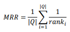
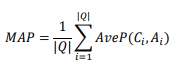
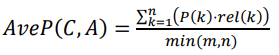
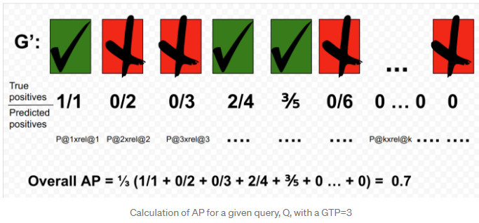
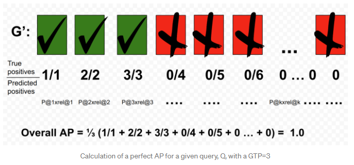
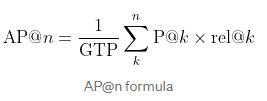
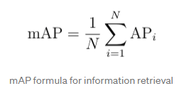
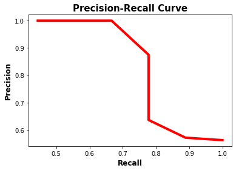
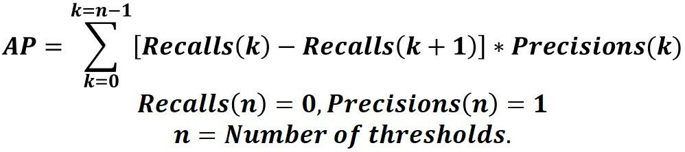

## Tasks

- Question Answer Match Task
  - NLPCC-DBQA
    - Evaluation Metrics: MRR, Accuracy@N, Averaged F1, MAP


## Evaluation Metrics

- Mean Reciprocal Rank (MRR)

  

  |𝑄| denotes the total number of questions in the evaluation set, 𝑟𝑎𝑛𝑘𝑖 denotes the position of the first correct answer in the generated answer set 𝐶𝑖 for the 𝑖 𝑡ℎ question 𝑄𝑖 . If 𝐶𝑖 doesn’t overlap with the golden answers 𝐴𝑖 for 𝑄𝑖 ,  1 𝑟𝑎𝑛𝑘𝑖 is set to 0.

- Mean Average Precision (MAP) for QA match (question answer sentence binary labeling like supporting evidence retrieval; multiple choice)

  

  

   𝑘 is the rank in the  sequence of retrieved answer sentences. 𝑚 is the number of correct answer sentences.  𝑛 is the number of retrieved answer sentences. If 𝑚𝑖𝑛(𝑚, 𝑛) is 0, 𝐴𝑣𝑒𝑃(𝐶, 𝐴) is set  to 0. 𝑃(𝑘) is the precision at cut-off 𝑘 in the list. 𝑟𝑒𝑙(𝑘) is an indicator function  equaling 1 if the item at rank 𝑘 is an answer sentence, and 0 otherwise

  

- MAP for IR

  [Breaking Down Mean Average Precision (mAP) | by Ren Jie Tan | Towards Data Science](https://towardsdatascience.com/breaking-down-mean-average-precision-map-ae462f623a52)

  - cut-off k (rank):

    By default, precision takes all the retrieved documents into account, but however, it can also be evaluated at a given number of retrieved documents, commonly known as cut-off rank, where the model is only assessed by considering only its top-most queries. The measure is called *precision at k or* P@K.

    

    Using the Precision formula above, we get the following,

    P@1 = 1/1 = 1

    P@2 = 1/2 = 0.5

    P@3 = 1/3 = 0.33

    P@4 = 2/4 = 0.5

    P@5 = 3/5 = 0.6

    P@n = 3/n

  - AP

    

    

    

    - What AP does, in this case, is to penalise models that are not able to sort G’ with TPs leading the set. It provides a number that is able to quantify the goodness of the sort based on the score function d( , ).
    - By dividing the sum of precision with the total GTP instead of dividing by the length of G’ allows a better representation for queries that only have a few GTP.

  - MAP

    

- Mean Average Precision (MAP) for Object Detection

  [Mean Average Precision (mAP) Explained | Paperspace Blog](https://blog.paperspace.com/mean-average-precision/)
  
  The **average precision (AP)** is a way to summarize the precision-recall curve into a single value representing the average of all precisions. The AP is calculated according to the next equation. Using a loop that goes through all precisions/recalls, the difference between the current and next recalls is calculated and then multiplied by the current precision. In other words, the AP is the weighted sum of precisions at each threshold where the weight is the increase in recall.

  
  
  
  
  
  
  ```python
  import numpy
  import sklearn.metrics
  
  def precision_recall_curve(y_true, pred_scores, thresholds):
      precisions = []
      recalls = []
      
      for threshold in thresholds:
          y_pred = ["positive" if score >= threshold else "negative" for score in pred_scores]
  
          precision = sklearn.metrics.precision_score(y_true=y_true, y_pred=y_pred, pos_label="positive")
          recall = sklearn.metrics.recall_score(y_true=y_true, y_pred=y_pred, pos_label="positive")
          
          precisions.append(precision)
          recalls.append(recall)
  
      return precisions, recalls
  
  y_true = ["positive", "negative", "negative", "positive", "positive", "positive", "negative", "positive", "negative", "positive", "positive", "positive", "positive", "negative", "negative", "negative"]
  pred_scores = [0.7, 0.3, 0.5, 0.6, 0.55, 0.9, 0.4, 0.2, 0.4, 0.3, 0.7, 0.5, 0.8, 0.2, 0.3, 0.35]
  thresholds=numpy.arange(start=0.2, stop=0.7, step=0.05)
  
  precisions, recalls = precision_recall_curve(y_true=y_true, 
                                               pred_scores=pred_scores, 
                                               thresholds=thresholds)
  
  precisions.append(1)
  recalls.append(0)
  
  precisions = numpy.array(precisions)
  recalls = numpy.array(recalls)
  
  AP = numpy.sum((recalls[:-1] - recalls[1:]) * precisions[:-1])
  print(AP)
  ```
  
  