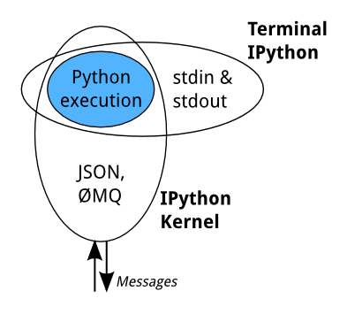
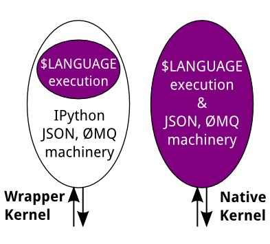

IPython (Ver 7.22.0 Date: 28 Apr 2021)

Many pieces which were previously part of IPython were split out in version 4, and now have their own documentation.

- Jupyter

   

  includes:

  - The [Jupyter notebook](https://jupyter-notebook.readthedocs.io/en/latest/) and [notebook file format](https://nbformat.readthedocs.io/en/latest/format_description.html)
  - The [Jupyter Qt console](https://qtconsole.readthedocs.io/en/latest/)
  - The [kernel messaging protocol](https://jupyter-client.readthedocs.io/en/latest/messaging.html)
  - Many other components

- [ipyparallel](https://ipyparallel.readthedocs.io/en/stable) (formerly `IPython.parallel`)

- [ipykernel](https://ipykernel.readthedocs.io/en/latest/) (minimal docs, only release notes for the ipykernel package)

- [ipywidgets](https://ipywidgets.readthedocs.io/en/latest/) (formerly `IPython.html.widgets`)

- [Traitlets](https://traitlets.readthedocs.io/en/stable/), the config system used by IPython and Jupyter


```
# IPython (5.5.0)

## line/cell magic
cp ${f}.txt $bar (Variable expansion in magics and system commands)
%alias
%pprint

%automagic, %autosave, %autocall, %alias_magic, %rehashx (system commands w/o !)
f 1,2 (with %autocall) = /f 1,2  ( meaning f(1,2) )
,f 1 2 ( meaning f("1","2") )
;f 1 2 ( meaning f("1 2") )

%config Class.prop=value
%doctest_mode
%debug
%pdb
%pdoc, obj?, obj??, %magic, %help, ?, %pdb?, %pdb??
?ob.*abc*

%timeit x=10

%%timeit x=2**100
x**100
(time 'x**100' with a setup of 'x=2**100'; setup code is notcounted. This is an example of a cell magic.)

%%[html, HTML, svg, SVG,bash, javascript, js, latex, perl, ruby, sh,
sx=system
time=timeit

## History
_ih, _oh, _dh, _i3, _oh[2:4]
%rep 81
exec _i81
_i, _ii, _iii, ...
_, __, ___, ...
%hist
%hist -g foo (Search command history of (almost) all sessions for 'foo'.)
%hist 8/1-~6/5 (Command history from line 1 of 8 sessions to line 5 of 6 sessions ago.)

## list
%lf
Alias for `!ls -F -o --color %l | grep ^-`
%lk
Alias for `!ls -F -o --color %l | grep ^l`
%ll
Alias for `!ls -F -o --color`

```

## How IPython works

### Terminal IPython

When you type `ipython`, you get the original IPython interface, running in the terminal. It does something like this:

```
while True:
    code = input(">>> ")
    exec(code)
```

Of course, it’s much more complex, because it has to deal with multi-line code, tab completion using [`readline`](https://docs.python.org/3/library/readline.html#module-readline), magic commands, and so on. But the model is like that: prompt the user for some code, and when they’ve entered it, exec it in the same process. This model is often called a REPL, or Read-Eval-Print-Loop.

### The IPython Kernel

All the other interfaces—the Notebook, the Qt console, `ipython console` in the terminal, and third party interfaces—use the IPython Kernel. This is a separate process which is responsible for running user code, and things like computing possible completions. Frontends communicate with it using JSON messages sent over [ZeroMQ](http://zeromq.org/) sockets; the protocol they use is described in [Messaging in Jupyter](https://jupyter-client.readthedocs.io/en/latest/messaging.html#messaging).

The core execution machinery for the kernel is shared with terminal IPython:



A kernel process can be connected to more than one frontend simultaneously. In this case, the different frontends will have access to the same variables.

This design was intended to allow easy development of different frontends based on the same kernel, but it also made it possible to support new languages in the same frontends, by developing kernels in those languages, and we are refining IPython to make that more practical.

Today, there are two ways to develop a kernel for another language. Wrapper kernels reuse the communications machinery from IPython, and implement only the core execution part. Native kernels implement execution and communications in the target language:



Wrapper kernels are easier to write quickly for languages that have good Python wrappers, like [octave_kernel](https://pypi.python.org/pypi/octave_kernel), or languages where it’s impractical to implement the communications machinery, like [bash_kernel](https://pypi.python.org/pypi/bash_kernel). Native kernels are likely to be better maintained by the community using them, like [IJulia](https://github.com/JuliaLang/IJulia.jl) or [IHaskell](https://github.com/gibiansky/IHaskell).

## The Frontend/Kernel Model

The traditional IPython (`ipython`) consists of a single process that combines a terminal based UI with the process that runs the users code.

While this traditional application still exists, the modern IPython consists of two processes:

- Kernel: this is the process that runs the users code.
- Frontend: this is the process that provides the user interface where the user types code and sees results.

IPython currently has 3 frontends:

- Terminal Console (`ipython console`)
- Qt Console (`ipython qtconsole`)
- Notebook (`ipython notebook`)

The Kernel and Frontend communicate over a ZeroMQ/JSON based messaging protocol, which allows multiple Frontends (even of different types) to communicate with a single Kernel. This opens the door for all sorts of interesting things, such as connecting a Console or Qt Console to a Notebook's Kernel. For example, you may want to connect a Qt console to your Notebook's Kernel and use it as a help browser, calling `??` on objects in the Qt console (whose pager is more flexible than the one in the notebook).

This Notebook describes how you would connect another Frontend to a Kernel that is associated with a Notebook.

### Manual connection

To connect another Frontend to a Kernel manually, you first need to find out the connection information for the Kernel using the `%connect_info` magic:


### ipykernel

```bash
python -m ipykernel install [--user] --name <name> --display-name <nameinjupyter>
#Installed kernelspec en_event_coref in /usr/local/share/jupyter/kernels/<name>
#install a new kernel in this environment where the interpreter of `python -m` is (you can check w/ `which python`) (and when you select this kernel, you are using the python interpreter of this enviroment)

jupyter kernelspec list
jupyter kernelspec list | grep my_env
jupyter kernelspec uninstall <kernelname>
```

## Kernels of other langugages

```bash
pip install mariadb_kernel
python -m mariadb_kernel.install

pip install bash_kernel
python -m bash_kernel.install
jupyter console --kernel bash
```


## Plotting with matplotlib

[matplotlib](http://matplotlib.org/) provides high quality 2D and 3D plotting for Python. [matplotlib](http://matplotlib.org/) can produce plots on screen using a variety of GUI toolkits, including Tk, PyGTK, PyQt4 and wxPython. It also provides a number of commands useful for scientific computing, all with a syntax compatible with that of the popular Matlab program.

To start IPython with matplotlib support, use the `--matplotlib` switch. If IPython is already running, you can run the [`%matplotlib`](https://ipython.readthedocs.io/en/latest/interactive/magics.html#magic-matplotlib) magic. If no arguments are given, IPython will automatically detect your choice of matplotlib backend. You can also request a specific backend with `%matplotlib backend`, where `backend` must be one of: ‘tk’, ‘qt’, ‘wx’, ‘gtk’, ‘osx’. In the web notebook and Qt console, ‘inline’ is also a valid backend value, which produces static figures inlined inside the application window instead of matplotlib’s interactive figures that live in separate windows.