ref: https://python-graph-gallery.com/donut-plot/
ref: https://seaborn.pydata.org/tutorial/distributions.html
ref: https://www.data-to-viz.com/


```python
# Libraries
import numpy as np
import matplotlib.pyplot as plt
from matplotlib.sankey import Sankey
 
# basic sankey chart
Sankey(flows=[0.25, 0.15, 0.60, -0.20, -0.15, -0.05, -0.50, -0.10], labels=['', '', '', 'First', 'Second', 'Third', 'Fourth', 'Fifth'], orientations=[-1, 1, 0, 1, 1, 1, 0,-1]).finish()
plt.title("Sankey diagram with default settings")

```


    Text(0.5, 1.0, 'Sankey diagram with default settings')


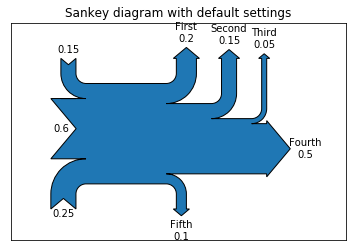


```python
# Libraries
import matplotlib.pyplot as plt
 
# Make data: I have 3 groups and 7 subgroups
group_names=['groupA', 'groupB', 'groupC']
group_size=[12,11,30]
subgroup_names=['A.1', 'A.2', 'A.3', 'B.1', 'B.2', 'C.1', 'C.2', 'C.3', 'C.4', 'C.5']
subgroup_size=[4,3,5,6,5,10,5,5,4,6]
 
# Create colors
a, b, c=[plt.cm.Blues, plt.cm.Reds, plt.cm.Greens]
 
# First Ring (outside)
fig, ax = plt.subplots()
ax.axis('equal')
mypie, _ = ax.pie(group_size, radius=1.3, labels=group_names, colors=[a(0.6), b(0.6), c(0.6)] )
plt.setp( mypie, width=0.3, edgecolor='white')
 
# Second Ring (Inside)
mypie2, _ = ax.pie(subgroup_size, radius=1.3-0.3, labels=subgroup_names, labeldistance=0.7, colors=[a(0.5), a(0.4), a(0.3), b(0.5), b(0.4), c(0.6), c(0.5), c(0.4), c(0.3), c(0.2)])
plt.setp( mypie2, width=0.4, edgecolor='white')
plt.margins(0,0)
 
# show it
plt.show()

```


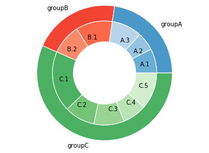


```python
# library & dataset
import seaborn as sns
df = sns.load_dataset('iris')
display(df)
# Just switch x and y
sns.violinplot( y=df["species"], x=df["sepal_length"] )
sns.plt.show()

```


<div>
<style scoped>
    .dataframe tbody tr th:only-of-type {
        vertical-align: middle;
    }

    .dataframe tbody tr th {
        vertical-align: top;
    }
    
    .dataframe thead th {
        text-align: right;
    }
</style>
<table border="1" class="dataframe">
  <thead>
    <tr style="text-align: right;">
      <th></th>
      <th>sepal_length</th>
      <th>sepal_width</th>
      <th>petal_length</th>
      <th>petal_width</th>
      <th>species</th>
    </tr>
  </thead>
  <tbody>
    <tr>
      <th>0</th>
      <td>5.1</td>
      <td>3.5</td>
      <td>1.4</td>
      <td>0.2</td>
      <td>setosa</td>
    </tr>
    <tr>
      <th>1</th>
      <td>4.9</td>
      <td>3.0</td>
      <td>1.4</td>
      <td>0.2</td>
      <td>setosa</td>
    </tr>
    <tr>
      <th>2</th>
      <td>4.7</td>
      <td>3.2</td>
      <td>1.3</td>
      <td>0.2</td>
      <td>setosa</td>
    </tr>
    <tr>
      <th>3</th>
      <td>4.6</td>
      <td>3.1</td>
      <td>1.5</td>
      <td>0.2</td>
      <td>setosa</td>
    </tr>
    <tr>
      <th>4</th>
      <td>5.0</td>
      <td>3.6</td>
      <td>1.4</td>
      <td>0.2</td>
      <td>setosa</td>
    </tr>
    <tr>
      <th>5</th>
      <td>5.4</td>
      <td>3.9</td>
      <td>1.7</td>
      <td>0.4</td>
      <td>setosa</td>
    </tr>
    <tr>
      <th>6</th>
      <td>4.6</td>
      <td>3.4</td>
      <td>1.4</td>
      <td>0.3</td>
      <td>setosa</td>
    </tr>
    <tr>
      <th>7</th>
      <td>5.0</td>
      <td>3.4</td>
      <td>1.5</td>
      <td>0.2</td>
      <td>setosa</td>
    </tr>
    <tr>
      <th>8</th>
      <td>4.4</td>
      <td>2.9</td>
      <td>1.4</td>
      <td>0.2</td>
      <td>setosa</td>
    </tr>
    <tr>
      <th>9</th>
      <td>4.9</td>
      <td>3.1</td>
      <td>1.5</td>
      <td>0.1</td>
      <td>setosa</td>
    </tr>
    <tr>
      <th>10</th>
      <td>5.4</td>
      <td>3.7</td>
      <td>1.5</td>
      <td>0.2</td>
      <td>setosa</td>
    </tr>
    <tr>
      <th>11</th>
      <td>4.8</td>
      <td>3.4</td>
      <td>1.6</td>
      <td>0.2</td>
      <td>setosa</td>
    </tr>
    <tr>
      <th>12</th>
      <td>4.8</td>
      <td>3.0</td>
      <td>1.4</td>
      <td>0.1</td>
      <td>setosa</td>
    </tr>
    <tr>
      <th>13</th>
      <td>4.3</td>
      <td>3.0</td>
      <td>1.1</td>
      <td>0.1</td>
      <td>setosa</td>
    </tr>
    <tr>
      <th>14</th>
      <td>5.8</td>
      <td>4.0</td>
      <td>1.2</td>
      <td>0.2</td>
      <td>setosa</td>
    </tr>
    <tr>
      <th>15</th>
      <td>5.7</td>
      <td>4.4</td>
      <td>1.5</td>
      <td>0.4</td>
      <td>setosa</td>
    </tr>
    <tr>
      <th>16</th>
      <td>5.4</td>
      <td>3.9</td>
      <td>1.3</td>
      <td>0.4</td>
      <td>setosa</td>
    </tr>
    <tr>
      <th>17</th>
      <td>5.1</td>
      <td>3.5</td>
      <td>1.4</td>
      <td>0.3</td>
      <td>setosa</td>
    </tr>
    <tr>
      <th>18</th>
      <td>5.7</td>
      <td>3.8</td>
      <td>1.7</td>
      <td>0.3</td>
      <td>setosa</td>
    </tr>
    <tr>
      <th>19</th>
      <td>5.1</td>
      <td>3.8</td>
      <td>1.5</td>
      <td>0.3</td>
      <td>setosa</td>
    </tr>
    <tr>
      <th>20</th>
      <td>5.4</td>
      <td>3.4</td>
      <td>1.7</td>
      <td>0.2</td>
      <td>setosa</td>
    </tr>
    <tr>
      <th>21</th>
      <td>5.1</td>
      <td>3.7</td>
      <td>1.5</td>
      <td>0.4</td>
      <td>setosa</td>
    </tr>
    <tr>
      <th>22</th>
      <td>4.6</td>
      <td>3.6</td>
      <td>1.0</td>
      <td>0.2</td>
      <td>setosa</td>
    </tr>
    <tr>
      <th>23</th>
      <td>5.1</td>
      <td>3.3</td>
      <td>1.7</td>
      <td>0.5</td>
      <td>setosa</td>
    </tr>
    <tr>
      <th>24</th>
      <td>4.8</td>
      <td>3.4</td>
      <td>1.9</td>
      <td>0.2</td>
      <td>setosa</td>
    </tr>
    <tr>
      <th>25</th>
      <td>5.0</td>
      <td>3.0</td>
      <td>1.6</td>
      <td>0.2</td>
      <td>setosa</td>
    </tr>
    <tr>
      <th>26</th>
      <td>5.0</td>
      <td>3.4</td>
      <td>1.6</td>
      <td>0.4</td>
      <td>setosa</td>
    </tr>
    <tr>
      <th>27</th>
      <td>5.2</td>
      <td>3.5</td>
      <td>1.5</td>
      <td>0.2</td>
      <td>setosa</td>
    </tr>
    <tr>
      <th>28</th>
      <td>5.2</td>
      <td>3.4</td>
      <td>1.4</td>
      <td>0.2</td>
      <td>setosa</td>
    </tr>
    <tr>
      <th>29</th>
      <td>4.7</td>
      <td>3.2</td>
      <td>1.6</td>
      <td>0.2</td>
      <td>setosa</td>
    </tr>
    <tr>
      <th>...</th>
      <td>...</td>
      <td>...</td>
      <td>...</td>
      <td>...</td>
      <td>...</td>
    </tr>
    <tr>
      <th>120</th>
      <td>6.9</td>
      <td>3.2</td>
      <td>5.7</td>
      <td>2.3</td>
      <td>virginica</td>
    </tr>
    <tr>
      <th>121</th>
      <td>5.6</td>
      <td>2.8</td>
      <td>4.9</td>
      <td>2.0</td>
      <td>virginica</td>
    </tr>
    <tr>
      <th>122</th>
      <td>7.7</td>
      <td>2.8</td>
      <td>6.7</td>
      <td>2.0</td>
      <td>virginica</td>
    </tr>
    <tr>
      <th>123</th>
      <td>6.3</td>
      <td>2.7</td>
      <td>4.9</td>
      <td>1.8</td>
      <td>virginica</td>
    </tr>
    <tr>
      <th>124</th>
      <td>6.7</td>
      <td>3.3</td>
      <td>5.7</td>
      <td>2.1</td>
      <td>virginica</td>
    </tr>
    <tr>
      <th>125</th>
      <td>7.2</td>
      <td>3.2</td>
      <td>6.0</td>
      <td>1.8</td>
      <td>virginica</td>
    </tr>
    <tr>
      <th>126</th>
      <td>6.2</td>
      <td>2.8</td>
      <td>4.8</td>
      <td>1.8</td>
      <td>virginica</td>
    </tr>
    <tr>
      <th>127</th>
      <td>6.1</td>
      <td>3.0</td>
      <td>4.9</td>
      <td>1.8</td>
      <td>virginica</td>
    </tr>
    <tr>
      <th>128</th>
      <td>6.4</td>
      <td>2.8</td>
      <td>5.6</td>
      <td>2.1</td>
      <td>virginica</td>
    </tr>
    <tr>
      <th>129</th>
      <td>7.2</td>
      <td>3.0</td>
      <td>5.8</td>
      <td>1.6</td>
      <td>virginica</td>
    </tr>
    <tr>
      <th>130</th>
      <td>7.4</td>
      <td>2.8</td>
      <td>6.1</td>
      <td>1.9</td>
      <td>virginica</td>
    </tr>
    <tr>
      <th>131</th>
      <td>7.9</td>
      <td>3.8</td>
      <td>6.4</td>
      <td>2.0</td>
      <td>virginica</td>
    </tr>
    <tr>
      <th>132</th>
      <td>6.4</td>
      <td>2.8</td>
      <td>5.6</td>
      <td>2.2</td>
      <td>virginica</td>
    </tr>
    <tr>
      <th>133</th>
      <td>6.3</td>
      <td>2.8</td>
      <td>5.1</td>
      <td>1.5</td>
      <td>virginica</td>
    </tr>
    <tr>
      <th>134</th>
      <td>6.1</td>
      <td>2.6</td>
      <td>5.6</td>
      <td>1.4</td>
      <td>virginica</td>
    </tr>
    <tr>
      <th>135</th>
      <td>7.7</td>
      <td>3.0</td>
      <td>6.1</td>
      <td>2.3</td>
      <td>virginica</td>
    </tr>
    <tr>
      <th>136</th>
      <td>6.3</td>
      <td>3.4</td>
      <td>5.6</td>
      <td>2.4</td>
      <td>virginica</td>
    </tr>
    <tr>
      <th>137</th>
      <td>6.4</td>
      <td>3.1</td>
      <td>5.5</td>
      <td>1.8</td>
      <td>virginica</td>
    </tr>
    <tr>
      <th>138</th>
      <td>6.0</td>
      <td>3.0</td>
      <td>4.8</td>
      <td>1.8</td>
      <td>virginica</td>
    </tr>
    <tr>
      <th>139</th>
      <td>6.9</td>
      <td>3.1</td>
      <td>5.4</td>
      <td>2.1</td>
      <td>virginica</td>
    </tr>
    <tr>
      <th>140</th>
      <td>6.7</td>
      <td>3.1</td>
      <td>5.6</td>
      <td>2.4</td>
      <td>virginica</td>
    </tr>
    <tr>
      <th>141</th>
      <td>6.9</td>
      <td>3.1</td>
      <td>5.1</td>
      <td>2.3</td>
      <td>virginica</td>
    </tr>
    <tr>
      <th>142</th>
      <td>5.8</td>
      <td>2.7</td>
      <td>5.1</td>
      <td>1.9</td>
      <td>virginica</td>
    </tr>
    <tr>
      <th>143</th>
      <td>6.8</td>
      <td>3.2</td>
      <td>5.9</td>
      <td>2.3</td>
      <td>virginica</td>
    </tr>
    <tr>
      <th>144</th>
      <td>6.7</td>
      <td>3.3</td>
      <td>5.7</td>
      <td>2.5</td>
      <td>virginica</td>
    </tr>
    <tr>
      <th>145</th>
      <td>6.7</td>
      <td>3.0</td>
      <td>5.2</td>
      <td>2.3</td>
      <td>virginica</td>
    </tr>
    <tr>
      <th>146</th>
      <td>6.3</td>
      <td>2.5</td>
      <td>5.0</td>
      <td>1.9</td>
      <td>virginica</td>
    </tr>
    <tr>
      <th>147</th>
      <td>6.5</td>
      <td>3.0</td>
      <td>5.2</td>
      <td>2.0</td>
      <td>virginica</td>
    </tr>
    <tr>
      <th>148</th>
      <td>6.2</td>
      <td>3.4</td>
      <td>5.4</td>
      <td>2.3</td>
      <td>virginica</td>
    </tr>
    <tr>
      <th>149</th>
      <td>5.9</td>
      <td>3.0</td>
      <td>5.1</td>
      <td>1.8</td>
      <td>virginica</td>
    </tr>
  </tbody>
</table>
<p>150 rows × 5 columns</p>
</div>


    ---------------------------------------------------------------------------
    
    AttributeError                            Traceback (most recent call last)
    
    <ipython-input-54-798cb88292a4> in <module>
          5 # Just switch x and y
          6 sns.violinplot( y=df["species"], x=df["sepal_length"] )
    ----> 7 sns.plt.show()


    AttributeError: module 'seaborn' has no attribute 'plt'


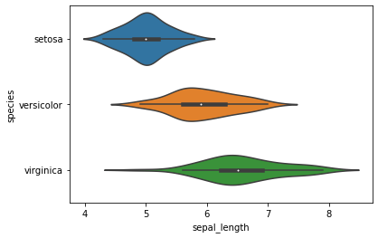


```python
df
```


<div>
<style scoped>
    .dataframe tbody tr th:only-of-type {
        vertical-align: middle;
    }

    .dataframe tbody tr th {
        vertical-align: top;
    }
    
    .dataframe thead th {
        text-align: right;
    }
</style>
<table border="1" class="dataframe">
  <thead>
    <tr style="text-align: right;">
      <th></th>
      <th>sepal_length</th>
      <th>sepal_width</th>
      <th>petal_length</th>
      <th>petal_width</th>
      <th>species</th>
    </tr>
  </thead>
  <tbody>
    <tr>
      <th>0</th>
      <td>5.1</td>
      <td>3.5</td>
      <td>1.4</td>
      <td>0.2</td>
      <td>setosa</td>
    </tr>
    <tr>
      <th>1</th>
      <td>4.9</td>
      <td>3.0</td>
      <td>1.4</td>
      <td>0.2</td>
      <td>setosa</td>
    </tr>
    <tr>
      <th>2</th>
      <td>4.7</td>
      <td>3.2</td>
      <td>1.3</td>
      <td>0.2</td>
      <td>setosa</td>
    </tr>
    <tr>
      <th>3</th>
      <td>4.6</td>
      <td>3.1</td>
      <td>1.5</td>
      <td>0.2</td>
      <td>setosa</td>
    </tr>
    <tr>
      <th>4</th>
      <td>5.0</td>
      <td>3.6</td>
      <td>1.4</td>
      <td>0.2</td>
      <td>setosa</td>
    </tr>
    <tr>
      <th>5</th>
      <td>5.4</td>
      <td>3.9</td>
      <td>1.7</td>
      <td>0.4</td>
      <td>setosa</td>
    </tr>
    <tr>
      <th>6</th>
      <td>4.6</td>
      <td>3.4</td>
      <td>1.4</td>
      <td>0.3</td>
      <td>setosa</td>
    </tr>
    <tr>
      <th>7</th>
      <td>5.0</td>
      <td>3.4</td>
      <td>1.5</td>
      <td>0.2</td>
      <td>setosa</td>
    </tr>
    <tr>
      <th>8</th>
      <td>4.4</td>
      <td>2.9</td>
      <td>1.4</td>
      <td>0.2</td>
      <td>setosa</td>
    </tr>
    <tr>
      <th>9</th>
      <td>4.9</td>
      <td>3.1</td>
      <td>1.5</td>
      <td>0.1</td>
      <td>setosa</td>
    </tr>
    <tr>
      <th>10</th>
      <td>5.4</td>
      <td>3.7</td>
      <td>1.5</td>
      <td>0.2</td>
      <td>setosa</td>
    </tr>
    <tr>
      <th>11</th>
      <td>4.8</td>
      <td>3.4</td>
      <td>1.6</td>
      <td>0.2</td>
      <td>setosa</td>
    </tr>
    <tr>
      <th>12</th>
      <td>4.8</td>
      <td>3.0</td>
      <td>1.4</td>
      <td>0.1</td>
      <td>setosa</td>
    </tr>
    <tr>
      <th>13</th>
      <td>4.3</td>
      <td>3.0</td>
      <td>1.1</td>
      <td>0.1</td>
      <td>setosa</td>
    </tr>
    <tr>
      <th>14</th>
      <td>5.8</td>
      <td>4.0</td>
      <td>1.2</td>
      <td>0.2</td>
      <td>setosa</td>
    </tr>
    <tr>
      <th>15</th>
      <td>5.7</td>
      <td>4.4</td>
      <td>1.5</td>
      <td>0.4</td>
      <td>setosa</td>
    </tr>
    <tr>
      <th>16</th>
      <td>5.4</td>
      <td>3.9</td>
      <td>1.3</td>
      <td>0.4</td>
      <td>setosa</td>
    </tr>
    <tr>
      <th>17</th>
      <td>5.1</td>
      <td>3.5</td>
      <td>1.4</td>
      <td>0.3</td>
      <td>setosa</td>
    </tr>
    <tr>
      <th>18</th>
      <td>5.7</td>
      <td>3.8</td>
      <td>1.7</td>
      <td>0.3</td>
      <td>setosa</td>
    </tr>
    <tr>
      <th>19</th>
      <td>5.1</td>
      <td>3.8</td>
      <td>1.5</td>
      <td>0.3</td>
      <td>setosa</td>
    </tr>
    <tr>
      <th>20</th>
      <td>5.4</td>
      <td>3.4</td>
      <td>1.7</td>
      <td>0.2</td>
      <td>setosa</td>
    </tr>
    <tr>
      <th>21</th>
      <td>5.1</td>
      <td>3.7</td>
      <td>1.5</td>
      <td>0.4</td>
      <td>setosa</td>
    </tr>
    <tr>
      <th>22</th>
      <td>4.6</td>
      <td>3.6</td>
      <td>1.0</td>
      <td>0.2</td>
      <td>setosa</td>
    </tr>
    <tr>
      <th>23</th>
      <td>5.1</td>
      <td>3.3</td>
      <td>1.7</td>
      <td>0.5</td>
      <td>setosa</td>
    </tr>
    <tr>
      <th>24</th>
      <td>4.8</td>
      <td>3.4</td>
      <td>1.9</td>
      <td>0.2</td>
      <td>setosa</td>
    </tr>
    <tr>
      <th>25</th>
      <td>5.0</td>
      <td>3.0</td>
      <td>1.6</td>
      <td>0.2</td>
      <td>setosa</td>
    </tr>
    <tr>
      <th>26</th>
      <td>5.0</td>
      <td>3.4</td>
      <td>1.6</td>
      <td>0.4</td>
      <td>setosa</td>
    </tr>
    <tr>
      <th>27</th>
      <td>5.2</td>
      <td>3.5</td>
      <td>1.5</td>
      <td>0.2</td>
      <td>setosa</td>
    </tr>
    <tr>
      <th>28</th>
      <td>5.2</td>
      <td>3.4</td>
      <td>1.4</td>
      <td>0.2</td>
      <td>setosa</td>
    </tr>
    <tr>
      <th>29</th>
      <td>4.7</td>
      <td>3.2</td>
      <td>1.6</td>
      <td>0.2</td>
      <td>setosa</td>
    </tr>
    <tr>
      <th>...</th>
      <td>...</td>
      <td>...</td>
      <td>...</td>
      <td>...</td>
      <td>...</td>
    </tr>
    <tr>
      <th>120</th>
      <td>6.9</td>
      <td>3.2</td>
      <td>5.7</td>
      <td>2.3</td>
      <td>virginica</td>
    </tr>
    <tr>
      <th>121</th>
      <td>5.6</td>
      <td>2.8</td>
      <td>4.9</td>
      <td>2.0</td>
      <td>virginica</td>
    </tr>
    <tr>
      <th>122</th>
      <td>7.7</td>
      <td>2.8</td>
      <td>6.7</td>
      <td>2.0</td>
      <td>virginica</td>
    </tr>
    <tr>
      <th>123</th>
      <td>6.3</td>
      <td>2.7</td>
      <td>4.9</td>
      <td>1.8</td>
      <td>virginica</td>
    </tr>
    <tr>
      <th>124</th>
      <td>6.7</td>
      <td>3.3</td>
      <td>5.7</td>
      <td>2.1</td>
      <td>virginica</td>
    </tr>
    <tr>
      <th>125</th>
      <td>7.2</td>
      <td>3.2</td>
      <td>6.0</td>
      <td>1.8</td>
      <td>virginica</td>
    </tr>
    <tr>
      <th>126</th>
      <td>6.2</td>
      <td>2.8</td>
      <td>4.8</td>
      <td>1.8</td>
      <td>virginica</td>
    </tr>
    <tr>
      <th>127</th>
      <td>6.1</td>
      <td>3.0</td>
      <td>4.9</td>
      <td>1.8</td>
      <td>virginica</td>
    </tr>
    <tr>
      <th>128</th>
      <td>6.4</td>
      <td>2.8</td>
      <td>5.6</td>
      <td>2.1</td>
      <td>virginica</td>
    </tr>
    <tr>
      <th>129</th>
      <td>7.2</td>
      <td>3.0</td>
      <td>5.8</td>
      <td>1.6</td>
      <td>virginica</td>
    </tr>
    <tr>
      <th>130</th>
      <td>7.4</td>
      <td>2.8</td>
      <td>6.1</td>
      <td>1.9</td>
      <td>virginica</td>
    </tr>
    <tr>
      <th>131</th>
      <td>7.9</td>
      <td>3.8</td>
      <td>6.4</td>
      <td>2.0</td>
      <td>virginica</td>
    </tr>
    <tr>
      <th>132</th>
      <td>6.4</td>
      <td>2.8</td>
      <td>5.6</td>
      <td>2.2</td>
      <td>virginica</td>
    </tr>
    <tr>
      <th>133</th>
      <td>6.3</td>
      <td>2.8</td>
      <td>5.1</td>
      <td>1.5</td>
      <td>virginica</td>
    </tr>
    <tr>
      <th>134</th>
      <td>6.1</td>
      <td>2.6</td>
      <td>5.6</td>
      <td>1.4</td>
      <td>virginica</td>
    </tr>
    <tr>
      <th>135</th>
      <td>7.7</td>
      <td>3.0</td>
      <td>6.1</td>
      <td>2.3</td>
      <td>virginica</td>
    </tr>
    <tr>
      <th>136</th>
      <td>6.3</td>
      <td>3.4</td>
      <td>5.6</td>
      <td>2.4</td>
      <td>virginica</td>
    </tr>
    <tr>
      <th>137</th>
      <td>6.4</td>
      <td>3.1</td>
      <td>5.5</td>
      <td>1.8</td>
      <td>virginica</td>
    </tr>
    <tr>
      <th>138</th>
      <td>6.0</td>
      <td>3.0</td>
      <td>4.8</td>
      <td>1.8</td>
      <td>virginica</td>
    </tr>
    <tr>
      <th>139</th>
      <td>6.9</td>
      <td>3.1</td>
      <td>5.4</td>
      <td>2.1</td>
      <td>virginica</td>
    </tr>
    <tr>
      <th>140</th>
      <td>6.7</td>
      <td>3.1</td>
      <td>5.6</td>
      <td>2.4</td>
      <td>virginica</td>
    </tr>
    <tr>
      <th>141</th>
      <td>6.9</td>
      <td>3.1</td>
      <td>5.1</td>
      <td>2.3</td>
      <td>virginica</td>
    </tr>
    <tr>
      <th>142</th>
      <td>5.8</td>
      <td>2.7</td>
      <td>5.1</td>
      <td>1.9</td>
      <td>virginica</td>
    </tr>
    <tr>
      <th>143</th>
      <td>6.8</td>
      <td>3.2</td>
      <td>5.9</td>
      <td>2.3</td>
      <td>virginica</td>
    </tr>
    <tr>
      <th>144</th>
      <td>6.7</td>
      <td>3.3</td>
      <td>5.7</td>
      <td>2.5</td>
      <td>virginica</td>
    </tr>
    <tr>
      <th>145</th>
      <td>6.7</td>
      <td>3.0</td>
      <td>5.2</td>
      <td>2.3</td>
      <td>virginica</td>
    </tr>
    <tr>
      <th>146</th>
      <td>6.3</td>
      <td>2.5</td>
      <td>5.0</td>
      <td>1.9</td>
      <td>virginica</td>
    </tr>
    <tr>
      <th>147</th>
      <td>6.5</td>
      <td>3.0</td>
      <td>5.2</td>
      <td>2.0</td>
      <td>virginica</td>
    </tr>
    <tr>
      <th>148</th>
      <td>6.2</td>
      <td>3.4</td>
      <td>5.4</td>
      <td>2.3</td>
      <td>virginica</td>
    </tr>
    <tr>
      <th>149</th>
      <td>5.9</td>
      <td>3.0</td>
      <td>5.1</td>
      <td>1.8</td>
      <td>virginica</td>
    </tr>
  </tbody>
</table>
<p>150 rows × 5 columns</p>
</div>


```python
# Make default density plot
sns.kdeplot(df['sepal_width'])
#sns.plt.show()

```


    <matplotlib.axes._subplots.AxesSubplot at 0x7f959bc06be0>


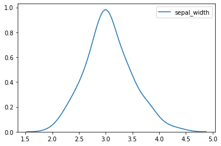


```python
sns.distplot(flights['arr_delay'], hist=True, kde=True, #,rug = True 
             bins=int(180/5), color = 'darkblue', 
             hist_kws={'edgecolor':'black'},
             kde_kws={'linewidth': 4})
```


```python
!pip install matplotlib_venn
```

    Collecting matplotlib_venn
    [?25l  Downloading https://files.pythonhosted.org/packages/c7/05/e084c8331ff7ab8b0e01c7cdb7c18854852340bf3096193510c902ffa1f1/matplotlib-venn-0.11.5.zip (40kB)
         |████████████████████████████████| 40kB 300kB/s eta 0:00:011
    [?25hRequirement already satisfied: matplotlib in /usr/local/lib/python3.6/dist-packages (from matplotlib_venn) (3.1.1)
    Requirement already satisfied: numpy in /usr/local/lib/python3.6/dist-packages (from matplotlib_venn) (1.16.4)
    Requirement already satisfied: scipy in /usr/local/lib/python3.6/dist-packages (from matplotlib_venn) (1.4.1)
    Requirement already satisfied: kiwisolver>=1.0.1 in /usr/local/lib/python3.6/dist-packages (from matplotlib->matplotlib_venn) (1.1.0)
    Requirement already satisfied: python-dateutil>=2.1 in /usr/local/lib/python3.6/dist-packages (from matplotlib->matplotlib_venn) (2.8.0)
    Requirement already satisfied: cycler>=0.10 in /usr/local/lib/python3.6/dist-packages (from matplotlib->matplotlib_venn) (0.10.0)
    Requirement already satisfied: pyparsing!=2.0.4,!=2.1.2,!=2.1.6,>=2.0.1 in /usr/local/lib/python3.6/dist-packages (from matplotlib->matplotlib_venn) (2.4.0)
    Requirement already satisfied: setuptools in /usr/local/lib/python3.6/dist-packages (from kiwisolver>=1.0.1->matplotlib->matplotlib_venn) (41.0.1)
    Requirement already satisfied: six>=1.5 in /usr/local/lib/python3.6/dist-packages (from python-dateutil>=2.1->matplotlib->matplotlib_venn) (1.12.0)
    Building wheels for collected packages: matplotlib-venn
      Building wheel for matplotlib-venn (setup.py) ... [?25ldone
    [?25h  Created wheel for matplotlib-venn: filename=matplotlib_venn-0.11.5-cp36-none-any.whl size=32397 sha256=b9575915ffbc7739d389332812bd0f077cbb31f1610992b1db00abc2dd5f0c56
      Stored in directory: /root/.cache/pip/wheels/d8/88/2f/e41518cb16e58109e8d14dc5dd7ef8166c82dce86c7c6d6c80
    Successfully built matplotlib-venn
    Installing collected packages: matplotlib-venn
    Successfully installed matplotlib-venn-0.11.5
    WARNING: You are using pip version 19.3.1; however, version 20.1 is available.
    You should consider upgrading via the 'pip install --upgrade pip' command.


```python
# library
import matplotlib.pyplot as plt
from matplotlib_venn import venn2
 
# First way to call the 2 group Venn diagram:
venn2(subsets = (10, 5, 2), set_labels = ('Group A', 'Group B'))
plt.show()
 
# Second way
venn2([set(['A', 'B', 'C', 'D']), set(['D', 'E', 'F'])])
plt.show()

```


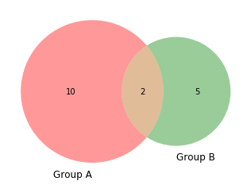


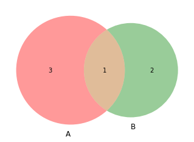


```python
data
```


<div>
<style scoped>
    .dataframe tbody tr th:only-of-type {
        vertical-align: middle;
    }

    .dataframe tbody tr th {
        vertical-align: top;
    }
    
    .dataframe thead th {
        text-align: right;
    }
</style>
<table border="1" class="dataframe">
  <thead>
    <tr style="text-align: right;">
      <th></th>
      <th>sepal_length</th>
      <th>sepal_width</th>
      <th>petal_length</th>
      <th>petal_width</th>
      <th>species</th>
    </tr>
  </thead>
  <tbody>
    <tr>
      <th>0</th>
      <td>5.1</td>
      <td>3.5</td>
      <td>1.4</td>
      <td>0.2</td>
      <td>setosa</td>
    </tr>
    <tr>
      <th>1</th>
      <td>4.9</td>
      <td>3.0</td>
      <td>1.4</td>
      <td>0.2</td>
      <td>setosa</td>
    </tr>
    <tr>
      <th>2</th>
      <td>4.7</td>
      <td>3.2</td>
      <td>1.3</td>
      <td>0.2</td>
      <td>setosa</td>
    </tr>
    <tr>
      <th>3</th>
      <td>4.6</td>
      <td>3.1</td>
      <td>1.5</td>
      <td>0.2</td>
      <td>setosa</td>
    </tr>
    <tr>
      <th>4</th>
      <td>5.0</td>
      <td>3.6</td>
      <td>1.4</td>
      <td>0.2</td>
      <td>setosa</td>
    </tr>
    <tr>
      <th>5</th>
      <td>5.4</td>
      <td>3.9</td>
      <td>1.7</td>
      <td>0.4</td>
      <td>setosa</td>
    </tr>
    <tr>
      <th>6</th>
      <td>4.6</td>
      <td>3.4</td>
      <td>1.4</td>
      <td>0.3</td>
      <td>setosa</td>
    </tr>
    <tr>
      <th>7</th>
      <td>5.0</td>
      <td>3.4</td>
      <td>1.5</td>
      <td>0.2</td>
      <td>setosa</td>
    </tr>
    <tr>
      <th>8</th>
      <td>4.4</td>
      <td>2.9</td>
      <td>1.4</td>
      <td>0.2</td>
      <td>setosa</td>
    </tr>
    <tr>
      <th>9</th>
      <td>4.9</td>
      <td>3.1</td>
      <td>1.5</td>
      <td>0.1</td>
      <td>setosa</td>
    </tr>
    <tr>
      <th>10</th>
      <td>5.4</td>
      <td>3.7</td>
      <td>1.5</td>
      <td>0.2</td>
      <td>setosa</td>
    </tr>
    <tr>
      <th>11</th>
      <td>4.8</td>
      <td>3.4</td>
      <td>1.6</td>
      <td>0.2</td>
      <td>setosa</td>
    </tr>
    <tr>
      <th>12</th>
      <td>4.8</td>
      <td>3.0</td>
      <td>1.4</td>
      <td>0.1</td>
      <td>setosa</td>
    </tr>
    <tr>
      <th>13</th>
      <td>4.3</td>
      <td>3.0</td>
      <td>1.1</td>
      <td>0.1</td>
      <td>setosa</td>
    </tr>
    <tr>
      <th>14</th>
      <td>5.8</td>
      <td>4.0</td>
      <td>1.2</td>
      <td>0.2</td>
      <td>setosa</td>
    </tr>
    <tr>
      <th>15</th>
      <td>5.7</td>
      <td>4.4</td>
      <td>1.5</td>
      <td>0.4</td>
      <td>setosa</td>
    </tr>
    <tr>
      <th>16</th>
      <td>5.4</td>
      <td>3.9</td>
      <td>1.3</td>
      <td>0.4</td>
      <td>setosa</td>
    </tr>
    <tr>
      <th>17</th>
      <td>5.1</td>
      <td>3.5</td>
      <td>1.4</td>
      <td>0.3</td>
      <td>setosa</td>
    </tr>
    <tr>
      <th>18</th>
      <td>5.7</td>
      <td>3.8</td>
      <td>1.7</td>
      <td>0.3</td>
      <td>setosa</td>
    </tr>
    <tr>
      <th>19</th>
      <td>5.1</td>
      <td>3.8</td>
      <td>1.5</td>
      <td>0.3</td>
      <td>setosa</td>
    </tr>
    <tr>
      <th>20</th>
      <td>5.4</td>
      <td>3.4</td>
      <td>1.7</td>
      <td>0.2</td>
      <td>setosa</td>
    </tr>
    <tr>
      <th>21</th>
      <td>5.1</td>
      <td>3.7</td>
      <td>1.5</td>
      <td>0.4</td>
      <td>setosa</td>
    </tr>
    <tr>
      <th>22</th>
      <td>4.6</td>
      <td>3.6</td>
      <td>1.0</td>
      <td>0.2</td>
      <td>setosa</td>
    </tr>
    <tr>
      <th>23</th>
      <td>5.1</td>
      <td>3.3</td>
      <td>1.7</td>
      <td>0.5</td>
      <td>setosa</td>
    </tr>
    <tr>
      <th>24</th>
      <td>4.8</td>
      <td>3.4</td>
      <td>1.9</td>
      <td>0.2</td>
      <td>setosa</td>
    </tr>
    <tr>
      <th>25</th>
      <td>5.0</td>
      <td>3.0</td>
      <td>1.6</td>
      <td>0.2</td>
      <td>setosa</td>
    </tr>
    <tr>
      <th>26</th>
      <td>5.0</td>
      <td>3.4</td>
      <td>1.6</td>
      <td>0.4</td>
      <td>setosa</td>
    </tr>
    <tr>
      <th>27</th>
      <td>5.2</td>
      <td>3.5</td>
      <td>1.5</td>
      <td>0.2</td>
      <td>setosa</td>
    </tr>
    <tr>
      <th>28</th>
      <td>5.2</td>
      <td>3.4</td>
      <td>1.4</td>
      <td>0.2</td>
      <td>setosa</td>
    </tr>
    <tr>
      <th>29</th>
      <td>4.7</td>
      <td>3.2</td>
      <td>1.6</td>
      <td>0.2</td>
      <td>setosa</td>
    </tr>
    <tr>
      <th>...</th>
      <td>...</td>
      <td>...</td>
      <td>...</td>
      <td>...</td>
      <td>...</td>
    </tr>
    <tr>
      <th>120</th>
      <td>6.9</td>
      <td>3.2</td>
      <td>5.7</td>
      <td>2.3</td>
      <td>virginica</td>
    </tr>
    <tr>
      <th>121</th>
      <td>5.6</td>
      <td>2.8</td>
      <td>4.9</td>
      <td>2.0</td>
      <td>virginica</td>
    </tr>
    <tr>
      <th>122</th>
      <td>7.7</td>
      <td>2.8</td>
      <td>6.7</td>
      <td>2.0</td>
      <td>virginica</td>
    </tr>
    <tr>
      <th>123</th>
      <td>6.3</td>
      <td>2.7</td>
      <td>4.9</td>
      <td>1.8</td>
      <td>virginica</td>
    </tr>
    <tr>
      <th>124</th>
      <td>6.7</td>
      <td>3.3</td>
      <td>5.7</td>
      <td>2.1</td>
      <td>virginica</td>
    </tr>
    <tr>
      <th>125</th>
      <td>7.2</td>
      <td>3.2</td>
      <td>6.0</td>
      <td>1.8</td>
      <td>virginica</td>
    </tr>
    <tr>
      <th>126</th>
      <td>6.2</td>
      <td>2.8</td>
      <td>4.8</td>
      <td>1.8</td>
      <td>virginica</td>
    </tr>
    <tr>
      <th>127</th>
      <td>6.1</td>
      <td>3.0</td>
      <td>4.9</td>
      <td>1.8</td>
      <td>virginica</td>
    </tr>
    <tr>
      <th>128</th>
      <td>6.4</td>
      <td>2.8</td>
      <td>5.6</td>
      <td>2.1</td>
      <td>virginica</td>
    </tr>
    <tr>
      <th>129</th>
      <td>7.2</td>
      <td>3.0</td>
      <td>5.8</td>
      <td>1.6</td>
      <td>virginica</td>
    </tr>
    <tr>
      <th>130</th>
      <td>7.4</td>
      <td>2.8</td>
      <td>6.1</td>
      <td>1.9</td>
      <td>virginica</td>
    </tr>
    <tr>
      <th>131</th>
      <td>7.9</td>
      <td>3.8</td>
      <td>6.4</td>
      <td>2.0</td>
      <td>virginica</td>
    </tr>
    <tr>
      <th>132</th>
      <td>6.4</td>
      <td>2.8</td>
      <td>5.6</td>
      <td>2.2</td>
      <td>virginica</td>
    </tr>
    <tr>
      <th>133</th>
      <td>6.3</td>
      <td>2.8</td>
      <td>5.1</td>
      <td>1.5</td>
      <td>virginica</td>
    </tr>
    <tr>
      <th>134</th>
      <td>6.1</td>
      <td>2.6</td>
      <td>5.6</td>
      <td>1.4</td>
      <td>virginica</td>
    </tr>
    <tr>
      <th>135</th>
      <td>7.7</td>
      <td>3.0</td>
      <td>6.1</td>
      <td>2.3</td>
      <td>virginica</td>
    </tr>
    <tr>
      <th>136</th>
      <td>6.3</td>
      <td>3.4</td>
      <td>5.6</td>
      <td>2.4</td>
      <td>virginica</td>
    </tr>
    <tr>
      <th>137</th>
      <td>6.4</td>
      <td>3.1</td>
      <td>5.5</td>
      <td>1.8</td>
      <td>virginica</td>
    </tr>
    <tr>
      <th>138</th>
      <td>6.0</td>
      <td>3.0</td>
      <td>4.8</td>
      <td>1.8</td>
      <td>virginica</td>
    </tr>
    <tr>
      <th>139</th>
      <td>6.9</td>
      <td>3.1</td>
      <td>5.4</td>
      <td>2.1</td>
      <td>virginica</td>
    </tr>
    <tr>
      <th>140</th>
      <td>6.7</td>
      <td>3.1</td>
      <td>5.6</td>
      <td>2.4</td>
      <td>virginica</td>
    </tr>
    <tr>
      <th>141</th>
      <td>6.9</td>
      <td>3.1</td>
      <td>5.1</td>
      <td>2.3</td>
      <td>virginica</td>
    </tr>
    <tr>
      <th>142</th>
      <td>5.8</td>
      <td>2.7</td>
      <td>5.1</td>
      <td>1.9</td>
      <td>virginica</td>
    </tr>
    <tr>
      <th>143</th>
      <td>6.8</td>
      <td>3.2</td>
      <td>5.9</td>
      <td>2.3</td>
      <td>virginica</td>
    </tr>
    <tr>
      <th>144</th>
      <td>6.7</td>
      <td>3.3</td>
      <td>5.7</td>
      <td>2.5</td>
      <td>virginica</td>
    </tr>
    <tr>
      <th>145</th>
      <td>6.7</td>
      <td>3.0</td>
      <td>5.2</td>
      <td>2.3</td>
      <td>virginica</td>
    </tr>
    <tr>
      <th>146</th>
      <td>6.3</td>
      <td>2.5</td>
      <td>5.0</td>
      <td>1.9</td>
      <td>virginica</td>
    </tr>
    <tr>
      <th>147</th>
      <td>6.5</td>
      <td>3.0</td>
      <td>5.2</td>
      <td>2.0</td>
      <td>virginica</td>
    </tr>
    <tr>
      <th>148</th>
      <td>6.2</td>
      <td>3.4</td>
      <td>5.4</td>
      <td>2.3</td>
      <td>virginica</td>
    </tr>
    <tr>
      <th>149</th>
      <td>5.9</td>
      <td>3.0</td>
      <td>5.1</td>
      <td>1.8</td>
      <td>virginica</td>
    </tr>
  </tbody>
</table>
<p>150 rows × 5 columns</p>
</div>


```python
# libraries
import pandas
import matplotlib.pyplot as plt
from pandas.plotting import parallel_coordinates
 
# Take the iris dataset
import seaborn as sns
data = sns.load_dataset('iris')
 
# Make the plot
parallel_coordinates(data, 'species', colormap=plt.get_cmap("Set2"))
plt.show()

```


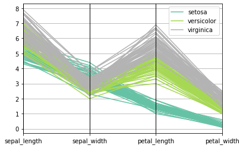


```python
!pip install squarify
```

    Collecting squarify
      Downloading https://files.pythonhosted.org/packages/0b/2b/2e77c35326efec19819cd1d729540d4d235e6c2a3f37658288a363a67da5/squarify-0.4.3-py3-none-any.whl
    Installing collected packages: squarify
    Successfully installed squarify-0.4.3
    WARNING: You are using pip version 19.3.1; however, version 20.1 is available.
    You should consider upgrading via the 'pip install --upgrade pip' command.


```python
# libraries
import matplotlib.pyplot as plt
import squarify    # pip install squarify (algorithm for treemap)
 
# If you have 2 lists
squarify.plot(sizes=[13,22,35,5], label=["group A", "group B", "group C", "group D"], alpha=.7 )
plt.axis('off')
plt.show()
 
# If you have a data frame?
import pandas as pd
df = pd.DataFrame({'nb_people':[8,3,4,2], 'group':["group A", "group B", "group C", "group D"] })
squarify.plot(sizes=df['nb_people'], label=df['group'], alpha=.8 )
plt.axis('off')
plt.show()

```


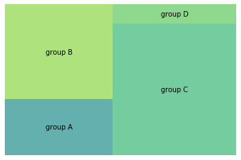


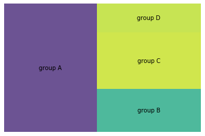


```python
# libraries
import pandas as pd
import numpy as np
import networkx as nx
import matplotlib.pyplot as plt
 
# Build a dataframe with 4 connections
df = pd.DataFrame({ 'from':['A', 'B', 'C','A'], 'to':['D', 'A', 'E','C']})
df
 
# Build your graph
# G=nx.from_pandas_dataframe(df, 'from', 'to')  # from_pandas_dataframe deprecated
G=nx.from_pandas_edgelist(df, 'from', 'to')
 
# Plot it
nx.draw(G, with_labels=True)
plt.show()

```


```python
# Libraries
import pandas as pd
from matplotlib import pyplot as plt
from scipy.cluster import hierarchy
import numpy as np
 
# Data set
url = 'https://python-graph-gallery.com/wp-content/uploads/mtcars.csv'
df = pd.read_csv(url)
df = df.set_index('model')
del df.index.name
df
 
# Calculate the distance between each sample
Z = hierarchy.linkage(df, 'ward')
 
 
# Plot with Custom leaves
hierarchy.dendrogram(Z, leaf_rotation=90, leaf_font_size=8, labels=df.index)

```


    {'icoord': [[25.0, 25.0, 35.0, 35.0],
      [15.0, 15.0, 30.0, 30.0],
      [5.0, 5.0, 22.5, 22.5],
      [95.0, 95.0, 105.0, 105.0],
      [85.0, 85.0, 100.0, 100.0],
      [75.0, 75.0, 92.5, 92.5],
      [65.0, 65.0, 83.75, 83.75],
      [55.0, 55.0, 74.375, 74.375],
      [45.0, 45.0, 64.6875, 64.6875],
      [125.0, 125.0, 135.0, 135.0],
      [145.0, 145.0, 155.0, 155.0],
      [130.0, 130.0, 150.0, 150.0],
      [115.0, 115.0, 140.0, 140.0],
      [54.84375, 54.84375, 127.5, 127.5],
      [13.75, 13.75, 91.171875, 91.171875],
      [165.0, 165.0, 175.0, 175.0],
      [195.0, 195.0, 205.0, 205.0],
      [185.0, 185.0, 200.0, 200.0],
      [215.0, 215.0, 225.0, 225.0],
      [192.5, 192.5, 220.0, 220.0],
      [170.0, 170.0, 206.25, 206.25],
      [255.0, 255.0, 265.0, 265.0],
      [245.0, 245.0, 260.0, 260.0],
      [235.0, 235.0, 252.5, 252.5],
      [285.0, 285.0, 295.0, 295.0],
      [275.0, 275.0, 290.0, 290.0],
      [305.0, 305.0, 315.0, 315.0],
      [282.5, 282.5, 310.0, 310.0],
      [243.75, 243.75, 296.25, 296.25],
      [188.125, 188.125, 270.0, 270.0],
      [52.4609375, 52.4609375, 229.0625, 229.0625]],
     'dcoord': [[0.0, 5.147341546856977, 5.147341546856977, 0.0],
      [0.0, 10.201299345344859, 10.201299345344859, 5.147341546856977],
      [0.0, 16.89707975262787, 16.89707975262787, 10.201299345344859],
      [0.0, 8.65359029536296, 8.65359029536296, 0.0],
      [0.0, 14.21755048053871, 14.21755048053871, 8.65359029536296],
      [0.0, 19.89440928586052, 19.89440928586052, 14.21755048053871],
      [0.0, 30.38720376243924, 30.38720376243924, 19.89440928586052],
      [0.0, 41.765577612830086, 41.765577612830086, 30.38720376243924],
      [0.0, 62.39473420394505, 62.39473420394505, 41.765577612830086],
      [0.0, 0.6153251173160401, 0.6153251173160401, 0.0],
      [0.0, 1.5231546211727793, 1.5231546211727793, 0.0],
      [0.6153251173160401, 21.8609037438986, 21.8609037438986, 1.5231546211727793],
      [0.0, 77.831513556528, 77.831513556528, 21.8609037438986],
      [62.39473420394505, 124.42513884575622, 124.42513884575622, 77.831513556528],
      [16.89707975262787,
       189.75327331432254,
       189.75327331432254,
       124.42513884575622],
      [0.0, 33.55086921377745, 33.55086921377745, 0.0],
      [0.0, 0.9826494797230624, 0.9826494797230624, 0.0],
      [0.0, 1.9956285559525688, 1.9956285559525688, 0.9826494797230624],
      [0.0, 14.015499455959462, 14.015499455959462, 0.0],
      [1.9956285559525688,
       71.69000545171319,
       71.69000545171319,
       14.015499455959462],
      [33.55086921377745,
       131.24667573749386,
       131.24667573749386,
       71.69000545171319],
      [0.0, 10.07612028510974, 10.07612028510974, 0.0],
      [0.0, 22.748314223256195, 22.748314223256195, 10.07612028510974],
      [0.0, 121.19933374404333, 121.19933374404333, 22.748314223256195],
      [0.0, 15.622444623041554, 15.622444623041554, 0.0],
      [0.0, 38.206294228394704, 38.206294228394704, 15.622444623041554],
      [0.0, 40.00524746830096, 40.00524746830096, 0.0],
      [38.206294228394704,
       136.59795344708988,
       136.59795344708988,
       40.00524746830096],
      [121.19933374404333,
       236.74277069464608,
       236.74277069464608,
       136.59795344708988],
      [131.24667573749386,
       389.04227922692326,
       389.04227922692326,
       236.74277069464608],
      [189.75327331432254,
       955.3712450494048,
       955.3712450494048,
       389.04227922692326]],
     'ivl': ['Honda Civic',
      'Toyota Corolla',
      'Fiat 128',
      'Fiat X1-9',
      'Merc 240D',
      'Lotus Europa',
      'Merc 230',
      'Volvo 142E',
      'Datsun 710',
      'Toyota Corona',
      'Porsche 914-2',
      'Ferrari Dino',
      'Mazda RX4',
      'Mazda RX4 Wag',
      'Merc 280',
      'Merc 280C',
      'Hornet 4 Drive',
      'Valiant',
      'Merc 450SLC',
      'Merc 450SE',
      'Merc 450SL',
      'Dodge Challenger',
      'AMC Javelin',
      'Maserati Bora',
      'Ford Pantera L',
      'Duster 360',
      'Camaro Z28',
      'Chrysler Imperial',
      'Cadillac Fleetwood',
      'Lincoln Continental',
      'Hornet Sportabout',
      'Pontiac Firebird'],
     'leaves': [18,
      19,
      17,
      25,
      7,
      27,
      8,
      31,
      2,
      20,
      26,
      29,
      0,
      1,
      9,
      10,
      3,
      5,
      13,
      11,
      12,
      21,
      22,
      30,
      28,
      6,
      23,
      16,
      14,
      15,
      4,
      24],
     'color_list': ['g',
      'g',
      'g',
      'g',
      'g',
      'g',
      'g',
      'g',
      'g',
      'g',
      'g',
      'g',
      'g',
      'g',
      'g',
      'r',
      'r',
      'r',
      'r',
      'r',
      'r',
      'r',
      'r',
      'r',
      'r',
      'r',
      'r',
      'r',
      'r',
      'r',
      'b']}


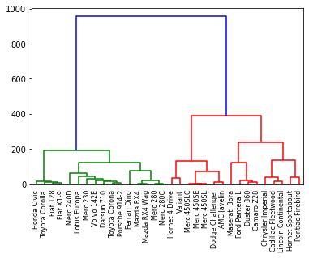


```python
!git clone https://github.com/klieret/pyplot-hierarchical-pie
```

    Cloning into 'pyplot-hierarchical-pie'...
    remote: Enumerating objects: 681, done.
    remote: Total 681 (delta 0), reused 0 (delta 0), pack-reused 681
    Receiving objects: 100% (681/681), 139.22 KiB | 216.00 KiB/s, done.
    Resolving deltas: 100% (427/427), done.


```python
!cd pyplot-hierarchical-pie/; 
```


```bash
%%bash
cd pyplot-hierarchical-pie/
python3 -m unittest discover
pip3 install .
pip3 freeze | grep hpie
```

    Processing /workspace/deployed_NER_Error_Recovery/notebooks/playgrounds/pyplot-hierarchical-pie
    Requirement already satisfied: matplotlib in /usr/local/lib/python3.6/dist-packages (from hpie==0.0.0) (3.1.1)
    Requirement already satisfied: typing in /usr/local/lib/python3.6/dist-packages (from hpie==0.0.0) (3.7.4.1)
    Requirement already satisfied: pyparsing!=2.0.4,!=2.1.2,!=2.1.6,>=2.0.1 in /usr/local/lib/python3.6/dist-packages (from matplotlib->hpie==0.0.0) (2.4.0)
    Requirement already satisfied: cycler>=0.10 in /usr/local/lib/python3.6/dist-packages (from matplotlib->hpie==0.0.0) (0.10.0)
    Requirement already satisfied: python-dateutil>=2.1 in /usr/local/lib/python3.6/dist-packages (from matplotlib->hpie==0.0.0) (2.8.0)
    Requirement already satisfied: numpy>=1.11 in /usr/local/lib/python3.6/dist-packages (from matplotlib->hpie==0.0.0) (1.16.4)
    Requirement already satisfied: kiwisolver>=1.0.1 in /usr/local/lib/python3.6/dist-packages (from matplotlib->hpie==0.0.0) (1.1.0)
    Requirement already satisfied: six in /usr/local/lib/python3.6/dist-packages (from cycler>=0.10->matplotlib->hpie==0.0.0) (1.12.0)
    Requirement already satisfied: setuptools in /usr/local/lib/python3.6/dist-packages (from kiwisolver>=1.0.1->matplotlib->hpie==0.0.0) (41.0.1)
    Building wheels for collected packages: hpie
      Building wheel for hpie (setup.py): started
      Building wheel for hpie (setup.py): finished with status 'done'
      Created wheel for hpie: filename=hpie-0.0.0-cp36-none-any.whl size=11926 sha256=d1943e970dbcf7183ef5f6e4d5b140e82ef8f67e9cf8b4620f91f3f86afc2be2
      Stored in directory: /root/.cache/pip/wheels/5c/14/c5/0591b7fb728cf1e4302304e508d396993f6e39933833d2fafa
    Successfully built hpie
    Installing collected packages: hpie
      Found existing installation: hpie 0.0.0
        Uninstalling hpie-0.0.0:
          Successfully uninstalled hpie-0.0.0
    Successfully installed hpie-0.0.0
    hpie==0.0.0


    ss................
    ----------------------------------------------------------------------
    Ran 18 tests in 1.520s
    
    OK (skipped=2)
    WARNING: You are using pip version 19.3.1; however, version 20.1 is available.
    You should consider upgrading via the 'pip install --upgrade pip' command.


```python
import matplotlib.pyplot as plt
from hpie import HPie, stringvalues_to_pv

fig, ax = plt.subplots()

# set up some random data

data = stringvalues_to_pv({
    'ipsum':                      40.45,
    'ipsum/eirmod':               29.34,
    'ipsum/eirmod/dolor':         94.4,
    'lorem':                      36.12,
    'lorem/sadipscing/dolor':     44.32,
    'lorem/sadipscing/lorem':     37.15,
    'lorem/sadipscing/nonumy':    23.98,
    'lorem/eirmod':               11.12,
    'lorem/eirmod/lorem':         45.65,
    'lorem/sadipscing':           79.67,
})


# do the magic

hp = HPie(data, ax)

# set plot attributes

hp.plot(setup_axes=True)
ax.set_title('Example HPie')

# save/show plot

plt.show()
```


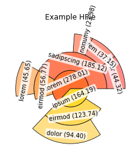


```python
!pip install plotly
```

    Collecting plotly
    [?25l  Downloading https://files.pythonhosted.org/packages/15/90/918bccb0ca60dc6d126d921e2c67126d75949f5da777e6b18c51fb12603d/plotly-4.6.0-py2.py3-none-any.whl (7.1MB)
         |████████████████████████████████| 7.2MB 6.1MB/s eta 0:00:01
    [?25hCollecting retrying>=1.3.3
      Downloading https://files.pythonhosted.org/packages/44/ef/beae4b4ef80902f22e3af073397f079c96969c69b2c7d52a57ea9ae61c9d/retrying-1.3.3.tar.gz
    Requirement already satisfied: six in /usr/local/lib/python3.6/dist-packages (from plotly) (1.12.0)
    Building wheels for collected packages: retrying
      Building wheel for retrying (setup.py) ... [?25ldone
    [?25h  Created wheel for retrying: filename=retrying-1.3.3-cp36-none-any.whl size=11432 sha256=54b3899bdee4811daffebebfddc731cc0c56f86f9f6ba81ed4068160b3bfa40e
      Stored in directory: /root/.cache/pip/wheels/d7/a9/33/acc7b709e2a35caa7d4cae442f6fe6fbf2c43f80823d46460c
    Successfully built retrying
    Installing collected packages: retrying, plotly
    Successfully installed plotly-4.6.0 retrying-1.3.3
    WARNING: You are using pip version 19.3.1; however, version 20.1 is available.
    You should consider upgrading via the 'pip install --upgrade pip' command.


```python
import plotly.express as px
df = px.data.tips()
fig = px.sunburst(df, path=['day', 'time', 'sex'], values='total_bill')
fig.show()
```


<div>

​        
            <div id="b04eb258-3806-41ab-ba7a-0de4b61deb90" class="plotly-graph-div" style="height:525px; width:100%;"></div>
            <script type="text/javascript">
                require(["plotly"], function(Plotly) {
                    window.PLOTLYENV=window.PLOTLYENV || {};
                    
                if (document.getElementById("b04eb258-3806-41ab-ba7a-0de4b61deb90")) {
                    Plotly.newPlot(
                        'b04eb258-3806-41ab-ba7a-0de4b61deb90',
                        [{"branchvalues": "total", "domain": {"x": [0.0, 1.0], "y": [0.0, 1.0]}, "hovertemplate": "labels=%{label}<br>total_bill=%{value}<br>parent=%{parent}<br>id=%{id}<extra></extra>", "ids": ["Fri/Dinner/Female", "Sat/Dinner/Female", "Sun/Dinner/Female", "Thur/Dinner/Female", "Fri/Lunch/Female", "Thur/Lunch/Female", "Fri/Dinner/Male", "Sat/Dinner/Male", "Sun/Dinner/Male", "Fri/Lunch/Male", "Thur/Lunch/Male", "Fri/Dinner", "Sat/Dinner", "Sun/Dinner", "Thur/Dinner", "Fri/Lunch", "Thur/Lunch", "Fri", "Sat", "Sun", "Thur"], "labels": ["Female", "Female", "Female", "Female", "Female", "Female", "Male", "Male", "Male", "Male", "Male", "Dinner", "Dinner", "Dinner", "Dinner", "Lunch", "Lunch", "Fri", "Sat", "Sun", "Thur"], "name": "", "parents": ["Fri/Dinner", "Sat/Dinner", "Sun/Dinner", "Thur/Dinner", "Fri/Lunch", "Thur/Lunch", "Fri/Dinner", "Sat/Dinner", "Sun/Dinner", "Fri/Lunch", "Thur/Lunch", "Fri", "Sat", "Sun", "Thur", "Fri", "Thur", "", "", "", ""], "type": "sunburst", "values": [71.55, 551.0499999999998, 357.69999999999993, 18.78, 55.760000000000005, 516.11, 164.41, 1227.3499999999997, 1269.46, 34.160000000000004, 561.4399999999999, 235.95999999999998, 1778.3999999999996, 1627.1600000000003, 18.78, 89.92, 1077.5499999999997, 325.87999999999994, 1778.3999999999996, 1627.1600000000003, 1096.3299999999997]}],
                        {"legend": {"tracegroupgap": 0}, "margin": {"t": 60}, "template": {"data": {"bar": [{"error_x": {"color": "#2a3f5f"}, "error_y": {"color": "#2a3f5f"}, "marker": {"line": {"color": "#E5ECF6", "width": 0.5}}, "type": "bar"}], "barpolar": [{"marker": {"line": {"color": "#E5ECF6", "width": 0.5}}, "type": "barpolar"}], "carpet": [{"aaxis": {"endlinecolor": "#2a3f5f", "gridcolor": "white", "linecolor": "white", "minorgridcolor": "white", "startlinecolor": "#2a3f5f"}, "baxis": {"endlinecolor": "#2a3f5f", "gridcolor": "white", "linecolor": "white", "minorgridcolor": "white", "startlinecolor": "#2a3f5f"}, "type": "carpet"}], "choropleth": [{"colorbar": {"outlinewidth": 0, "ticks": ""}, "type": "choropleth"}], "contour": [{"colorbar": {"outlinewidth": 0, "ticks": ""}, "colorscale": [[0.0, "#0d0887"], [0.1111111111111111, "#46039f"], [0.2222222222222222, "#7201a8"], [0.3333333333333333, "#9c179e"], [0.4444444444444444, "#bd3786"], [0.5555555555555556, "#d8576b"], [0.6666666666666666, "#ed7953"], [0.7777777777777778, "#fb9f3a"], [0.8888888888888888, "#fdca26"], [1.0, "#f0f921"]], "type": "contour"}], "contourcarpet": [{"colorbar": {"outlinewidth": 0, "ticks": ""}, "type": "contourcarpet"}], "heatmap": [{"colorbar": {"outlinewidth": 0, "ticks": ""}, "colorscale": [[0.0, "#0d0887"], [0.1111111111111111, "#46039f"], [0.2222222222222222, "#7201a8"], [0.3333333333333333, "#9c179e"], [0.4444444444444444, "#bd3786"], [0.5555555555555556, "#d8576b"], [0.6666666666666666, "#ed7953"], [0.7777777777777778, "#fb9f3a"], [0.8888888888888888, "#fdca26"], [1.0, "#f0f921"]], "type": "heatmap"}], "heatmapgl": [{"colorbar": {"outlinewidth": 0, "ticks": ""}, "colorscale": [[0.0, "#0d0887"], [0.1111111111111111, "#46039f"], [0.2222222222222222, "#7201a8"], [0.3333333333333333, "#9c179e"], [0.4444444444444444, "#bd3786"], [0.5555555555555556, "#d8576b"], [0.6666666666666666, "#ed7953"], [0.7777777777777778, "#fb9f3a"], [0.8888888888888888, "#fdca26"], [1.0, "#f0f921"]], "type": "heatmapgl"}], "histogram": [{"marker": {"colorbar": {"outlinewidth": 0, "ticks": ""}}, "type": "histogram"}], "histogram2d": [{"colorbar": {"outlinewidth": 0, "ticks": ""}, "colorscale": [[0.0, "#0d0887"], [0.1111111111111111, "#46039f"], [0.2222222222222222, "#7201a8"], [0.3333333333333333, "#9c179e"], [0.4444444444444444, "#bd3786"], [0.5555555555555556, "#d8576b"], [0.6666666666666666, "#ed7953"], [0.7777777777777778, "#fb9f3a"], [0.8888888888888888, "#fdca26"], [1.0, "#f0f921"]], "type": "histogram2d"}], "histogram2dcontour": [{"colorbar": {"outlinewidth": 0, "ticks": ""}, "colorscale": [[0.0, "#0d0887"], [0.1111111111111111, "#46039f"], [0.2222222222222222, "#7201a8"], [0.3333333333333333, "#9c179e"], [0.4444444444444444, "#bd3786"], [0.5555555555555556, "#d8576b"], [0.6666666666666666, "#ed7953"], [0.7777777777777778, "#fb9f3a"], [0.8888888888888888, "#fdca26"], [1.0, "#f0f921"]], "type": "histogram2dcontour"}], "mesh3d": [{"colorbar": {"outlinewidth": 0, "ticks": ""}, "type": "mesh3d"}], "parcoords": [{"line": {"colorbar": {"outlinewidth": 0, "ticks": ""}}, "type": "parcoords"}], "pie": [{"automargin": true, "type": "pie"}], "scatter": [{"marker": {"colorbar": {"outlinewidth": 0, "ticks": ""}}, "type": "scatter"}], "scatter3d": [{"line": {"colorbar": {"outlinewidth": 0, "ticks": ""}}, "marker": {"colorbar": {"outlinewidth": 0, "ticks": ""}}, "type": "scatter3d"}], "scattercarpet": [{"marker": {"colorbar": {"outlinewidth": 0, "ticks": ""}}, "type": "scattercarpet"}], "scattergeo": [{"marker": {"colorbar": {"outlinewidth": 0, "ticks": ""}}, "type": "scattergeo"}], "scattergl": [{"marker": {"colorbar": {"outlinewidth": 0, "ticks": ""}}, "type": "scattergl"}], "scattermapbox": [{"marker": {"colorbar": {"outlinewidth": 0, "ticks": ""}}, "type": "scattermapbox"}], "scatterpolar": [{"marker": {"colorbar": {"outlinewidth": 0, "ticks": ""}}, "type": "scatterpolar"}], "scatterpolargl": [{"marker": {"colorbar": {"outlinewidth": 0, "ticks": ""}}, "type": "scatterpolargl"}], "scatterternary": [{"marker": {"colorbar": {"outlinewidth": 0, "ticks": ""}}, "type": "scatterternary"}], "surface": [{"colorbar": {"outlinewidth": 0, "ticks": ""}, "colorscale": [[0.0, "#0d0887"], [0.1111111111111111, "#46039f"], [0.2222222222222222, "#7201a8"], [0.3333333333333333, "#9c179e"], [0.4444444444444444, "#bd3786"], [0.5555555555555556, "#d8576b"], [0.6666666666666666, "#ed7953"], [0.7777777777777778, "#fb9f3a"], [0.8888888888888888, "#fdca26"], [1.0, "#f0f921"]], "type": "surface"}], "table": [{"cells": {"fill": {"color": "#EBF0F8"}, "line": {"color": "white"}}, "header": {"fill": {"color": "#C8D4E3"}, "line": {"color": "white"}}, "type": "table"}]}, "layout": {"annotationdefaults": {"arrowcolor": "#2a3f5f", "arrowhead": 0, "arrowwidth": 1}, "coloraxis": {"colorbar": {"outlinewidth": 0, "ticks": ""}}, "colorscale": {"diverging": [[0, "#8e0152"], [0.1, "#c51b7d"], [0.2, "#de77ae"], [0.3, "#f1b6da"], [0.4, "#fde0ef"], [0.5, "#f7f7f7"], [0.6, "#e6f5d0"], [0.7, "#b8e186"], [0.8, "#7fbc41"], [0.9, "#4d9221"], [1, "#276419"]], "sequential": [[0.0, "#0d0887"], [0.1111111111111111, "#46039f"], [0.2222222222222222, "#7201a8"], [0.3333333333333333, "#9c179e"], [0.4444444444444444, "#bd3786"], [0.5555555555555556, "#d8576b"], [0.6666666666666666, "#ed7953"], [0.7777777777777778, "#fb9f3a"], [0.8888888888888888, "#fdca26"], [1.0, "#f0f921"]], "sequentialminus": [[0.0, "#0d0887"], [0.1111111111111111, "#46039f"], [0.2222222222222222, "#7201a8"], [0.3333333333333333, "#9c179e"], [0.4444444444444444, "#bd3786"], [0.5555555555555556, "#d8576b"], [0.6666666666666666, "#ed7953"], [0.7777777777777778, "#fb9f3a"], [0.8888888888888888, "#fdca26"], [1.0, "#f0f921"]]}, "colorway": ["#636efa", "#EF553B", "#00cc96", "#ab63fa", "#FFA15A", "#19d3f3", "#FF6692", "#B6E880", "#FF97FF", "#FECB52"], "font": {"color": "#2a3f5f"}, "geo": {"bgcolor": "white", "lakecolor": "white", "landcolor": "#E5ECF6", "showlakes": true, "showland": true, "subunitcolor": "white"}, "hoverlabel": {"align": "left"}, "hovermode": "closest", "mapbox": {"style": "light"}, "paper_bgcolor": "white", "plot_bgcolor": "#E5ECF6", "polar": {"angularaxis": {"gridcolor": "white", "linecolor": "white", "ticks": ""}, "bgcolor": "#E5ECF6", "radialaxis": {"gridcolor": "white", "linecolor": "white", "ticks": ""}}, "scene": {"xaxis": {"backgroundcolor": "#E5ECF6", "gridcolor": "white", "gridwidth": 2, "linecolor": "white", "showbackground": true, "ticks": "", "zerolinecolor": "white"}, "yaxis": {"backgroundcolor": "#E5ECF6", "gridcolor": "white", "gridwidth": 2, "linecolor": "white", "showbackground": true, "ticks": "", "zerolinecolor": "white"}, "zaxis": {"backgroundcolor": "#E5ECF6", "gridcolor": "white", "gridwidth": 2, "linecolor": "white", "showbackground": true, "ticks": "", "zerolinecolor": "white"}}, "shapedefaults": {"line": {"color": "#2a3f5f"}}, "ternary": {"aaxis": {"gridcolor": "white", "linecolor": "white", "ticks": ""}, "baxis": {"gridcolor": "white", "linecolor": "white", "ticks": ""}, "bgcolor": "#E5ECF6", "caxis": {"gridcolor": "white", "linecolor": "white", "ticks": ""}}, "title": {"x": 0.05}, "xaxis": {"automargin": true, "gridcolor": "white", "linecolor": "white", "ticks": "", "title": {"standoff": 15}, "zerolinecolor": "white", "zerolinewidth": 2}, "yaxis": {"automargin": true, "gridcolor": "white", "linecolor": "white", "ticks": "", "title": {"standoff": 15}, "zerolinecolor": "white", "zerolinewidth": 2}}}},
                        {"responsive": true}
                    ).then(function(){

var gd = document.getElementById('b04eb258-3806-41ab-ba7a-0de4b61deb90');
var x = new MutationObserver(function (mutations, observer) {{
        var display = window.getComputedStyle(gd).display;
        if (!display || display === 'none') {{
            console.log([gd, 'removed!']);
            Plotly.purge(gd);
            observer.disconnect();
        }}
}});

// Listen for the removal of the full notebook cells
var notebookContainer = gd.closest('#notebook-container');
if (notebookContainer) {{
    x.observe(notebookContainer, {childList: true});
}}

// Listen for the clearing of the current output cell
var outputEl = gd.closest('.output');
if (outputEl) {{
    x.observe(outputEl, {childList: true});
}}

                        })
                };
                });
            </script>
        </div>


```python
import plotly.graph_objects as go

fig =go.Figure(go.Sunburst(
    labels=[ "Eve", "Cain", "Seth", "Enos", "Noam", "Abel", "Awan", "Enoch", "Azura"],
    parents=["",    "Eve",  "Eve",  "Seth", "Seth", "Eve",  "Eve",  "Awan",  "Eve" ],
    values=[  65,    14,     12,     10,     2,      6,      6,      4,       4],
    branchvalues='total',

    textinfo='label+value+percent root'  # percent entry / percent root / percent parent
))
# Update layout for tight margin
# See https://plot.ly/python/creating-and-updating-figures/
fig.update_layout(margin = dict(t=0, l=0, r=0, b=0))
fig.show()
```


<div>

​        
            <div id="a6e09630-4b1a-4523-af3a-c13de9b0fb4f" class="plotly-graph-div" style="height:525px; width:100%;"></div>
            <script type="text/javascript">
                require(["plotly"], function(Plotly) {
                    window.PLOTLYENV=window.PLOTLYENV || {};
                    
                if (document.getElementById("a6e09630-4b1a-4523-af3a-c13de9b0fb4f")) {
                    Plotly.newPlot(
                        'a6e09630-4b1a-4523-af3a-c13de9b0fb4f',
                        [{"branchvalues": "total", "labels": ["Eve", "Cain", "Seth", "Enos", "Noam", "Abel", "Awan", "Enoch", "Azura"], "parents": ["", "Eve", "Eve", "Seth", "Seth", "Eve", "Eve", "Awan", "Eve"], "textinfo": "label+value+percent root", "type": "sunburst", "values": [65, 14, 12, 10, 2, 6, 6, 4, 4]}],
                        {"margin": {"b": 0, "l": 0, "r": 0, "t": 0}, "template": {"data": {"bar": [{"error_x": {"color": "#2a3f5f"}, "error_y": {"color": "#2a3f5f"}, "marker": {"line": {"color": "#E5ECF6", "width": 0.5}}, "type": "bar"}], "barpolar": [{"marker": {"line": {"color": "#E5ECF6", "width": 0.5}}, "type": "barpolar"}], "carpet": [{"aaxis": {"endlinecolor": "#2a3f5f", "gridcolor": "white", "linecolor": "white", "minorgridcolor": "white", "startlinecolor": "#2a3f5f"}, "baxis": {"endlinecolor": "#2a3f5f", "gridcolor": "white", "linecolor": "white", "minorgridcolor": "white", "startlinecolor": "#2a3f5f"}, "type": "carpet"}], "choropleth": [{"colorbar": {"outlinewidth": 0, "ticks": ""}, "type": "choropleth"}], "contour": [{"colorbar": {"outlinewidth": 0, "ticks": ""}, "colorscale": [[0.0, "#0d0887"], [0.1111111111111111, "#46039f"], [0.2222222222222222, "#7201a8"], [0.3333333333333333, "#9c179e"], [0.4444444444444444, "#bd3786"], [0.5555555555555556, "#d8576b"], [0.6666666666666666, "#ed7953"], [0.7777777777777778, "#fb9f3a"], [0.8888888888888888, "#fdca26"], [1.0, "#f0f921"]], "type": "contour"}], "contourcarpet": [{"colorbar": {"outlinewidth": 0, "ticks": ""}, "type": "contourcarpet"}], "heatmap": [{"colorbar": {"outlinewidth": 0, "ticks": ""}, "colorscale": [[0.0, "#0d0887"], [0.1111111111111111, "#46039f"], [0.2222222222222222, "#7201a8"], [0.3333333333333333, "#9c179e"], [0.4444444444444444, "#bd3786"], [0.5555555555555556, "#d8576b"], [0.6666666666666666, "#ed7953"], [0.7777777777777778, "#fb9f3a"], [0.8888888888888888, "#fdca26"], [1.0, "#f0f921"]], "type": "heatmap"}], "heatmapgl": [{"colorbar": {"outlinewidth": 0, "ticks": ""}, "colorscale": [[0.0, "#0d0887"], [0.1111111111111111, "#46039f"], [0.2222222222222222, "#7201a8"], [0.3333333333333333, "#9c179e"], [0.4444444444444444, "#bd3786"], [0.5555555555555556, "#d8576b"], [0.6666666666666666, "#ed7953"], [0.7777777777777778, "#fb9f3a"], [0.8888888888888888, "#fdca26"], [1.0, "#f0f921"]], "type": "heatmapgl"}], "histogram": [{"marker": {"colorbar": {"outlinewidth": 0, "ticks": ""}}, "type": "histogram"}], "histogram2d": [{"colorbar": {"outlinewidth": 0, "ticks": ""}, "colorscale": [[0.0, "#0d0887"], [0.1111111111111111, "#46039f"], [0.2222222222222222, "#7201a8"], [0.3333333333333333, "#9c179e"], [0.4444444444444444, "#bd3786"], [0.5555555555555556, "#d8576b"], [0.6666666666666666, "#ed7953"], [0.7777777777777778, "#fb9f3a"], [0.8888888888888888, "#fdca26"], [1.0, "#f0f921"]], "type": "histogram2d"}], "histogram2dcontour": [{"colorbar": {"outlinewidth": 0, "ticks": ""}, "colorscale": [[0.0, "#0d0887"], [0.1111111111111111, "#46039f"], [0.2222222222222222, "#7201a8"], [0.3333333333333333, "#9c179e"], [0.4444444444444444, "#bd3786"], [0.5555555555555556, "#d8576b"], [0.6666666666666666, "#ed7953"], [0.7777777777777778, "#fb9f3a"], [0.8888888888888888, "#fdca26"], [1.0, "#f0f921"]], "type": "histogram2dcontour"}], "mesh3d": [{"colorbar": {"outlinewidth": 0, "ticks": ""}, "type": "mesh3d"}], "parcoords": [{"line": {"colorbar": {"outlinewidth": 0, "ticks": ""}}, "type": "parcoords"}], "pie": [{"automargin": true, "type": "pie"}], "scatter": [{"marker": {"colorbar": {"outlinewidth": 0, "ticks": ""}}, "type": "scatter"}], "scatter3d": [{"line": {"colorbar": {"outlinewidth": 0, "ticks": ""}}, "marker": {"colorbar": {"outlinewidth": 0, "ticks": ""}}, "type": "scatter3d"}], "scattercarpet": [{"marker": {"colorbar": {"outlinewidth": 0, "ticks": ""}}, "type": "scattercarpet"}], "scattergeo": [{"marker": {"colorbar": {"outlinewidth": 0, "ticks": ""}}, "type": "scattergeo"}], "scattergl": [{"marker": {"colorbar": {"outlinewidth": 0, "ticks": ""}}, "type": "scattergl"}], "scattermapbox": [{"marker": {"colorbar": {"outlinewidth": 0, "ticks": ""}}, "type": "scattermapbox"}], "scatterpolar": [{"marker": {"colorbar": {"outlinewidth": 0, "ticks": ""}}, "type": "scatterpolar"}], "scatterpolargl": [{"marker": {"colorbar": {"outlinewidth": 0, "ticks": ""}}, "type": "scatterpolargl"}], "scatterternary": [{"marker": {"colorbar": {"outlinewidth": 0, "ticks": ""}}, "type": "scatterternary"}], "surface": [{"colorbar": {"outlinewidth": 0, "ticks": ""}, "colorscale": [[0.0, "#0d0887"], [0.1111111111111111, "#46039f"], [0.2222222222222222, "#7201a8"], [0.3333333333333333, "#9c179e"], [0.4444444444444444, "#bd3786"], [0.5555555555555556, "#d8576b"], [0.6666666666666666, "#ed7953"], [0.7777777777777778, "#fb9f3a"], [0.8888888888888888, "#fdca26"], [1.0, "#f0f921"]], "type": "surface"}], "table": [{"cells": {"fill": {"color": "#EBF0F8"}, "line": {"color": "white"}}, "header": {"fill": {"color": "#C8D4E3"}, "line": {"color": "white"}}, "type": "table"}]}, "layout": {"annotationdefaults": {"arrowcolor": "#2a3f5f", "arrowhead": 0, "arrowwidth": 1}, "coloraxis": {"colorbar": {"outlinewidth": 0, "ticks": ""}}, "colorscale": {"diverging": [[0, "#8e0152"], [0.1, "#c51b7d"], [0.2, "#de77ae"], [0.3, "#f1b6da"], [0.4, "#fde0ef"], [0.5, "#f7f7f7"], [0.6, "#e6f5d0"], [0.7, "#b8e186"], [0.8, "#7fbc41"], [0.9, "#4d9221"], [1, "#276419"]], "sequential": [[0.0, "#0d0887"], [0.1111111111111111, "#46039f"], [0.2222222222222222, "#7201a8"], [0.3333333333333333, "#9c179e"], [0.4444444444444444, "#bd3786"], [0.5555555555555556, "#d8576b"], [0.6666666666666666, "#ed7953"], [0.7777777777777778, "#fb9f3a"], [0.8888888888888888, "#fdca26"], [1.0, "#f0f921"]], "sequentialminus": [[0.0, "#0d0887"], [0.1111111111111111, "#46039f"], [0.2222222222222222, "#7201a8"], [0.3333333333333333, "#9c179e"], [0.4444444444444444, "#bd3786"], [0.5555555555555556, "#d8576b"], [0.6666666666666666, "#ed7953"], [0.7777777777777778, "#fb9f3a"], [0.8888888888888888, "#fdca26"], [1.0, "#f0f921"]]}, "colorway": ["#636efa", "#EF553B", "#00cc96", "#ab63fa", "#FFA15A", "#19d3f3", "#FF6692", "#B6E880", "#FF97FF", "#FECB52"], "font": {"color": "#2a3f5f"}, "geo": {"bgcolor": "white", "lakecolor": "white", "landcolor": "#E5ECF6", "showlakes": true, "showland": true, "subunitcolor": "white"}, "hoverlabel": {"align": "left"}, "hovermode": "closest", "mapbox": {"style": "light"}, "paper_bgcolor": "white", "plot_bgcolor": "#E5ECF6", "polar": {"angularaxis": {"gridcolor": "white", "linecolor": "white", "ticks": ""}, "bgcolor": "#E5ECF6", "radialaxis": {"gridcolor": "white", "linecolor": "white", "ticks": ""}}, "scene": {"xaxis": {"backgroundcolor": "#E5ECF6", "gridcolor": "white", "gridwidth": 2, "linecolor": "white", "showbackground": true, "ticks": "", "zerolinecolor": "white"}, "yaxis": {"backgroundcolor": "#E5ECF6", "gridcolor": "white", "gridwidth": 2, "linecolor": "white", "showbackground": true, "ticks": "", "zerolinecolor": "white"}, "zaxis": {"backgroundcolor": "#E5ECF6", "gridcolor": "white", "gridwidth": 2, "linecolor": "white", "showbackground": true, "ticks": "", "zerolinecolor": "white"}}, "shapedefaults": {"line": {"color": "#2a3f5f"}}, "ternary": {"aaxis": {"gridcolor": "white", "linecolor": "white", "ticks": ""}, "baxis": {"gridcolor": "white", "linecolor": "white", "ticks": ""}, "bgcolor": "#E5ECF6", "caxis": {"gridcolor": "white", "linecolor": "white", "ticks": ""}}, "title": {"x": 0.05}, "xaxis": {"automargin": true, "gridcolor": "white", "linecolor": "white", "ticks": "", "title": {"standoff": 15}, "zerolinecolor": "white", "zerolinewidth": 2}, "yaxis": {"automargin": true, "gridcolor": "white", "linecolor": "white", "ticks": "", "title": {"standoff": 15}, "zerolinecolor": "white", "zerolinewidth": 2}}}},
                        {"responsive": true}
                    ).then(function(){

var gd = document.getElementById('a6e09630-4b1a-4523-af3a-c13de9b0fb4f');
var x = new MutationObserver(function (mutations, observer) {{
        var display = window.getComputedStyle(gd).display;
        if (!display || display === 'none') {{
            console.log([gd, 'removed!']);
            Plotly.purge(gd);
            observer.disconnect();
        }}
}});

// Listen for the removal of the full notebook cells
var notebookContainer = gd.closest('#notebook-container');
if (notebookContainer) {{
    x.observe(notebookContainer, {childList: true});
}}

// Listen for the clearing of the current output cell
var outputEl = gd.closest('.output');
if (outputEl) {{
    x.observe(outputEl, {childList: true});
}}

                        })
                };
                });
            </script>
        </div>


```python
import plotly.graph_objects as go

fig =go.Figure(go.Sunburst(
    labels=["Eve", "Cain", "Seth", "Enos", "Noam", "Abel", "Awan", "Enoch", "Azura"],
    parents=["", "Eve", "Eve", "Seth", "Seth", "Eve", "Eve", "Awan", "Eve" ],
    values=[10, 14, 12, 10, 2, 6, 6, 4, 4],
    texttemplate="%{label}: %{value:$,s} (%{percentParent})",

))
# Update layout for tight margin
# See https://plotly.com/python/creating-and-updating-figures/
fig.update_layout(margin = dict(t=0, l=0, r=0, b=0))

fig.show()
```


<div>

​        
            <div id="60f93429-b351-4cd4-b69e-6e3f379b987b" class="plotly-graph-div" style="height:525px; width:100%;"></div>
            <script type="text/javascript">
                require(["plotly"], function(Plotly) {
                    window.PLOTLYENV=window.PLOTLYENV || {};
                    
                if (document.getElementById("60f93429-b351-4cd4-b69e-6e3f379b987b")) {
                    Plotly.newPlot(
                        '60f93429-b351-4cd4-b69e-6e3f379b987b',
                        [{"labels": ["Eve", "Cain", "Seth", "Enos", "Noam", "Abel", "Awan", "Enoch", "Azura"], "parents": ["", "Eve", "Eve", "Seth", "Seth", "Eve", "Eve", "Awan", "Eve"], "texttemplate": "%{label}: %{value:$,s} (%{percentParent})", "type": "sunburst", "values": [10, 14, 12, 10, 2, 6, 6, 4, 4]}],
                        {"margin": {"b": 0, "l": 0, "r": 0, "t": 0}, "template": {"data": {"bar": [{"error_x": {"color": "#2a3f5f"}, "error_y": {"color": "#2a3f5f"}, "marker": {"line": {"color": "#E5ECF6", "width": 0.5}}, "type": "bar"}], "barpolar": [{"marker": {"line": {"color": "#E5ECF6", "width": 0.5}}, "type": "barpolar"}], "carpet": [{"aaxis": {"endlinecolor": "#2a3f5f", "gridcolor": "white", "linecolor": "white", "minorgridcolor": "white", "startlinecolor": "#2a3f5f"}, "baxis": {"endlinecolor": "#2a3f5f", "gridcolor": "white", "linecolor": "white", "minorgridcolor": "white", "startlinecolor": "#2a3f5f"}, "type": "carpet"}], "choropleth": [{"colorbar": {"outlinewidth": 0, "ticks": ""}, "type": "choropleth"}], "contour": [{"colorbar": {"outlinewidth": 0, "ticks": ""}, "colorscale": [[0.0, "#0d0887"], [0.1111111111111111, "#46039f"], [0.2222222222222222, "#7201a8"], [0.3333333333333333, "#9c179e"], [0.4444444444444444, "#bd3786"], [0.5555555555555556, "#d8576b"], [0.6666666666666666, "#ed7953"], [0.7777777777777778, "#fb9f3a"], [0.8888888888888888, "#fdca26"], [1.0, "#f0f921"]], "type": "contour"}], "contourcarpet": [{"colorbar": {"outlinewidth": 0, "ticks": ""}, "type": "contourcarpet"}], "heatmap": [{"colorbar": {"outlinewidth": 0, "ticks": ""}, "colorscale": [[0.0, "#0d0887"], [0.1111111111111111, "#46039f"], [0.2222222222222222, "#7201a8"], [0.3333333333333333, "#9c179e"], [0.4444444444444444, "#bd3786"], [0.5555555555555556, "#d8576b"], [0.6666666666666666, "#ed7953"], [0.7777777777777778, "#fb9f3a"], [0.8888888888888888, "#fdca26"], [1.0, "#f0f921"]], "type": "heatmap"}], "heatmapgl": [{"colorbar": {"outlinewidth": 0, "ticks": ""}, "colorscale": [[0.0, "#0d0887"], [0.1111111111111111, "#46039f"], [0.2222222222222222, "#7201a8"], [0.3333333333333333, "#9c179e"], [0.4444444444444444, "#bd3786"], [0.5555555555555556, "#d8576b"], [0.6666666666666666, "#ed7953"], [0.7777777777777778, "#fb9f3a"], [0.8888888888888888, "#fdca26"], [1.0, "#f0f921"]], "type": "heatmapgl"}], "histogram": [{"marker": {"colorbar": {"outlinewidth": 0, "ticks": ""}}, "type": "histogram"}], "histogram2d": [{"colorbar": {"outlinewidth": 0, "ticks": ""}, "colorscale": [[0.0, "#0d0887"], [0.1111111111111111, "#46039f"], [0.2222222222222222, "#7201a8"], [0.3333333333333333, "#9c179e"], [0.4444444444444444, "#bd3786"], [0.5555555555555556, "#d8576b"], [0.6666666666666666, "#ed7953"], [0.7777777777777778, "#fb9f3a"], [0.8888888888888888, "#fdca26"], [1.0, "#f0f921"]], "type": "histogram2d"}], "histogram2dcontour": [{"colorbar": {"outlinewidth": 0, "ticks": ""}, "colorscale": [[0.0, "#0d0887"], [0.1111111111111111, "#46039f"], [0.2222222222222222, "#7201a8"], [0.3333333333333333, "#9c179e"], [0.4444444444444444, "#bd3786"], [0.5555555555555556, "#d8576b"], [0.6666666666666666, "#ed7953"], [0.7777777777777778, "#fb9f3a"], [0.8888888888888888, "#fdca26"], [1.0, "#f0f921"]], "type": "histogram2dcontour"}], "mesh3d": [{"colorbar": {"outlinewidth": 0, "ticks": ""}, "type": "mesh3d"}], "parcoords": [{"line": {"colorbar": {"outlinewidth": 0, "ticks": ""}}, "type": "parcoords"}], "pie": [{"automargin": true, "type": "pie"}], "scatter": [{"marker": {"colorbar": {"outlinewidth": 0, "ticks": ""}}, "type": "scatter"}], "scatter3d": [{"line": {"colorbar": {"outlinewidth": 0, "ticks": ""}}, "marker": {"colorbar": {"outlinewidth": 0, "ticks": ""}}, "type": "scatter3d"}], "scattercarpet": [{"marker": {"colorbar": {"outlinewidth": 0, "ticks": ""}}, "type": "scattercarpet"}], "scattergeo": [{"marker": {"colorbar": {"outlinewidth": 0, "ticks": ""}}, "type": "scattergeo"}], "scattergl": [{"marker": {"colorbar": {"outlinewidth": 0, "ticks": ""}}, "type": "scattergl"}], "scattermapbox": [{"marker": {"colorbar": {"outlinewidth": 0, "ticks": ""}}, "type": "scattermapbox"}], "scatterpolar": [{"marker": {"colorbar": {"outlinewidth": 0, "ticks": ""}}, "type": "scatterpolar"}], "scatterpolargl": [{"marker": {"colorbar": {"outlinewidth": 0, "ticks": ""}}, "type": "scatterpolargl"}], "scatterternary": [{"marker": {"colorbar": {"outlinewidth": 0, "ticks": ""}}, "type": "scatterternary"}], "surface": [{"colorbar": {"outlinewidth": 0, "ticks": ""}, "colorscale": [[0.0, "#0d0887"], [0.1111111111111111, "#46039f"], [0.2222222222222222, "#7201a8"], [0.3333333333333333, "#9c179e"], [0.4444444444444444, "#bd3786"], [0.5555555555555556, "#d8576b"], [0.6666666666666666, "#ed7953"], [0.7777777777777778, "#fb9f3a"], [0.8888888888888888, "#fdca26"], [1.0, "#f0f921"]], "type": "surface"}], "table": [{"cells": {"fill": {"color": "#EBF0F8"}, "line": {"color": "white"}}, "header": {"fill": {"color": "#C8D4E3"}, "line": {"color": "white"}}, "type": "table"}]}, "layout": {"annotationdefaults": {"arrowcolor": "#2a3f5f", "arrowhead": 0, "arrowwidth": 1}, "coloraxis": {"colorbar": {"outlinewidth": 0, "ticks": ""}}, "colorscale": {"diverging": [[0, "#8e0152"], [0.1, "#c51b7d"], [0.2, "#de77ae"], [0.3, "#f1b6da"], [0.4, "#fde0ef"], [0.5, "#f7f7f7"], [0.6, "#e6f5d0"], [0.7, "#b8e186"], [0.8, "#7fbc41"], [0.9, "#4d9221"], [1, "#276419"]], "sequential": [[0.0, "#0d0887"], [0.1111111111111111, "#46039f"], [0.2222222222222222, "#7201a8"], [0.3333333333333333, "#9c179e"], [0.4444444444444444, "#bd3786"], [0.5555555555555556, "#d8576b"], [0.6666666666666666, "#ed7953"], [0.7777777777777778, "#fb9f3a"], [0.8888888888888888, "#fdca26"], [1.0, "#f0f921"]], "sequentialminus": [[0.0, "#0d0887"], [0.1111111111111111, "#46039f"], [0.2222222222222222, "#7201a8"], [0.3333333333333333, "#9c179e"], [0.4444444444444444, "#bd3786"], [0.5555555555555556, "#d8576b"], [0.6666666666666666, "#ed7953"], [0.7777777777777778, "#fb9f3a"], [0.8888888888888888, "#fdca26"], [1.0, "#f0f921"]]}, "colorway": ["#636efa", "#EF553B", "#00cc96", "#ab63fa", "#FFA15A", "#19d3f3", "#FF6692", "#B6E880", "#FF97FF", "#FECB52"], "font": {"color": "#2a3f5f"}, "geo": {"bgcolor": "white", "lakecolor": "white", "landcolor": "#E5ECF6", "showlakes": true, "showland": true, "subunitcolor": "white"}, "hoverlabel": {"align": "left"}, "hovermode": "closest", "mapbox": {"style": "light"}, "paper_bgcolor": "white", "plot_bgcolor": "#E5ECF6", "polar": {"angularaxis": {"gridcolor": "white", "linecolor": "white", "ticks": ""}, "bgcolor": "#E5ECF6", "radialaxis": {"gridcolor": "white", "linecolor": "white", "ticks": ""}}, "scene": {"xaxis": {"backgroundcolor": "#E5ECF6", "gridcolor": "white", "gridwidth": 2, "linecolor": "white", "showbackground": true, "ticks": "", "zerolinecolor": "white"}, "yaxis": {"backgroundcolor": "#E5ECF6", "gridcolor": "white", "gridwidth": 2, "linecolor": "white", "showbackground": true, "ticks": "", "zerolinecolor": "white"}, "zaxis": {"backgroundcolor": "#E5ECF6", "gridcolor": "white", "gridwidth": 2, "linecolor": "white", "showbackground": true, "ticks": "", "zerolinecolor": "white"}}, "shapedefaults": {"line": {"color": "#2a3f5f"}}, "ternary": {"aaxis": {"gridcolor": "white", "linecolor": "white", "ticks": ""}, "baxis": {"gridcolor": "white", "linecolor": "white", "ticks": ""}, "bgcolor": "#E5ECF6", "caxis": {"gridcolor": "white", "linecolor": "white", "ticks": ""}}, "title": {"x": 0.05}, "xaxis": {"automargin": true, "gridcolor": "white", "linecolor": "white", "ticks": "", "title": {"standoff": 15}, "zerolinecolor": "white", "zerolinewidth": 2}, "yaxis": {"automargin": true, "gridcolor": "white", "linecolor": "white", "ticks": "", "title": {"standoff": 15}, "zerolinecolor": "white", "zerolinewidth": 2}}}},
                        {"responsive": true}
                    ).then(function(){

var gd = document.getElementById('60f93429-b351-4cd4-b69e-6e3f379b987b');
var x = new MutationObserver(function (mutations, observer) {{
        var display = window.getComputedStyle(gd).display;
        if (!display || display === 'none') {{
            console.log([gd, 'removed!']);
            Plotly.purge(gd);
            observer.disconnect();
        }}
}});

// Listen for the removal of the full notebook cells
var notebookContainer = gd.closest('#notebook-container');
if (notebookContainer) {{
    x.observe(notebookContainer, {childList: true});
}}

// Listen for the clearing of the current output cell
var outputEl = gd.closest('.output');
if (outputEl) {{
    x.observe(outputEl, {childList: true});
}}

                        })
                };
                });
            </script>
        </div>


```python

```
